# 准备数据库（mysql5.7）

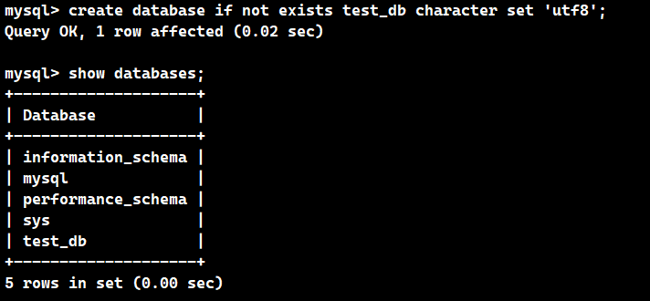

## 创建表（学生表、教师表、班级表）

```sql
# 创建学生表
create table if not exists student(
sno varchar(4) primary key,
sname varchar(15) not null,
sage int not null,
ssex varchar(3) not null check(ssex = '男' or ssex = '女'),
scno varchar(4) not null,

constraint fk_stu_cls_no foreign key(scno) references class(cno)
);

# 创建教师表
create table if not exists teacher(
tno varchar(4) primary key,
tname varchar(15) not null,
tage int not null,
tsex varchar(3) not null check(tsex = '男' or tsex = '女'),
tcno varchar(4) not null,

constraint fk_thr_cls_no foreign key(tcno) references class(cno)
);

# 创建班级表
create table if not exists class(
cno varchar(4) primary key,
cname varchar(40) not null,
cnum int default 0
);
```

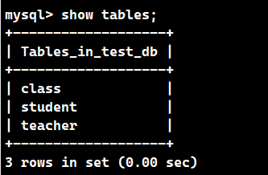

## 创建触发器（当student表中增加数据或减少数据时，class表中的cnum属性也会随之改变）

```sql
# 增加
DELIMITER //
CREATE TRIGGER increase_cnum AFTER INSERT ON student
FOR EACH ROW
BEGIN
    UPDATE class SET cnum = cnum + 1 WHERE cno = NEW.scno;
END //
DELIMITER ;

# 减少
DELIMITER //
CREATE TRIGGER decrease_cnum AFTER DELETE ON student
FOR EACH ROW
BEGIN
    UPDATE class SET cnum = cnum - 1 WHERE cno = OLD.scno;
END //
DELIMITER ;
```

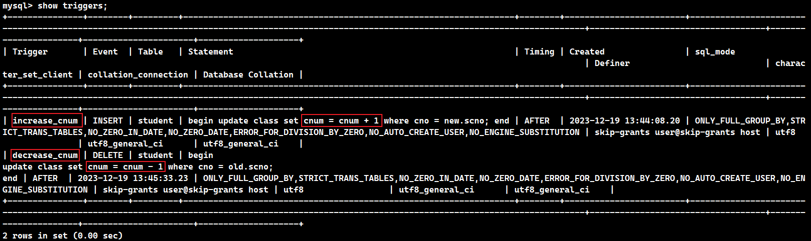

## 创建预设数据

```sql
INSERT INTO class (cno, cname, cnum)
VALUES
    ('C001', 'Mathematics', 0),
    ('C002', 'Physics', 0),
    ('C003', 'Chemistry', 0);

INSERT INTO teacher (tno, tname, tage, tsex, tcno)
VALUES
    ('T001', 'John', 35, '男', 'C001'),
    ('T002', 'Mary', 28, '女', 'C002'),
    ('T003', 'David', 42, '男', 'C003');

INSERT INTO student (sno, sname, sage, ssex, scno)
VALUES
    ('S001', 'Alice', 20, '女', 'C001'),
    ('S002', 'Bob', 22, '男', 'C002'),
    ('S003', 'Charlie', 19, '男', 'C001');
    
INSERT INTO student (sno, sname, sage, ssex, scno)
VALUES
    ('S004', 'Emma', 21, '女', 'C002'),
    ('S005', 'Michael', 23, '男', 'C003'),
    ('S006', 'Olivia', 20, '女', 'C001');
```

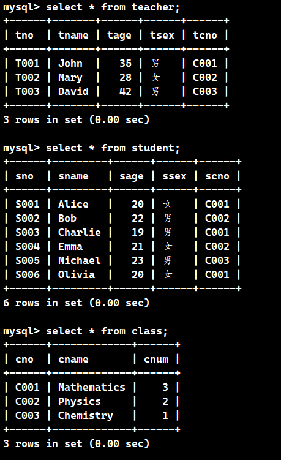

# c语言连接数据库

```c
#include <iostream>
#include <string>
#include <mysql/mysql.h>
using namespace std;

const string host = "127.0.0.1";
const string user = "root";
const string password = "";
const string db = "test_db";
const int port = 3306;

int main()
{
    // 1.初始化
    MYSQL* my = mysql_init(NULL);
    // 2.连接数据库
    if(mysql_real_connect(my, host.c_str(), user.c_str(), password.c_str(), db.c_str(), port, NULL, 0) == NULL)
    {
        cout << "数据库连接失败！" << endl;
        return 1;
    }
    cout << "连接成功" << endl;
    // 3.关闭连接
    mysql_close(my);
    
    return 0;
}

```

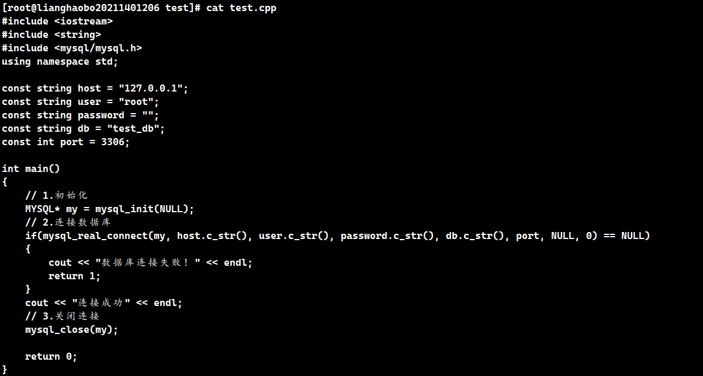

```shell
g++ -o mysql test.cpp -L /lib64/mysql -l mysqlclient
```

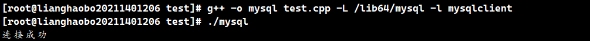

# 代码实现部分

## mysql.h

```c++
#include <iostream>
#include <mysql/mysql.h>

using namespace std;

MYSQL* get_connect();

void close_connect(MYSQL* my);
```

## mysql.cpp

```c++
#include <iostream>
#include <mysql/mysql.h>
#include "mysql.h"

using namespace std;

const string host = "127.0.0.1";
const string user = "root";
const string password = "";
const string db = "test_db";
const int port = 3306;

MYSQL* get_connect() {
	//初始化连接
	MYSQL* my = mysql_init(NULL);

	//2.连接数据库
	if (mysql_real_connect(my, host.c_str(), user.c_str(), password.c_str(), db.c_str(), port, NULL, 0) == NULL)
	{
		cout << "connect failed" << endl;
		return my;
	}

	return my;
	cout << "connect success" << endl;
}

void close_connect(MYSQL* my) {
	//3.关闭连接
	mysql_close(my);
}
```

## class.h

```c++
#include <iostream>
#include <string>

using namespace std;

void class_select();

void class_insert();

void class_update();

void class_delete();

void _class(int choice);
```

## class.cpp

```c++
#include <iostream>
#include "class.h"
#include "mysql.h"

using namespace std;

string cno;
string cname;

void class_select(MYSQL* my) {
	cout << "************  查询数据  ************" << endl;

	string sql = "select * from class;";
	if (mysql_query(my, sql.c_str()) != 0)
	{
		cout << sql << "	failed" << endl;
		return;
	}

	//获取结果集
	MYSQL_RES* res = mysql_store_result(my);
	int row = mysql_num_rows(res); 	//数据行数
	int col = mysql_num_fields(res);	//数据列数

	//获取每列的数据，并打印
	MYSQL_FIELD* fields = mysql_fetch_field(res);
	for (int i = 0; i < col; ++i)
	{
		cout << fields[i].name << "\t";
	}
	cout << endl;

	//遍历数据
	for (int i = 0; i < row; ++i)
	{
		//获取每一行
		MYSQL_ROW rows = mysql_fetch_row(res);
		for (int j = 0; j < col; ++j)
		{
			cout << rows[j] << "\t";
		}
		cout << endl;
	}
}

void class_insert(MYSQL* my) {
	cout << "************  插入数据  ************" << endl;
	cout << "请输入编辑编号：" << endl;
	cin >> cno;
	cout << "请输入班级名称" << endl;
	cin >> cname;

	string sql = "insert into class(cno,cname,cnum) values ('" + cno + "','" + cname + "',0);";
	if (mysql_query(my, sql.c_str()) != 0)
	{
		cout << sql << "	failed." << endl;
		return;
	}
	cout << sql << "	success." << endl;
}

void class_update(MYSQL* my) {
	cout << "************  修改数据  ************" << endl;
	cout << "请输入要修改的班级编号：" << endl;
	cin >> cno;

	string sql;
	cout << "请输入班级名称：" << endl;
	cin >> cname;
	sql = "update class set cname='" + cname + "' where cno='" + cno + "';";

	if (mysql_query(my, sql.c_str()) != 0)
	{
		cout << sql << "	failed." << endl;
		return;
	}
	cout << sql << "	success." << endl;
}

void class_delete(MYSQL* my) {
	cout << "************  删除数据  ************" << endl;
	cout << "请输入要删除的编辑编号：" << endl;
	cin >> cno;

	string sql = "delete from class where cno='" + cno + "';";
	if (mysql_query(my, sql.c_str()) != 0)
	{
		cout << sql << "	failed." << endl;
		return;
	}
	cout << sql << "	success." << endl;
}

void _class(int choice) {
	//获取数据库连接
	MYSQL* my = get_connect();

	//3.执行操作
	//设置编码格式
	mysql_set_character_set(my, "utf8");

	switch (choice) {
	case 1:
		class_select(my);
		break;
	case 2:
		class_insert(my);
		break;
	case 3:
		class_update(my);
		break;
	case 4:
		class_delete(my);
		break;
	}

	//关闭数据库连接
	close_connect(my);
}
```

## teacher.h

```c++
#include <iostream>
#include <string>

using namespace std;

void teacher_select();

void teacher_insert();

void teacher_update();

void teacher_delete();

void _teacher(int choice);
```

## teacher.cpp

```c++
#include <iostream>
#include "teacher.h"
#include "mysql.h"

using namespace std;

string tno;
string tname;
string tsex;
string tage;
string tcno;

void teacher_select(MYSQL* my) {
	cout << "************  查询数据  ************" << endl;

	string sql = "select * from teacher;";
	if (mysql_query(my, sql.c_str()) != 0)
	{
		cout << sql << "	failed" << endl;
		return;
	}

	//获取结果集
	MYSQL_RES* res = mysql_store_result(my);
	int row = mysql_num_rows(res); 	//数据行数
	int col = mysql_num_fields(res);	//数据列数

	//获取每列的数据，并打印
	MYSQL_FIELD* fields = mysql_fetch_field(res);
	for (int i = 0; i < col; ++i)
	{
		cout << fields[i].name << "\t";
	}
	cout << endl;

	//遍历数据
	for (int i = 0; i < row; ++i)
	{
		//获取每一行
		MYSQL_ROW rows = mysql_fetch_row(res);
		for (int j = 0; j < col; ++j)
		{
			cout << rows[j] << "\t";
		}
		cout << endl;
	}
}

void teacher_insert(MYSQL* my) {
	cout << "************  插入数据  ************" << endl;
	cout << "请输入教师工号：" << endl;
	cin >> tno;
	cout << "请输入教师姓名" << endl;
	cin >> tname;
	cout << "请输入教师年龄：" << endl;
	cin >> tage;
	cout << "请输入教师性别" << endl;
	cin >> tsex;
	cout << "请输入教师班级编号" << endl;
	cin >> tcno;

	string sql = "insert into teacher(tno,tname,tage,tsex,tcno) values ('" + tno + "','" + tname + "'," + tage + ",'" + tsex + "','" + tcno + "');";
	if (mysql_query(my, sql.c_str()) != 0)
	{
		cout << sql << "	failed." << endl;
		return;
	}
	cout << sql << "	success." << endl;
}

void teacher_update(MYSQL* my) {
	cout << "************  修改数据  ************" << endl;
	cout << "请输入要修改的教师工号：" << endl;
	cin >> tno;

	cout << "****    请选择要修改的属性：    ****" << endl;
	cout << "************************************" << endl;
	cout << "**********      1.姓名      ********" << endl;
	cout << "**********      2.年龄      ********" << endl;
	cout << "**********      3.性别      ********" << endl;
	cout << "**********      4.班级编号  ********" << endl;
	cout << "************************************" << endl;

	int choice;
	cin >> choice;

	string sql;

	switch (choice) {
	case 1:
		cout << "请输入教师姓名" << endl;
		cin >> tname;
		sql = "update teacher set tname='" + tname + "' where tno='" + tno + "';";
		break;
	case 2:
		cout << "请输入教师年龄：" << endl;
		cin >> tage;
		sql = "update teacher set tage=" + tage + " where tno='" + tno + "';";
		break;
	case 3:
		cout << "请输入教师性别" << endl;
		cin >> tsex;
		sql = "update teacher set tsex='" + tsex + "' where tno='" + tno + "';";
		break;
	case 4:
		cout << "请输入教师班级编号" << endl;
		cin >> tcno;
		sql = "update teacher set tcno='" + tcno + "' where tno='" + tno + "';";
		break;
	}

	if (mysql_query(my, sql.c_str()) != 0)
	{
		cout << sql << "	failed." << endl;
		return;
	}
	cout << sql << "	success." << endl;
}

void teacher_delete(MYSQL* my) {
	cout << "************  删除数据  ************" << endl;
	cout << "请输入要删除的教师学号：" << endl;
	cin >> tno;

	string sql = "delete from teacher where sno='" + tno + "';";
	if (mysql_query(my, sql.c_str()) != 0)
	{
		cout << sql << "	failed." << endl;
		return;
	}
	cout << sql << "	success." << endl;
}

void _teacher(int choice) {
	//获取数据库连接
	MYSQL* my = get_connect();

	//3.执行操作
	//设置编码格式
	mysql_set_character_set(my, "utf8");

	switch (choice) {
	case 1:
		teacher_select(my);
		break;
	case 2:
		teacher_insert(my);
		break;
	case 3:
		teacher_update(my);
		break;
	case 4:
		teacher_delete(my);
		break;
	}

	//关闭数据库连接
	close_connect(my);
}
```

## student.h

```c++
#include <iostream>
#include <string>

using namespace std;

void student_select();

void student_insert();

void student_update();

void student_delete();

void _student(int choice);
```

## student.cpp

```c++
#include <iostream>
#include "student.h"
#include "mysql.h"

using namespace std;

string sno;
string sname;
string ssex;
string sage;
string scno;

void student_select(MYSQL* my) {
	cout << "************  查询数据  ************" << endl;

	string sql = "select * from student;";
	if (mysql_query(my, sql.c_str()) != 0)
	{
		cout << sql << "	failed" << endl;
		return;
	}

	//获取结果集
	MYSQL_RES* res = mysql_store_result(my);
	int row = mysql_num_rows(res); 	//数据行数
	int col = mysql_num_fields(res);	//数据列数

	//获取每列的数据，并打印
	MYSQL_FIELD* fields = mysql_fetch_field(res);
	for (int i = 0; i < col; ++i)
	{
		cout << fields[i].name << "\t";
	}
	cout << endl;

	//遍历数据
	for (int i = 0; i < row; ++i)
	{
		//获取每一行
		MYSQL_ROW rows = mysql_fetch_row(res);
		for (int j = 0; j < col; ++j)
		{
			cout << rows[j] << "\t";
		}
		cout << endl;
	}
}

void student_insert(MYSQL* my) {
	cout << "************  插入数据  ************" << endl;
	cout << "请输入学生学号：" << endl;
	cin >> sno;
	cout << "请输入学生姓名" << endl;
	cin >> sname;
	cout << "请输入学生年龄：" << endl;
	cin >> sage;
	cout << "请输入学生性别" << endl;
	cin >> ssex;
	cout << "请输入学生班级编号" << endl;
	cin >> scno;

	string sql = "insert into student(sno,sname,sage,ssex,scno) values ('" + sno + "','" + sname + "'," + sage + ",'" + ssex + "','" + scno + "');";
	if (mysql_query(my, sql.c_str()) != 0)
	{
		cout << sql << "	failed." << endl;
		return;
	}
	cout << sql << "	success." << endl;
}

void student_update(MYSQL* my) {
	cout << "************  修改数据  ************" << endl;
	cout << "请输入要修改的学生学号：" << endl;
	cin >> sno;

	cout << "****    请选择要修改的属性：    ****" << endl;
	cout << "************************************" << endl;
	cout << "**********      1.姓名      ********" << endl;
	cout << "**********      2.年龄      ********" << endl;
	cout << "**********      3.性别      ********" << endl;
	cout << "**********      4.班级编号  ********" << endl;
	cout << "************************************" << endl;

	int choice;
	cin >> choice;

	string sql;

	switch (choice) {
	case 1:
		cout << "请输入学生姓名" << endl;
		cin >> sname;
		sql = "update student set sname='" + sname + "' where sno='" + sno + "';";
		break;
	case 2:
		cout << "请输入学生年龄：" << endl;
		cin >> sage;
		sql = "update student set sage=" + sage + " where sno='" + sno + "';";
		break;
	case 3:
		cout << "请输入学生性别" << endl;
		cin >> ssex;
		sql = "update student set ssex='" + ssex + "' where sno='" + sno + "';";
		break;
	case 4:
		cout << "请输入学生班级编号" << endl;
		cin >> scno;
		sql = "update student set scno='" + scno + "' where sno='" + sno + "';";
		break;
	}

	if (mysql_query(my, sql.c_str()) != 0)
	{
		cout << sql << "	failed." << endl;
		return;
	}
	cout << sql << "	success." << endl;
}

void student_delete(MYSQL* my) {
	cout << "************  删除数据  ************" << endl;
	cout << "请输入要删除的学生学号：" << endl;
	cin >> sno;

	string sql = "delete from student where sno='" + sno + "';";
	if (mysql_query(my, sql.c_str()) != 0)
	{
		cout << sql << "	failed." << endl;
		return;
	}
	cout << sql << "	success." << endl;
}

void _student(int choice) {
	//获取数据库连接
	MYSQL* my = get_connect();

	//3.执行操作
	//设置编码格式
	mysql_set_character_set(my, "utf8");

	switch (choice) {
	case 1:
		student_select(my);
		break;
	case 2:
		student_insert(my);
		break;
	case 3:
		student_update(my);
		break;
	case 4:
		student_delete(my);
		break;
	}

	//关闭数据库连接
	close_connect(my);
}
```

## management.h

```c++
#include <iostream>
#include "student.h"
#include "teacher.h"
#include "class.h"

using namespace std;

void menu();

int menu_select();

void _select();

void _insert();

void _update();

void _delete();

void _quit();
```

## management.cpp

```c++
#include <iostream>
#include <stdlib.h>
#include "management.h"

using namespace std;

void menu()
{
	cout << "*************************************" << endl;
	cout << "******** 欢迎使用学生管理系统 *******" << endl;
	cout << "********      1.查看数据      *******" << endl;
	cout << "********      2.增加数据      *******" << endl;
	cout << "********      3.修改数据      *******" << endl;
	cout << "********      4.删除数据      *******" << endl;
	cout << "********      0.退出系统      *******" << endl;
	cout << "*************************************" << endl;
	cout << endl;
}

int menu_select()
{
	int select;
	cout << "请选择要操作的数据的选项：" << endl;
	cout << "*************************************" << endl;
	cout << "**********  请选择数据选项  *********" << endl;
	cout << "**********      1.学生      *********" << endl;
	cout << "**********      2.教师      *********" << endl;
	cout << "**********      3.班级      *********" << endl;
	cout << "**********      0.退出      *********" << endl;
	cout << "*************************************" << endl;
	cin >> select;

	return select;
}

void _select()
{
	int sel = menu_select();

	switch (sel) {
	case 1:
		_student(1);
		break;
	case 2:
		_teacher(1);
		break;
	case 3:
		_class(1);
		break;
	case 0:
		return;
	default:
		cout << "数据选项输入错误，退回主菜单！！！" << endl;
		return;
	}
}

void _insert()
{
	int sel = menu_select();

	switch (sel) {
	case 1:
		_student(2);
		break;
	case 2:
		_teacher(2);
		break;
	case 3:
		_class(2);
		break;
	case 0:
		return;
	default:
		cout << "数据选项输入错误，退回主菜单！！！" << endl;
		return;
	}
}

void _update()
{
	int sel = menu_select();

	switch (sel) {
	case 1:
		_student(3);
		break;
	case 2:
		_teacher(3);
		break;
	case 3:
		_class(3);
		break;
	case 0:
		return;
	default:
		cout << "数据选项输入错误，退回主菜单！！！" << endl;
		return;
	}
}

void _delete()
{
	int sel = menu_select();

	switch (sel) {
	case 1:
		_student(4);
		break;
	case 2:
		_teacher(4);
		break;
	case 3:
		_class(4);
		break;
	case 0:
		return;
	default:
		cout << "数据选项输入错误，退回主菜单！！！" << endl;
		return;
	}
}

void _quit()
{
	cout << "正在退出程序......" << endl;
	cout << "欢迎下次使用" << endl;
	exit(0);
}
```

## main.cpp

```c++
#include <iostream>
#include "management.h"

using namespace std;

int main() 
{
	int choice;

	while (1) {
		menu();
		cout << "请输入选项：" << endl;
		cin >> choice;
		switch (choice) {
		case 1:
			_select();
			break;
		case 2:
			_insert();
			break;
		case 3:
			_update();
			break;
		case 4:
			_delete();
			break;
		case 0:
			_quit();
			break;
		default:
			break;
		}
	}

	return 0;
}
```

## Makefile文件的编写

```makefile
objects=main.o management.o class.o student.o teacher.o mysql.o
test.exe:$(objects)
	g++ $(objects) -o test.exe -L /lib64/mysql -l mysqlclient
class.o student.o teacher.o:mysql.h
management.o:class.h student.h teacher.h
.PHONY:clean
clean:
	rm -rf *.o
```

# 运行结果

## 1、make编译

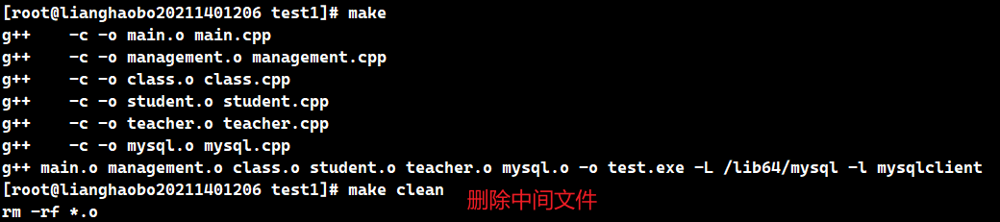

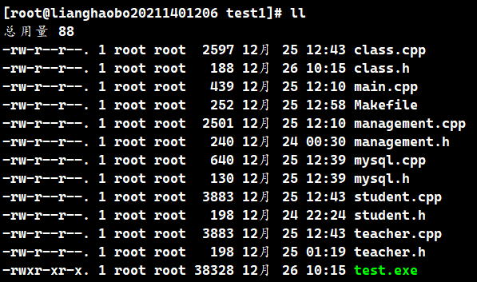

## 2、系统测试

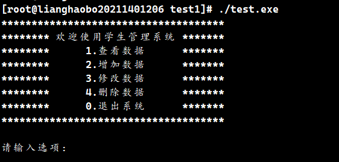

### 查询数据

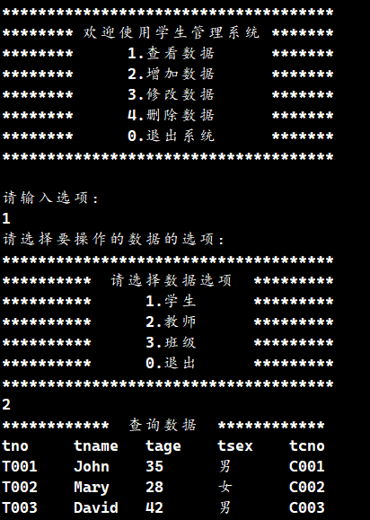

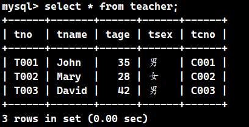

### 增添数据

> 插入一个新的班级jsj21-1

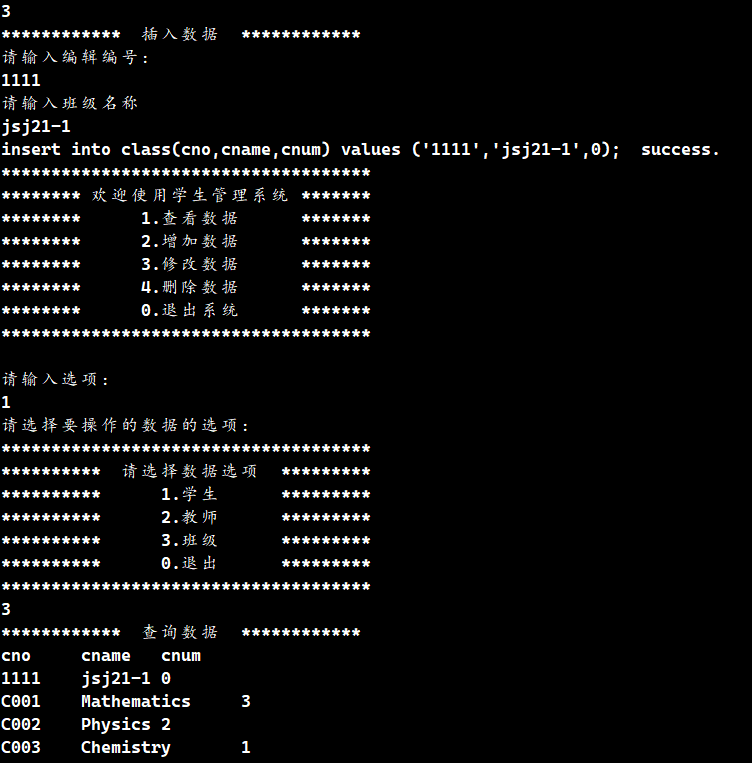

> 插入一条学生数据

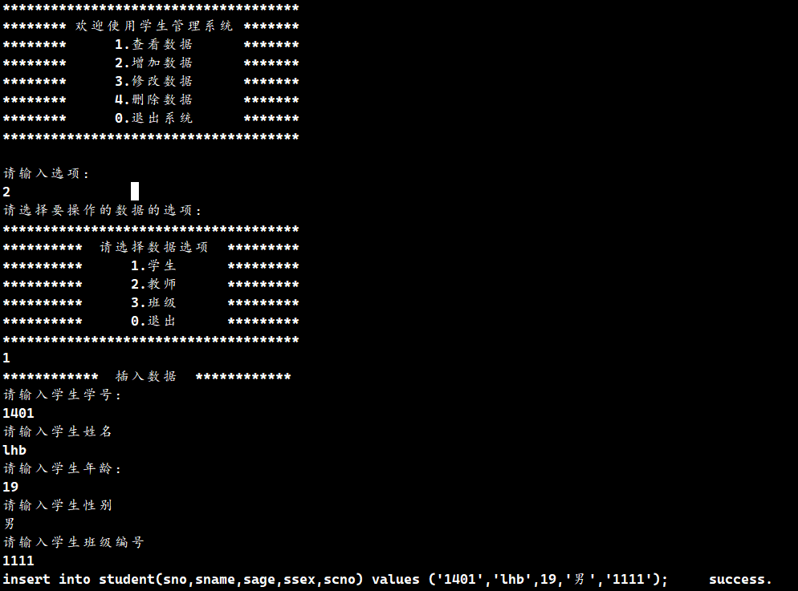

> 在mysql数据库中检查，jsj21-1班级中的班级人数从0变成了1

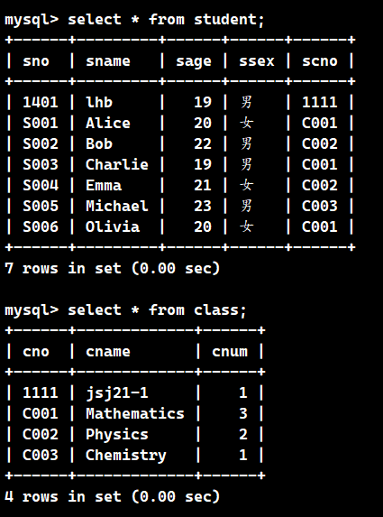

### 修改数据

> 原始数据

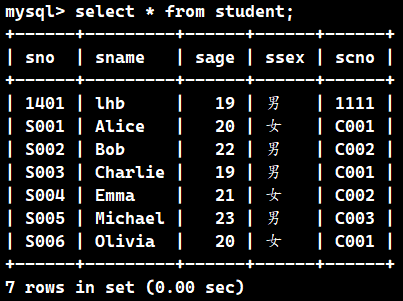

> 修改

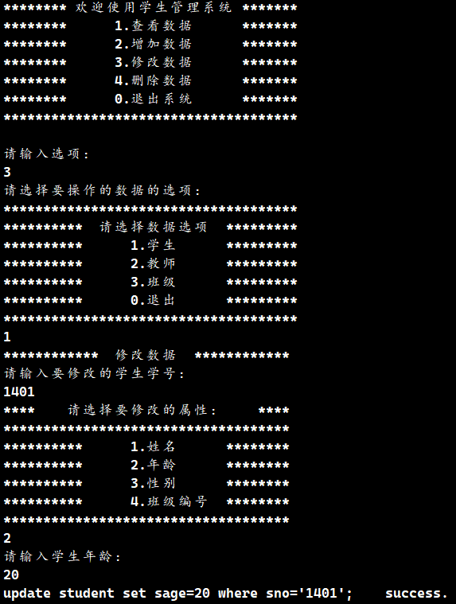

> 在mysql中检查修改是否成功

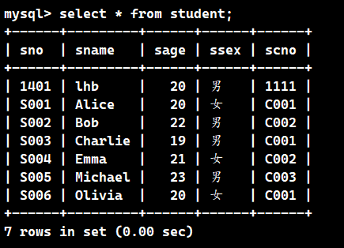

### 删除数据

> 原始数据

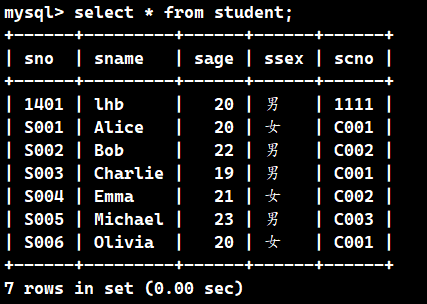

> 删除

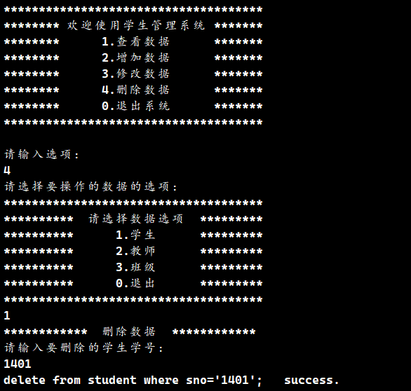

> 在mysql数据库中检查删除是否成功

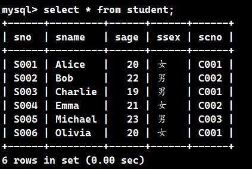

### 退出系统

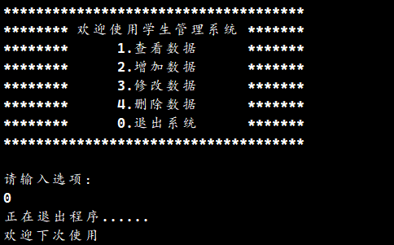
