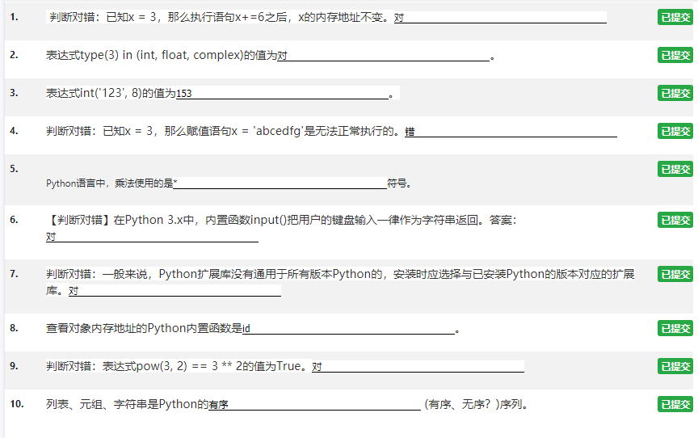

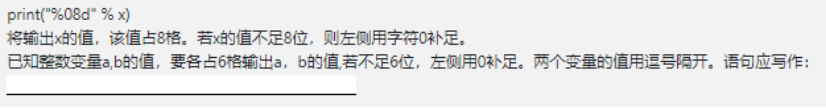

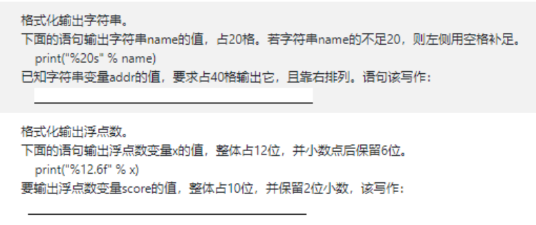

```python
x = 123
y = 456

print("x=%d" % x)

print("%8d" % x)

print("%-8d" % x, end='')
print("%-8d" % y)

print("%08d" % x, end=' ')
print("%08d" % x)
# # #
x = input("请输入x：")
y = input("请输入y：")
sum = x + y

print(x)
print(y)
print(sum)

x = int(input("请输入x："))
y = int(input("请输入y："))
sum = x + y

print(x)
print(y)
print(sum)

x=3.1415926535
print("%-40f"%x)
print("%.2f"%x)
print("%10.5f"%x)
s='asdfghjkl'
print("%20s"%s)
```

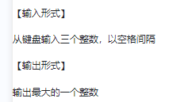

```python
a, b, c = input().split()
print(a)
print(b)
print(c)
print(max(a, b, c))
```

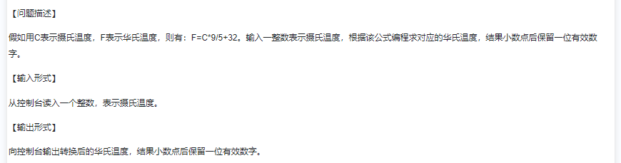

```python
c = eval(input("请输入摄氏温度："))
f = c * 9 / 5 + 32
print("%.1f" % f);
```

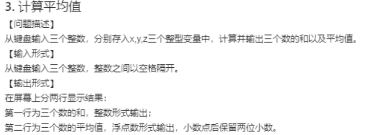

```python
x, y, z = map(int, input().split())
avg = x + y + z
mean = (x + y + z) / 3
print(avg)
print("%.2f" % mean)
```

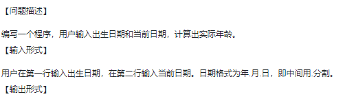

```python
y1, m1, d1 = map(int, input().split('.'))
y2, m2, d3 = map(int, input().split('.'))
print(y2-y1)
```

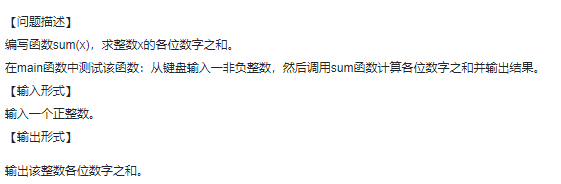

```python
def sum(x):
    i = 0
    while (x):
        i += x % 10
        x //= 10
    return i


x = int(input())
print(sum(x))
```

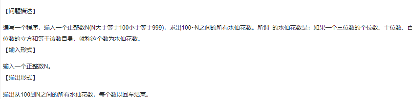

```python
x = int(input())
for i in range(100, x+1):
    a = i % 10
    b = (i // 10) % 10
    c = (i // 100) % 10
    if a ** 3 + b ** 3 + c ** 3 == i:
        print(i)

```

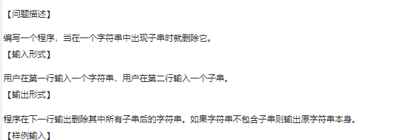

```python
s = input()
c = input()

s = s.replace(c, '')

print(s)
```

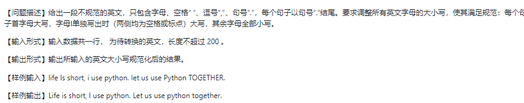

```python
str = 'life is short,i use python.let us use Python TOGETHER.'
ret = ''

for i in range(len(str)):
    if i == 0 or str[i - 1] == '.':
        ret += str[i].upper()
    elif str[i] == 'i' and ((str[i - 1] == ' ' and str[i + 1] == ' ') or (str[i - 1] == ',' and str[i + 1] == ' ')):
        ret += str[i].upper()
    elif str[i] == ',' or str[i] == ' ' or str[i] == '.':
        ret += str[i]
    else:
        ret += str[i].lower()

print(ret)
```

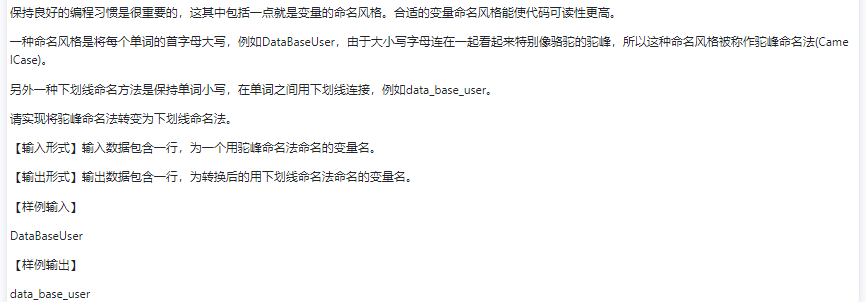

```python
str = input()
ret = ''

for i in range(len(str)):
    if i == 0 and ('A' <= str[i] <= 'Z'):
        ret += str[i].lower()
    elif 'A' <= str[i] <= 'Z':
        ret += '_'
        ret += str[i].lower()
    else:
        ret += str[i]

print(ret)
```

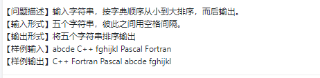

```python
str = input()
list = str.split(' ')

list.sort()

# list = sorted(list)

for i in list:
    print(i, end=' ')
```

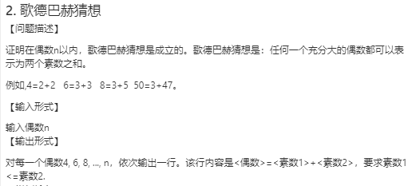

```python
def is_prime(n):
    if n <= 1:
        return False
    for i in range(2, int(n**0.5) + 1):
        if n % i == 0:
            return False
    return True

def verify_goldbach_conjecture(n):
    if n <= 2 or n % 2 != 0:
        return

    for i in range(2, n // 2 + 1):
        if is_prime(i) and is_prime(n - i):
            print(f"{n} = {i} + {n - i}")
            return

# 输入范围
start = 4
end = int(input("请输入一个整数："))

# 遍历范围内的偶数并验证哥德巴赫猜想
for num in range(start, end + 1, 2):
    verify_goldbach_conjecture(num)
```

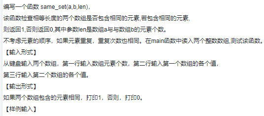

```python
def same_set(a,b,len):
    for i in a:
        if i in b:
            return 1
    return 0

num = int(input())
list1 = input().split(' ')
list2 = input().split(' ')

print(same_set(list1,list2,num))
```


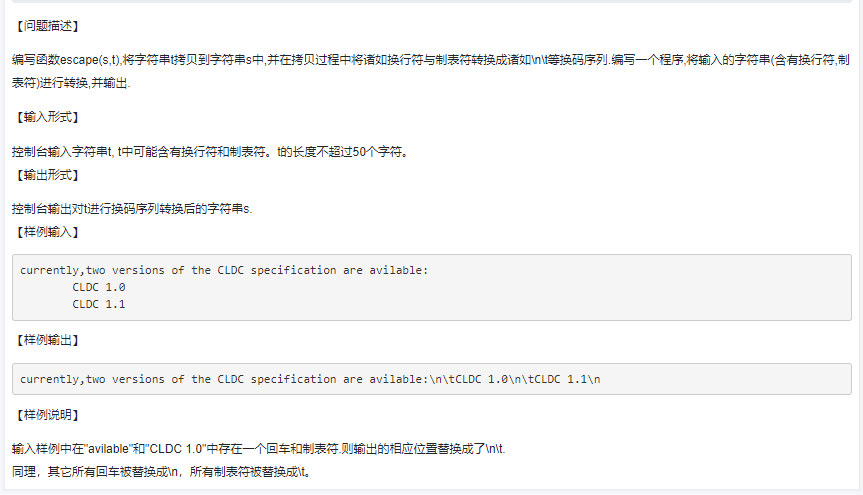

```python
def escape(s, t):
    # 将换行符和制表符转换为对应的转义序列
    t = t.replace('\n', '\\n').replace('\t', '\\t')
    # 将字符串 t 拷贝到字符串 s 中
    s = t
    return s


# 从标准输入读取输入字符（包含换行符和制表符）
input_str = """currently,two versions of the CLDC specification are avilable!
\tCLDC 1.0
\tCLDC 1.1"""
# 调用 escape() 函数进行转换
print(input_str)
output_str = escape("", input_str)
# 输出转换后的字符串
print(output_str)
```

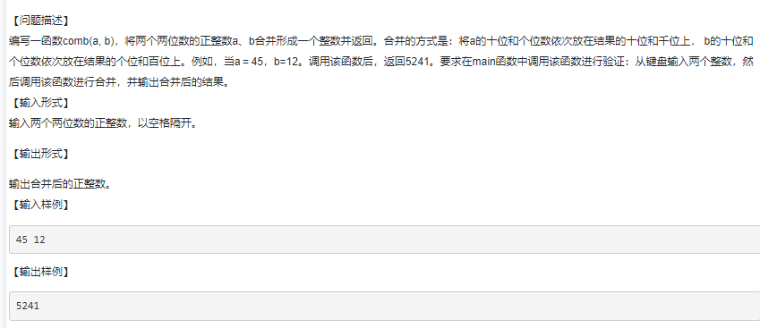

```python
def comb(a, b):
    th = a % 10
    h = b % 10
    t = a // 10
    z = b // 10
    return th * 1000 + h * 100 + t * 10 + z


a = int(input())
b = int(input())
print(comb(a, b))
```

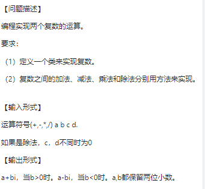

```python
class ComplexNumber:
    def __init__(self, real, imaginary):
        self.real = real
        self.imaginary = imaginary

    def __str__(self):
        if self.imaginary >= 0:
            return f"{self.real:.2f} + {self.imaginary:.2f}i"
        else:
            return f"{self.real:.2f} - {abs(self.imaginary):.2f}i"

    def add(self, other):
        real_sum = self.real + other.real
        imaginary_sum = self.imaginary + other.imaginary
        return ComplexNumber(real_sum, imaginary_sum)

    def subtract(self, other):
        real_diff = self.real - other.real
        imaginary_diff = self.imaginary - other.imaginary
        return ComplexNumber(real_diff, imaginary_diff)

    def multiply(self, other):
        real_product = self.real * other.real - self.imaginary * other.imaginary
        imaginary_product = self.real * other.imaginary + self.imaginary * other.real
        return ComplexNumber(real_product, imaginary_product)

    def divide(self, other):
        denominator = other.real ** 2 + other.imaginary ** 2
        real_quotient = (self.real * other.real + self.imaginary * other.imaginary) / denominator
        imaginary_quotient = (self.imaginary * other.real - self.real * other.imaginary) / denominator
        return ComplexNumber(real_quotient, imaginary_quotient)


# 创建两个复数对象
signal, a, b, c, d = input().split()
c1 = ComplexNumber(float(a), float(b))
c2 = ComplexNumber(float(c), float(d))

if signal=='+':
    # 加法
    sum_result = c1.add(c2)
    print(f"Sum: {sum_result}")
elif signal=='-':
    # 减法
    diff_result = c1.subtract(c2)
    print(f"Difference: {diff_result}")
elif signal=='*':
    # 乘法
    product_result = c1.multiply(c2)
    print(f"Product: {product_result}")
elif signal=='/':
    # 除法
    quotient_result = c1.divide(c2)
    print(f"Quotient: {quotient_result}")
```

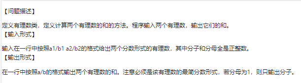

```python
class RationalNumber:
    def __init__(self, numerator, denominator):
        self.numerator = numerator
        self.denominator = denominator

    def __str__(self):
        if self.denominator == 1:
            return str(self.numerator)
        else:
            return f"{self.numerator}/{self.denominator}"

    def simplify(self):
        gcd = self.compute_gcd(self.numerator, self.denominator)
        self.numerator //= gcd
        self.denominator //= gcd

    def compute_gcd(self, a, b):
        while b:
            a, b = b, a % b
        return a

    def add(self, other):
        numerator_sum = self.numerator * other.denominator + other.numerator * self.denominator
        denominator_sum = self.denominator * other.denominator
        result = RationalNumber(numerator_sum, denominator_sum)
        result.simplify()
        return result

    def subtract(self, other):
        numerator_diff = self.numerator * other.denominator - other.numerator * self.denominator
        denominator_diff = self.denominator * other.denominator
        result = RationalNumber(numerator_diff, denominator_diff)
        result.simplify()
        return result

    def multiply(self, other):
        numerator_product = self.numerator * other.numerator
        denominator_product = self.denominator * other.denominator
        result = RationalNumber(numerator_product, denominator_product)
        result.simplify()
        return result

    def divide(self, other):
        numerator_quotient = self.numerator * other.denominator
        denominator_quotient = self.denominator * other.numerator
        result = RationalNumber(numerator_quotient, denominator_quotient)
        result.simplify()
        return result


# 输入两个有理数
r1, r2 = input("请输入两个分数形式的有理数，以空格分隔：").split()
numerator1, denominator1 = map(int, r1.split('/'))
numerator2, denominator2 = map(int, r2.split('/'))

# 创建两个有理数对象
rn1 = RationalNumber(numerator1, denominator1)
rn2 = RationalNumber(numerator2, denominator2)

# 计算两个有理数的和、差、积、商
sum_result = rn1.add(rn2)
diff_result = rn1.subtract(rn2)
product_result = rn1.multiply(rn2)
quotient_result = rn1.divide(rn2)

# 输出结果
print(f"加法结果: {sum_result}")
print(f"减法结果: {diff_result}")
print(f"乘法结果: {product_result}")
print(f"除法结果: {quotient_result}")
```

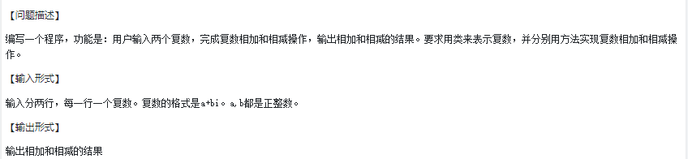

```python
class ComplexNumber:
    def __init__(self, real, imaginary):
        self.real = real
        self.imaginary = imaginary

    def __str__(self):
        if self.imaginary >= 0:
            return f"{self.real:.2f}+{self.imaginary:.2f}i"
        else:
            return f"{self.real:.2f}-{abs(self.imaginary):.2f}i"

    def add(self, other):
        real_sum = self.real + other.real
        imaginary_sum = self.imaginary + other.imaginary
        result = ComplexNumber(real_sum, imaginary_sum)
        return result

    def subtract(self, other):
        real_diff = self.real - other.real
        imaginary_diff = self.imaginary - other.imaginary
        result = ComplexNumber(real_diff, imaginary_diff)
        return result

    def multiply(self, other):
        real_product = self.real * other.real - self.imaginary * other.imaginary
        imaginary_product = self.real * other.imaginary + self.imaginary * other.real
        result = ComplexNumber(real_product, imaginary_product)
        return result

    def divide(self, other):
        denominator = other.real ** 2 + other.imaginary ** 2
        real_quotient = (self.real * other.real + self.imaginary * other.imaginary) / denominator
        imaginary_quotient = (self.imaginary * other.real - self.real * other.imaginary) / denominator
        result = ComplexNumber(real_quotient, imaginary_quotient)
        return result


# 输入两个复数
c1 = input("请输入第一个复数（格式：a+bi）：")
c2 = input("请输入第二个复数（格式：a+bi）：")

# 解析复数的实部和虚部
parts1 = c1.split('+')
real1 = int(parts1[0])
imaginary1 = int(parts1[1][:-1])  # 去除末尾的'i'

parts2 = c2.split('+')
real2 = int(parts2[0])
imaginary2 = int(parts2[1][:-1])  # 去除末尾的'i'

# 创建两个复数对象
cn1 = ComplexNumber(real1, imaginary1)
cn2 = ComplexNumber(real2, imaginary2)

# 计算复数的相加、相减、相乘和相除
sum_result = cn1.add(cn2)
diff_result = cn1.subtract(cn2)
product_result = cn1.multiply(cn2)
quotient_result = cn1.divide(cn2)

# 输出结果
print(f"相加的结果: {sum_result}")
print(f"相减的结果: {diff_result}")
print(f"相乘的结果: {product_result}")
print(f"相除的结果: {quotient_result}")
```

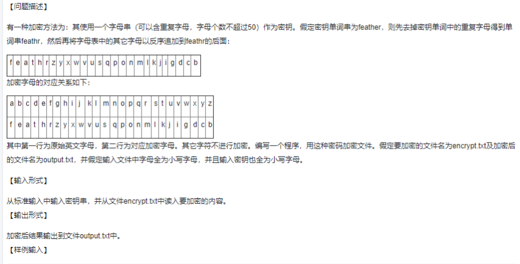

```python
str = input()
unique = []

# 去重
for c in str:
    if c not in unique:
        unique.append(c)

str = ''.join(unique)

# 加密字串
list = [char for char in str]
for i in range(122, 96, -1):
    if chr(i) in str:
        continue
    else:
        list.append(chr(i))

print(list)

# 读取文件数据
with open('F:\\source\\Python\\WorkSpace\\BasicCode\\test\\Python\\encrypt.txt', 'r') as f:
    data = f.read()

ret = ''
for i in data:
    if 97 <= ord(i) <= 122:
        ret += list[ord(i) - ord('a')]
    else:
        ret += i

with open('F:\\source\\Python\\WorkSpace\\BasicCode\\test\\Python\\output.txt','w') as f:
    f.write(ret)

```

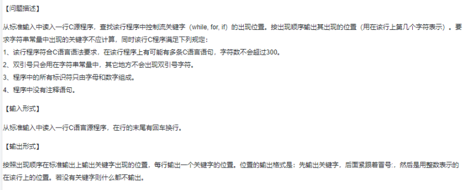

```python
import re

# 读取输入的C源程序行
c_program = input("请输入一行C源程序：")

# 定义控制流关键字
control_keywords = ['while', 'for']

# 使用正则表达式匹配控制流关键字的位置
pattern = r'\b(' + '|'.join(control_keywords) + r')\b'
matches = re.finditer(pattern, c_program)

# 输出关键字的位置
for match in matches:
    keyword = match.group()
    position = match.start() + 1  # 位置从1开始
    print(f"{keyword}:{position}")
```

