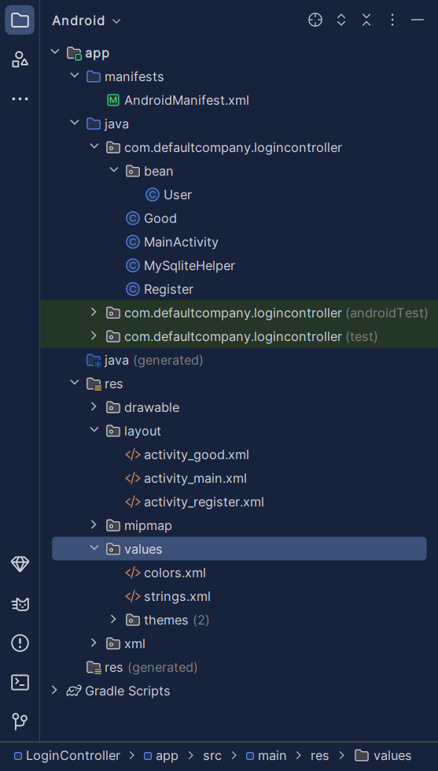

# 计算器


```xml
<?xml version="1.0" encoding="utf-8"?>
<shape xmlns:android="http://schemas.android.com/apk/res/android">
    <solid android:color="@color/gray"/>
    <stroke android:width="0.3dp" android:color="#000000"/>
</shape>
```

```xml
<?xml version="1.0" encoding="utf-8"?>
<androidx.constraintlayout.widget.ConstraintLayout xmlns:android="http://schemas.android.com/apk/res/android"
    xmlns:app="http://schemas.android.com/apk/res-auto"
    xmlns:tools="http://schemas.android.com/tools"
    android:layout_width="match_parent"
    android:layout_height="match_parent"
    tools:context=".MainActivity">
    <LinearLayout
        android:layout_width="match_parent"
        android:layout_height="match_parent"
        tools:context=".MainActivity"
        android:orientation="vertical">
        <LinearLayout
            android:layout_width="match_parent"
            android:layout_height="wrap_content">

            <TextView
                android:id="@+id/textView"
                android:layout_width="match_parent"
                android:layout_height="wrap_content"
                android:textSize="20sp"
                android:background="@color/white"
                android:textColor="@color/teal_200"
                android:text="个人科学计算器"
                android:gravity="center"
                android:layout_gravity="center_vertical"/>
        </LinearLayout>
        <LinearLayout
            android:layout_width="match_parent"
            android:layout_height="0dp"
            android:layout_weight="1"
            android:layout_marginTop="1dp"
            android:orientation="vertical">
            <EditText
                android:id="@+id/editView"
                android:layout_marginTop="10dp"
                android:background="@color/white"
                android:editable="false"
                android:hint="Please enter..."
                android:textColorHint="@color/gray"
                android:textColor="@color/black"
                android:gravity="center_vertical|start"
                android:textSize="25sp"
                tools:ignore="Deprecated"
                android:layout_height="match_parent"
                android:layout_width="match_parent" />
        </LinearLayout>

        <LinearLayout
            android:layout_width="match_parent"
            android:layout_height="0dp"
            android:layout_weight="5"
            android:background="@color/black"
            android:orientation="vertical">

            <LinearLayout
                android:layout_width="match_parent"
                android:layout_height="0dp"
                android:layout_marginTop="10dp"
                android:layout_weight="1"
                android:orientation="horizontal">

                <Button
                    android:layout_width="0dp"
                    android:layout_height="match_parent"
                    android:layout_weight="1"
                    android:background="@drawable/button_style1"
                    android:onClick="empty"
                    android:text="c"
                    android:textColor="@color/blue"
                    android:textSize="20sp" />

                <Button
                    android:layout_width="0dp"
                    android:layout_height="match_parent"
                    android:layout_marginLeft="1dp"
                    android:layout_weight="1"
                    android:background="@drawable/button_style1"
                    android:onClick="delete"
                    android:text="delete"
                    android:textColor="@color/blue"
                    android:textSize="20sp" />
            </LinearLayout>

            <LinearLayout
                android:layout_width="match_parent"
                android:layout_height="0dp"
                android:layout_marginTop="1dp"
                android:layout_weight="1"
                android:orientation="horizontal">

                <Button
                    android:layout_width="0dp"
                    android:layout_height="match_parent"
                    android:layout_weight="1"
                    android:background="@drawable/button_style1"
                    android:onClick="squareRoot"
                    android:text="√"
                    android:textAllCaps="false"
                    android:textSize="20sp" />

                <Button
                    android:layout_width="0dp"
                    android:layout_height="match_parent"
                    android:layout_marginLeft="1dp"
                    android:layout_weight="1"
                    android:background="@drawable/button_style1"
                    android:onClick="eulerNumber"
                    android:text="e"
                    android:textAllCaps="false"
                    android:textSize="20sp" />

                <Button
                    android:layout_width="0dp"
                    android:layout_height="match_parent"
                    android:layout_marginLeft="1dp"
                    android:layout_weight="1"
                    android:background="@drawable/button_style1"
                    android:onClick="log"
                    android:text="log"
                    android:textAllCaps="false"
                    android:textSize="20sp" />

                <Button
                    android:layout_width="0dp"
                    android:layout_height="match_parent"
                    android:layout_weight="1"
                    android:background="@drawable/button_style1"
                    android:onClick="ln"
                    android:text="ln"
                    android:textAllCaps="false"
                    android:textSize="20sp" />
            </LinearLayout>

            <LinearLayout
                android:layout_width="match_parent"
                android:layout_height="0dp"
                android:layout_marginTop="1dp"
                android:layout_weight="1"
                android:orientation="horizontal">

                <Button
                    android:layout_width="0dp"
                    android:layout_height="match_parent"
                    android:layout_marginLeft="1dp"
                    android:layout_weight="1"
                    android:background="@drawable/button_style1"
                    android:onClick="pi"
                    android:text="π"
                    android:textAllCaps="false"
                    android:textSize="20sp" />

                <Button
                    android:layout_width="0dp"
                    android:layout_height="match_parent"
                    android:layout_marginLeft="1dp"
                    android:layout_weight="1"
                    android:background="@drawable/button_style1"
                    android:onClick="tan"
                    android:text="tan"
                    android:textAllCaps="false"
                    android:textSize="20sp" />

                <Button
                    android:layout_width="0dp"
                    android:layout_height="match_parent"
                    android:layout_marginLeft="1dp"
                    android:layout_weight="1"
                    android:background="@drawable/button_style1"
                    android:onClick="cos"
                    android:text="cos"
                    android:textAllCaps="false"
                    android:textSize="20sp" />

                <Button
                    android:layout_width="0dp"
                    android:layout_height="match_parent"
                    android:layout_weight="1"
                    android:background="@drawable/button_style1"
                    android:onClick="sin"
                    android:text="sin"
                    android:textAllCaps="false"
                    android:textSize="20sp" />

            </LinearLayout>

            <LinearLayout
                android:layout_width="match_parent"
                android:layout_height="0dp"
                android:layout_marginTop="1dp"
                android:layout_weight="1"
                android:orientation="horizontal">

                <Button
                    android:layout_width="0dp"
                    android:layout_height="match_parent"
                    android:layout_marginLeft="1dp"
                    android:layout_weight="1"
                    android:background="@drawable/button_style1"
                    android:onClick="power"
                    android:text="x^y"
                    android:textAllCaps="false"
                    android:textSize="20sp" />

                <Button
                    android:layout_width="0dp"
                    android:layout_height="match_parent"
                    android:layout_marginLeft="1dp"
                    android:layout_weight="1"
                    android:background="@drawable/button_style1"
                    android:onClick="factorial"
                    android:text="x!"
                    android:textAllCaps="false"
                    android:textSize="20sp" />

                <Button
                    android:layout_width="0dp"
                    android:layout_height="match_parent"
                    android:layout_marginLeft="1dp"
                    android:layout_weight="1"
                    android:background="@drawable/button_style1"
                    android:onClick="reciprocal"
                    android:text="1/x"
                    android:textAllCaps="false"
                    android:textSize="20sp" />

                <Button
                    android:layout_width="0dp"
                    android:layout_height="match_parent"
                    android:layout_marginLeft="1dp"
                    android:layout_weight="1"
                    android:background="@drawable/button_style1"
                    android:onClick="square"
                    android:text="x^2"
                    android:textAllCaps="false"
                    android:textSize="20sp" />

            </LinearLayout>

            <LinearLayout
                android:layout_width="match_parent"
                android:layout_height="0dp"
                android:layout_marginTop="1dp"
                android:layout_weight="1"
                android:orientation="horizontal">

                <Button
                    android:layout_width="0dp"
                    android:layout_height="match_parent"
                    android:layout_weight="1"
                    android:background="@drawable/button_style1"
                    android:onClick="clickButton"
                    android:text="("
                    android:textAllCaps="false"
                    android:textColor="@color/blue"
                    android:textSize="20sp" />

                <Button
                    android:layout_width="0dp"
                    android:layout_height="match_parent"
                    android:layout_marginLeft="1dp"
                    android:layout_weight="1"
                    android:background="@drawable/button_style1"
                    android:onClick="clickButton"
                    android:text=")"
                    android:textAllCaps="false"
                    android:textColor="@color/blue"
                    android:textSize="20sp" />

                <Button
                    android:layout_width="0dp"
                    android:layout_height="match_parent"
                    android:layout_marginLeft="1dp"
                    android:layout_weight="1"
                    android:background="@drawable/button_style1"
                    android:onClick="div"
                    android:text="÷"
                    android:textColor="@color/blue"
                    android:textSize="25sp" />

                <Button
                    android:layout_width="0dp"
                    android:layout_height="match_parent"
                    android:layout_marginLeft="1dp"
                    android:layout_weight="1"
                    android:background="@drawable/button_style1"
                    android:onClick="mul"
                    android:text="×"
                    android:textColor="@color/blue"
                    android:textSize="25sp" />
            </LinearLayout>

            <LinearLayout
                android:layout_width="match_parent"
                android:layout_height="0dp"
                android:layout_marginTop="1dp"
                android:layout_weight="1"
                android:onClick="clickButton"
                android:orientation="horizontal">

                <Button
                    android:layout_width="0dp"
                    android:layout_height="match_parent"
                    android:layout_weight="1"
                    android:background="@color/white"
                    android:onClick="clickButton"
                    android:text="7"
                    android:textSize="20sp" />

                <Button
                    android:layout_width="0dp"
                    android:layout_height="match_parent"
                    android:layout_marginLeft="1dp"
                    android:layout_weight="1"
                    android:background="@color/white"
                    android:onClick="clickButton"
                    android:text="8"
                    android:textSize="20sp" />

                <Button
                    android:layout_width="0dp"
                    android:layout_height="match_parent"
                    android:layout_marginLeft="1dp"
                    android:layout_weight="1"
                    android:background="@color/white"
                    android:onClick="clickButton"
                    android:text="9"
                    android:textSize="20sp" />

                <Button
                    android:layout_width="0dp"
                    android:layout_height="match_parent"
                    android:layout_marginLeft="1dp"
                    android:layout_weight="1"
                    android:background="@drawable/button_style1"
                    android:onClick="clickButton"
                    android:text="-"
                    android:textColor="@color/blue"
                    android:textSize="25sp" />
            </LinearLayout>

            <LinearLayout
                android:layout_width="match_parent"
                android:layout_height="0dp"
                android:layout_marginTop="1dp"
                android:layout_weight="1"
                android:orientation="horizontal">

                <Button
                    android:layout_width="0dp"
                    android:layout_height="match_parent"
                    android:layout_weight="1"
                    android:background="@color/white"
                    android:onClick="clickButton"
                    android:text="4"
                    android:textSize="20sp" />

                <Button
                    android:layout_width="0dp"
                    android:layout_height="match_parent"
                    android:layout_marginLeft="1dp"
                    android:layout_weight="1"
                    android:background="@color/white"
                    android:onClick="clickButton"
                    android:text="5"
                    android:textSize="20sp" />

                <Button
                    android:layout_width="0dp"
                    android:layout_height="match_parent"
                    android:layout_marginLeft="1dp"
                    android:layout_weight="1"
                    android:background="@color/white"
                    android:onClick="clickButton"
                    android:text="6"
                    android:textSize="20sp" />

                <Button
                    android:layout_width="0dp"
                    android:layout_height="match_parent"
                    android:layout_marginLeft="1dp"
                    android:layout_weight="1"
                    android:background="@drawable/button_style1"
                    android:onClick="clickButton"
                    android:text="+"
                    android:textColor="@color/blue"
                    android:textSize="20sp" />
            </LinearLayout>

            <LinearLayout
                android:layout_width="match_parent"
                android:layout_height="0dp"
                android:layout_marginTop="1dp"
                android:layout_weight="2"
                android:orientation="horizontal">

                <LinearLayout
                    android:layout_width="0dp"
                    android:layout_height="match_parent"
                    android:layout_weight="1"
                    android:orientation="vertical">

                    <Button
                        android:layout_width="match_parent"
                        android:layout_height="0dp"
                        android:layout_weight="1"
                        android:background="@color/white"
                        android:onClick="clickButton"
                        android:text="1"
                        android:textSize="20sp" />

                    <Button
                        android:layout_width="match_parent"
                        android:layout_height="0dp"
                        android:layout_marginTop="1dp"
                        android:layout_weight="1"
                        android:background="@color/white"
                        android:onClick="percentage"
                        android:text="%"
                        android:textSize="20sp" />
                </LinearLayout>

                <LinearLayout
                    android:layout_width="0dp"
                    android:layout_height="match_parent"
                    android:layout_marginLeft="1dp"
                    android:layout_weight="1"
                    android:orientation="vertical">

                    <Button
                        android:layout_width="match_parent"
                        android:layout_height="0dp"
                        android:layout_weight="1"
                        android:background="@color/white"
                        android:onClick="clickButton"
                        android:text="2"
                        android:textSize="20sp" />

                    <Button
                        android:layout_width="match_parent"
                        android:layout_height="0dp"
                        android:layout_marginTop="1dp"
                        android:layout_weight="1"
                        android:background="@color/white"
                        android:onClick="clickButton"
                        android:text="0"
                        android:textSize="20sp" />
                </LinearLayout>

                <LinearLayout
                    android:layout_width="0dp"
                    android:layout_height="match_parent"
                    android:layout_marginLeft="1dp"
                    android:layout_weight="1"
                    android:orientation="vertical">

                    <Button
                        android:layout_width="match_parent"
                        android:layout_height="0dp"
                        android:layout_weight="1"
                        android:background="@color/white"
                        android:onClick="clickButton"
                        android:text="3"
                        android:textSize="20sp" />

                    <Button
                        android:layout_width="match_parent"
                        android:layout_height="0dp"
                        android:layout_marginTop="1dp"
                        android:layout_weight="1"
                        android:background="@color/white"
                        android:onClick="clickButton"
                        android:text="."
                        android:textSize="20sp" />
                </LinearLayout>

                <LinearLayout
                    android:layout_width="0dp"
                    android:layout_height="match_parent"
                    android:layout_marginLeft="1dp"
                    android:layout_weight="1"
                    android:orientation="vertical">

                    <Button
                        android:layout_width="match_parent"
                        android:layout_height="match_parent"
                        android:background="@color/blue"
                        android:onClick="equal"
                        android:text="="
                        android:textColor="@color/white"
                        android:textSize="25sp" />
                </LinearLayout>
            </LinearLayout>
        </LinearLayout>
    </LinearLayout>
</androidx.constraintlayout.widget.ConstraintLayout>
```

```java
package com.defaultcompany.calculator;

import androidx.appcompat.app.AppCompatActivity;

import android.os.Bundle;
import android.view.View;
import android.widget.Button;
import android.widget.EditText;
import android.widget.TextView;

import java.util.ArrayList;
import java.util.List;
import java.util.Stack;

/*
    infixExpression:中缀表达式
    suffixExpression:后缀表达式
 */
public class MainActivity extends AppCompatActivity {

    //输入框
    private EditText editText;
    //错误提示框
    private TextView text;
    //参与运算的式子，用于记忆计算
    private final StringBuilder str = new StringBuilder();
    //是否出错的标志
    private int indexYN = 0;

    @Override
    protected void onCreate(Bundle savedInstanceState) {
        super.onCreate(savedInstanceState);
        setContentView(R.layout.activity_main);

        //组件绑定
        editText = (EditText) findViewById(R.id.editView);
        text = (TextView) findViewById(R.id.textView);
    }

    //1234567890+-.()
    public void clickButton(View view) {
        Button button = (Button) view;
        editText.append(button.getText());
        str.append(button.getText());
    }

    //除
    public void div(View view) {
        editText.append("/");
        str.append("/");
    }

    //乘
    public void mul(View view) {
        editText.append("*");
        str.append("*");
    }

    //清空
    public void empty(View view) {
        editText.setText(null);
        text.setText(null);
        str.delete(0, str.length());
    }

    //删除
    public void delete(View view) {
        String nowText = editText.getText().toString();
        if (!nowText.isEmpty() && str.length() != 0) {
            editText.setText(nowText.substring(0, nowText.length() - 1));
            str.deleteCharAt(str.length() - 1);
        }
        text.setText(null);
    }

    //等于
    public void equal(View view) {
        indexYN = 0;
        /*
            System.out.println("str:\t" + str);
            System.out.println("length:\t" + str.length());
         */
        //错误检测
        estimate();

        if (indexYN == 0) {
            //转化为中缀表达式
            List<String> infixExpression = turnIntoInfixExpression(str.toString());
            System.out.println(infixExpression);

            //将中缀表达式转换为逆波兰式
            List<String> suffixExpression = turnIntoSuffixExpression(infixExpression);
            System.out.println(suffixExpression);

            //计算
            double ret = math(suffixExpression);
            editText.setText(String.valueOf(ret));
            str.delete(0, str.length());
            str.append(ret);
        }
    }

    //倒数
    public void reciprocal(View view) {
        editText.append("1/");
        str.append("1/");
    }

    //阶乘
    public void factorial(View view) {
        editText.append("!");
        str.append("!");
    }

    //平方
    public void square(View view) {
        editText.append("^2");
        str.append("^2");
    }
    //幂
    public void power(View view) {
        editText.append("^");
        str.append("^");
    }

    //开方
    public void squareRoot(View view) {
        editText.append("√");
        str.append("g");
    }

    //欧拉数e
    public void eulerNumber(View view) {
        editText.append("e");
        str.append("e");
    }

    //百分数
    public void percentage(View view) {
        editText.append("%");
        str.append("*0.01");
    }

    //圆周率
    public void pi(View view) {
        editText.append("π");
        str.append("p");
    }

    //sin
    public void sin(View view) {
        editText.append("sin");
        str.append("s");
    }

    //cos
    public void cos(View view) {
        editText.append("cos");
        str.append("c");
    }

    //tan
    public void tan(View view) {
        editText.append("tan");
        str.append("t");
    }

    //ln
    public void ln(View view) {
        editText.append("ln");
        str.append("l");
    }

    //log
    public void log(View view) {
        editText.append("log");
        str.append("o");
    }

    //把输入的字符串转换成中缀表达式。存入list中
    private List<String> turnIntoInfixExpression(String str) {
        int index = 0;
        List<String> list = new ArrayList<>();
        do {
            char ch = str.charAt(index);
            if ("+-*/^!logsct()".indexOf(str.charAt(index)) >= 0) {
                //是操作符，直接添加至list中
                index++;
                list.add(ch + "");
            } else if (str.charAt(index) == 'e' || str.charAt(index) == 'p') {
                index++;
                list.add(ch + "");
            } else if ("0123456789".indexOf(str.charAt(index)) >= 0) {
                //是数字,判断多位数的情况
                StringBuilder str1 = new StringBuilder();
                while (index < str.length()
                        && "0123456789.".indexOf(str.charAt(index)) >= 0) {
                    str1.append(str.charAt(index));
                    index++;
                }
                list.add(str1.toString());
            }
        } while (index < str.length());
        return list;
    }

    //中缀表达式转换称后缀表达式
    public List<String> turnIntoSuffixExpression(List<String> list) {
        Stack<String> fuZhan = new Stack<>();
        List<String> list2 = new ArrayList<>();
        if (!list.isEmpty()) {
            for (int i = 0; i < list.size(); i++) {
                if (isNumber(list.get(i))) {
                    list2.add(list.get(i));
                } else if (list.get(i).charAt(0) == '(') {
                    fuZhan.push(list.get(i));
                } else if (isOperator(list.get(i)) && list.get(i).charAt(0) != '(') {
                    if (fuZhan.isEmpty()) {
                        fuZhan.push(list.get(i));
                    } else {//符栈不为空
                        if (list.get(i).charAt(0) != ')') {
                            if (adv(fuZhan.peek()) <= adv(list.get(i))) {
                                //入栈
                                fuZhan.push(list.get(i));
                            } else {
                                //出栈
                                while (!fuZhan.isEmpty() && !"(".equals(fuZhan.peek())) {
                                    if (adv(list.get(i)) <= adv(fuZhan.peek())) {
                                        list2.add(fuZhan.pop());
                                    }
                                }
                                if (fuZhan.isEmpty() || fuZhan.peek().charAt(0) == '(') {
                                    fuZhan.push(list.get(i));
                                }
                            }
                        } else if (list.get(i).charAt(0) == ')') {
                            while (fuZhan.peek().charAt(0) != '(') {
                                list2.add(fuZhan.pop());
                            }
                            fuZhan.pop();
                        }
                    }
                }
            }
            while (!fuZhan.isEmpty()) {
                list2.add(fuZhan.pop());
            }
        } else {
            editText.setText("");
        }
        return list2;
    }

    //判断是否为操作符
    public static boolean isOperator(String op) {
        return "0123456789.ep".indexOf(op.charAt(0)) == -1;
    }

    //判断是否为操作数
    public static boolean isNumber(String num) {
        return "0123456789ep".indexOf(num.charAt(0)) >= 0;
    }

    //判断操作符的优先级
    public static int adv(String f) {
        int result = 0;
        switch (f) {
            case "+":
            case "-":
                result = 1;
                break;
            case "*":
            case "/":
                result = 2;
                break;
            case "^":
                result = 3;
                break;
            case "!":
            case "g":
            case "l":
            case "o":
            case "s":
            case "c":
            case "t":
                result = 4;
                break;
        }
        return result;
    }

    //通过后缀表达式进行计算
    public double math(List<String> list2) {
        Stack<String> stack = new Stack<>();
        for (int i = 0; i < list2.size(); i++) {
            if (isNumber(list2.get(i))) {
                if (list2.get(i).charAt(0) == 'e') {
                    stack.push(String.valueOf(Math.E));
                } else if (list2.get(i).charAt(0) == 'p') {
                    stack.push(String.valueOf(Math.PI));
                } else {
                    stack.push(list2.get(i));
                }
            } else if (isOperator(list2.get(i))) {
                double res = 0;
                switch (list2.get(i)) {
                    case "+": {
                        double num2 = Double.parseDouble(stack.pop());
                        double num1 = Double.parseDouble(stack.pop());
                        res = num1 + num2;
                        break;
                    }
                    case "-": {
                        double num2 = Double.parseDouble(stack.pop());
                        double num1 = Double.parseDouble(stack.pop());
                        res = num1 - num2;
                        break;
                    }
                    case "*": {
                        double num2 = Double.parseDouble(stack.pop());
                        double num1 = Double.parseDouble(stack.pop());
                        res = num1 * num2;
                        break;
                    }
                    case "/": {
                        double num2 = Double.parseDouble(stack.pop());
                        double num1 = Double.parseDouble(stack.pop());
                        if (num2 != 0) {
                            res = num1 / num2;
                        } else {
                            text.setText("Can't be divided by 0!");
                            indexYN = 1;
                        }
                        break;
                    }
                    case "^": {
                        double num2 = Double.parseDouble(stack.pop());
                        double num1 = Double.parseDouble(stack.pop());
                        res = Math.pow(num1, num2);
                        break;
                    }
                    case "!": {
                        double num1 = Double.parseDouble(stack.pop());
                        if (num1 == 0 || num1 == 1) {
                            res = 1;
                        } else if (num1 == (int) num1 && num1 > 1) {
                            int d = 1;
                            for (int j = (int) num1; j > 0; j--) {
                                d *= j;
                            }
                            res = d;
                        } else {
                            text.setText("The factorial must be a natural number!");
                            indexYN = 1;
                        }
                        break;
                    }
                    case "g": {
                        double num1 = Double.parseDouble(stack.pop());
                        res = Math.sqrt(num1);
                        break;
                    }
                    case "l": {
                        double num1 = Double.parseDouble(stack.pop());
                        if (num1 > 0) {
                            res = Math.log(num1);
                        } else {
                            text.setText("The variable x in ln must be greater than 0!");
                            indexYN = 1;
                        }
                        break;
                    }
                    case "o": {
                        double num1 = Double.parseDouble(stack.pop());
                        if (num1 > 0) {
                            res = Math.log(num1) / Math.log(2);
                        } else {
                            text.setText("The variable x in function log must be greater than 0!");
                            indexYN = 1;
                        }
                        break;
                    }
                    case "s": {
                        double num1 = Double.parseDouble(stack.pop());
                        res = Math.sin(num1);
                        break;
                    }
                    case "c": {
                        double num1 = Double.parseDouble(stack.pop());
                        res = Math.cos(num1);
                        break;
                    }
                    case "t": {
                        double num1 = Double.parseDouble(stack.pop());
                        if (Math.cos(num1) != 0) {
                            res = Math.tan(num1);
                        } else {
                            text.setText("The variable in function tan can't be +-(π/2 + kπ)!");
                            indexYN = 1;
                        }
                        break;
                    }
                }
                stack.push("" + res);
            }
        }
        if (indexYN == 0) {
            if (!stack.isEmpty()) {
                return Double.parseDouble(stack.pop());
            } else {
                return 0;
            }
        } else {
            return -999999;
        }
    }

    //判断输入是否错误
    public void estimate() {
        int i;
        if (str.length() == 0) {
            text.setText("Error!");
            indexYN = 1;
        }
        if (str.length() == 1) {
            //当只有一位字符时，只能是“0123456789ep”中的一个
            if ("0123456789ep".indexOf(str.charAt(0)) == -1) {
                text.setText("Error!");
                indexYN = 1;
            }
        }
        if (str.length() > 1) {
            for (i = 0; i < str.length() - 1; i++) {
                //1.第一个字符只能为"losctg(0123456789ep"中的一个
                if ("losctg(0123456789ep".indexOf(str.charAt(0)) == -1) {
                    text.setText("Error!");
                    indexYN = 1;
                }
                //2.“+-*/”后面只能是"0123456789losctg(ep"中的一个
                if ("+-*/".indexOf(str.charAt(i)) >= 0
                        && "0123456789losctg(ep".indexOf(str.charAt(i + 1)) == -1) {
                    text.setText("Error!");
                    indexYN = 1;
                }
                //3."."后面只能是“0123456789”中的一个
                if (str.charAt(i) == '.' && "0123456789".indexOf(str.charAt(i + 1)) == -1) {
                    text.setText("Error!");
                    indexYN = 1;
                }
                //4."!"后面只能是“+-*/^)”中的一个
                if (str.charAt(i) == '!' && "+-*/^)".indexOf(str.charAt(i + 1)) == -1) {
                    text.setText("Error!");
                    indexYN = 1;
                }
                //5."losctg"后面只能是“0123456789(ep”中的一个
                if ("losctg".indexOf(str.charAt(i)) >= 0 && "0123456789(ep".indexOf(str.charAt(i + 1)) == -1) {
                    text.setText("Error!");
                    indexYN = 1;
                }
                //6."0"的判断操作
                if (str.charAt(0) == '0' && str.charAt(1) == '0') {
                    text.setText("Error!");
                    indexYN = 1;
                }
                if (i >= 1 && str.charAt(i) == '0') {
                    //&& str.charAt(0) == '0' && str.charAt(1) == '0'
                    int n = i;
                    int is = 0;
                    //1.当0的上一个字符不为"0123456789."时，后一位只能是“+-*/.!^)”中的一个
                    if ("0123456789.".indexOf(str.charAt(i - 1)) == -1 && "+-*/.!^)".indexOf(str.charAt(i + 1)) == -1) {
                        text.setText("Error!");
                        indexYN = 1;
                    }
                    //2.如果0的上一位为“.”,则后一位只能是“0123456789+-*/.^)”中的一个
                    if (str.charAt(i - 1) == '.' && "0123456789+-*/.^)".indexOf(str.charAt(i + 1)) == -1) {
                        text.setText("Error!");
                        indexYN = 1;
                    }
                    n -= 1;
                    while (n > 0) {
                        if ("(+-*/^glosct".indexOf(str.charAt(n)) >= 0) {
                            break;
                        }
                        if (str.charAt(n) == '.') {
                            is++;
                        }
                        n--;
                    }

                    //3.如果0到上一个运算符之间没有“.”的话，整数位第一个只能是“123456789”，
                    //  且后一位只能是“0123456789+-*/.!^)”中的一个。
                    if ((is == 0 && str.charAt(n) == '0') || "0123456789+-*/.!^)".indexOf(str.charAt(i + 1)) == -1) {
                        text.setText("Error!");
                        indexYN = 1;
                    }
                    //4.如果0到上一个运算符之间有一个“.”的话,则后一位只能是“0123456789+-*/.^)”中的一个
                    if (is == 1 && "0123456789+-*/.^)".indexOf(str.charAt(i + 1)) == -1) {
                        text.setText("Error!");
                        indexYN = 1;
                    }
                    if (is > 1) {
                        text.setText("Error!");
                        indexYN = 1;
                    }

                }
                //7."123456789"后面只能是“0123456789+-*/.!^)”中的一个
                if ("123456789".indexOf(str.charAt(i)) >= 0 && "0123456789+-*/.!^)".indexOf(str.charAt(i + 1)) == -1) {
                    text.setText("Error!");
                    indexYN = 1;
                }
                //8."("后面只能是“0123456789locstg()ep”中的一个
                if (str.charAt(i) == '(' && "0123456789locstg()ep".indexOf(str.charAt(i + 1)) == -1) {
                    text.setText("Error!");
                    indexYN = 1;
                }
                //9.")"后面只能是“+-*/!^)”中的一个
                if (str.charAt(i) == ')' && "+-*/!^)".indexOf(str.charAt(i + 1)) == -1) {
                    text.setText("Error!");
                    indexYN = 1;
                }
                //10.最后一位字符只能是“0123456789!)ep”中的一个
                if ("0123456789!)ep".indexOf(str.charAt(str.length() - 1)) == -1) {
                    text.setText("Error!");
                    indexYN = 1;
                }
                //11.不能有多个“.”
                if (i > 2 && str.charAt(i) == '.') {
                    int n = i - 1;
                    int is = 0;
                    while (n > 0) {
                        if ("(+-*/^glosct".indexOf(str.charAt(n)) >= 0) {
                            break;
                        }
                        if (str.charAt(n) == '.') {
                            is++;
                        }
                        n--;
                    }
                    if (is > 0) {
                        text.setText("Error!");
                        indexYN = 1;
                    }
                }
                //12."ep"后面只能是“+-*/^)”中的一个
                if ("ep".indexOf(str.charAt(i)) >= 0 && "+-*/^)".indexOf(str.charAt(i + 1)) == -1) {
                    text.setText("Error!");
                    indexYN = 1;
                }
            }
        }
    }
}
```

# 视频播放器


```xml
<?xml version="1.0" encoding="utf-8"?>
<androidx.constraintlayout.widget.ConstraintLayout xmlns:android="http://schemas.android.com/apk/res/android"
    xmlns:app="http://schemas.android.com/apk/res-auto"
    xmlns:tools="http://schemas.android.com/tools"
    android:id="@+id/main"
    android:layout_width="match_parent"
    android:layout_height="match_parent"
    tools:context=".MainActivity">

    <LinearLayout
        android:layout_height="match_parent"
        android:layout_width="match_parent"
        android:orientation="vertical">

        <TextView
            android:layout_width="match_parent"
            android:layout_height="wrap_content"
            android:layout_marginTop="50dp"
            android:textSize="24sp"
            android:text="视频播放"
            android:gravity="center"/>

        <TextView
            android:id="@+id/videotext"
            android:layout_width="match_parent"
            android:layout_height="wrap_content"
            android:layout_marginTop="50dp"
            android:textSize="24sp"
            android:text="@string/video1"
            android:textColor="@color/light_blue_900"
            android:gravity="center"/>

        <VideoView
            android:id="@+id/video"
            android:layout_width="360dp"
            android:layout_height="280dp"
            android:layout_gravity="center"
            android:layout_marginTop="20dp"/>

        <LinearLayout
            android:layout_height="wrap_content"
            android:layout_width="match_parent"
            android:orientation="horizontal"
            android:gravity="center"
            android:layout_marginTop="30dp">

            <ImageButton
                android:id="@+id/previousbtn"
                android:layout_width="75dp"
                android:layout_height="75dp"
                android:scaleType="centerCrop"/>

            <ImageButton
                android:id="@+id/playbtn"
                android:layout_width="75dp"
                android:layout_height="75dp"
                android:layout_marginLeft="15dp"
                android:scaleType="centerCrop"/>

            <ImageButton
                android:id="@+id/nextbtn"
                android:layout_width="75dp"
                android:layout_height="75dp"
                android:layout_marginLeft="15dp"
                android:scaleType="centerCrop"/>

            <ImageButton
                android:id="@+id/menubtn"
                android:layout_width="75dp"
                android:layout_height="75dp"
                android:layout_marginLeft="15dp"
                android:scaleType="centerCrop"/>
        </LinearLayout>

        <LinearLayout
            android:id="@+id/linear"
            android:orientation="vertical"
            android:layout_width="200dp"
            android:layout_height="wrap_content"
            android:layout_marginStart="200dp"
            android:layout_marginTop="15dp"
            android:visibility="invisible">

            <Button
                android:id="@+id/btn1"
                android:layout_width="200dp"
                android:layout_height="wrap_content"
                android:text="森林阳光"
                android:textSize="15sp"/>

            <Button
                android:id="@+id/btn2"
                android:layout_width="200dp"
                android:layout_height="wrap_content"
                android:text="春夏秋冬"
                android:textSize="15sp"/>

            <Button
                android:id="@+id/btn3"
                android:layout_width="200dp"
                android:layout_height="wrap_content"
                android:text="水墨荷花"
                android:textSize="15sp"/>

            <Button
                android:id="@+id/btn4"
                android:layout_width="200dp"
                android:layout_height="wrap_content"
                android:text="祖国河山"
                android:textSize="15sp"/>

            <Button
                android:id="@+id/btn5"
                android:layout_width="200dp"
                android:layout_height="wrap_content"
                android:text="数码科技"
                android:textSize="15sp"/>
        </LinearLayout>

    </LinearLayout>

</androidx.constraintlayout.widget.ConstraintLayout>
```

```java
package com.defaultcompany.videoplayer;

import android.annotation.SuppressLint;
import android.net.Uri;
import android.os.Bundle;
import android.view.View;
import android.widget.Button;
import android.widget.ImageButton;
import android.widget.LinearLayout;
import android.widget.MediaController;
import android.widget.TextView;
import android.widget.VideoView;

import androidx.activity.EdgeToEdge;
import androidx.appcompat.app.AppCompatActivity;
import androidx.core.graphics.Insets;
import androidx.core.view.ViewCompat;
import androidx.core.view.WindowInsetsCompat;

public class MainActivity extends AppCompatActivity {

    //组件变量
    private VideoView videoPlayer;
    private ImageButton previousBtn, playerBtn, menuBtn, nextBtn;
    private TextView videoText;
    private Button[] btns;
    private LinearLayout linearLayout;
    MediaController mediaController;

    //控制变量
    private int count = 0, index = 0;
    private int savePosition;
    private int currentVideoResId;
    private int currentVideoText;
    private Uri videoUri;

    private int[] videoSourceArry = new int[]{R.raw.demo1, R.raw.demo2,
            R.raw.demo3, R.raw.demo4, R.raw.demo5};
    private int[] videoTextArry = new int[]{R.string.video1, R.string.video2,
            R.string.video3, R.string.video4, R.string.video5};

    @SuppressLint({"MissingInflatedId", "WrongViewCast"})
    @Override
    protected void onCreate(Bundle savedInstanceState) {
        super.onCreate(savedInstanceState);
        EdgeToEdge.enable(this);
        setContentView(R.layout.activity_main);
        ViewCompat.setOnApplyWindowInsetsListener(findViewById(R.id.main), (v, insets) -> {
            Insets systemBars = insets.getInsets(WindowInsetsCompat.Type.systemBars());
            v.setPadding(systemBars.left, systemBars.top, systemBars.right, systemBars.bottom);
            return insets;
        });

        init();
    }

    @SuppressLint("WrongViewCast")
    private void init() {
        //获取组件
        videoPlayer = findViewById(R.id.video);
        mediaController = new MediaController(this);
        playerBtn = findViewById(R.id.playbtn);
        menuBtn = findViewById(R.id.menubtn);
        previousBtn = findViewById(R.id.previousbtn);
        nextBtn = findViewById(R.id.nextbtn);
        videoText = findViewById(R.id.videotext);
        linearLayout = findViewById(R.id.linear);
        btns = new Button[]{
                findViewById(R.id.btn1),
                findViewById(R.id.btn2),
                findViewById(R.id.btn3),
                findViewById(R.id.btn4),
                findViewById(R.id.btn5)
        };

        //初始化图片按钮的图片
        previousBtn.setImageResource(R.drawable.previous);
        nextBtn.setImageResource(R.drawable.next);
        playerBtn.setImageResource(R.drawable.paly);
        menuBtn.setImageResource(R.drawable.menu);

        //初始化视频
        currentVideoResId = videoSourceArry[0];
        currentVideoText = videoTextArry[0];

        videoText.setText(currentVideoText);

        //按钮事件绑定
        setBtnOnclick();
    }

    private void setBtnOnclick() {
        //播放按钮
        playerBtn.setOnClickListener(v -> {
            count++;
            if (count == 1) {
                playVideo();
            }

            if (count % 2 == 1) {
                //继续播放按钮
                playerBtn.setImageResource(R.drawable.pause);
                videoPlayer.setVideoURI(videoUri);
                videoPlayer.seekTo(savePosition);
                videoPlayer.start();
            } else {
                //暂停
                videoPlayer.pause();
                playerBtn.setImageResource(R.drawable.paly);
                savePosition = videoPlayer.getCurrentPosition();
            }
        });

        //播放上一个视频
        previousBtn.setOnClickListener(v -> {
            index--;
            count = 1;

            playVideo();

            currentVideoResId = videoSourceArry[index % 5];
            currentVideoText = videoTextArry[index % 5];
        });

        //播放下一个视频
        nextBtn.setOnClickListener(v -> {
            index++;
            count = 1;
            playVideo();

            currentVideoResId = videoSourceArry[index % 5];
            currentVideoText = videoTextArry[index % 5];
        });

        //引出菜单栏
        menuBtn.setOnClickListener(v -> {
            if (linearLayout.getVisibility() == View.INVISIBLE) {
                linearLayout.setVisibility(View.VISIBLE);
            } else if (linearLayout.getVisibility() == View.VISIBLE) {
                linearLayout.setVisibility(View.INVISIBLE);
            }
        });

        for (int i = 0; i < btns.length; i++) {
            final int buttonIndex = i;
            btns[i].setOnClickListener(v -> {
                currentVideoResId = videoSourceArry[buttonIndex];
                currentVideoText = videoTextArry[buttonIndex];

                playVideo();
            });
        }
    }

    //播放视频
    private void playVideo() {
        //视频源
        videoUri = Uri.parse("android.resource://" + this.getPackageName() + "/" + currentVideoResId);
        videoPlayer.setVideoURI(videoUri);
        mediaController.setMediaPlayer(videoPlayer);
        videoPlayer.setMediaController(mediaController);
        videoPlayer.start();

        playerBtn.setImageResource(R.drawable.pause);
        videoText.setText(currentVideoText);
    }
}
```

# 画廊


```xml
<?xml version="1.0" encoding="utf-8"?>
<LinearLayout xmlns:android="http://schemas.android.com/apk/res/android"
    android:id="@+id/ll_layout"
    android:layout_width="match_parent"
    android:layout_height="match_parent"
    android:clipChildren="false"
    android:orientation="vertical">

    <TextView
        android:layout_width="match_parent"
        android:layout_height="wrap_content"
        android:layout_marginTop="60dp"
        android:gravity="center"
        android:padding="5dp"
        android:text="AI画展"
        android:textSize="36sp"
        android:textColor="@color/colorPrimary"/>

    <androidx.viewpager.widget.ViewPager
        android:id="@+id/viewPager"
        android:layout_width="300dp"
        android:layout_height="540dp"
        android:layout_gravity="center"
        android:layout_marginTop="75dp"
        android:layout_marginBottom="30dp"
        android:clipChildren="false" />

    <TextView
        android:id="@+id/record"
        android:layout_width="wrap_content"
        android:layout_height="wrap_content"
        android:layout_gravity="center"
        android:layout_marginTop="125dp"
        android:text="注：本画展所用图片均由讯飞星火生成"
        android:textSize="15sp"/>

</LinearLayout>
```

```xml
<?xml version="1.0" encoding="utf-8"?>
<LinearLayout xmlns:android="http://schemas.android.com/apk/res/android"
    android:layout_width="match_parent"
    android:layout_height="match_parent"
    android:orientation="vertical">

    <ImageView
        android:id="@+id/iv_icon"
        android:layout_width="match_parent"
        android:layout_height="450dp"
        android:scaleType="centerCrop"
        android:src="@drawable/img1" />

    <TextView
        android:id="@+id/text"
        android:layout_width="wrap_content"
        android:layout_height="wrap_content"
        android:layout_gravity="center"
        android:layout_marginTop="10dp"
        android:text="醉后不知天在水\n满床星梦压星河"
        android:textColor="@color/light_blue_500"
        android:textSize="20sp" />
</LinearLayout>
```

```java
package com.defaultcompany.gallery;

import android.annotation.SuppressLint;
import android.os.Bundle;
import android.widget.LinearLayout;
import android.widget.TextView;

import androidx.appcompat.app.AppCompatActivity;
import androidx.viewpager.widget.ViewPager;

public class MainActivity extends AppCompatActivity {
    private ViewPager mViewPager;
    private LinearLayout ll_layout;
    private TextView text;

    //图片资源
    private int[] mPics = new int[]{R.drawable.img1, R.drawable.img2,
            R.drawable.img3, R.drawable.img4, R.drawable.img5, R.drawable.img6,
            R.drawable.img7, R.drawable.img8, R.drawable.img9};

    //文本资源
    private int[] texts = new int[]{R.string.text1, R.string.text2, R.string.text3,
            R.string.text4, R.string.text5, R.string.text6, R.string.text7,
            R.string.text8, R.string.text9};

    @Override
    protected void onCreate(Bundle savedInstanceState) {
        super.onCreate(savedInstanceState);
        setContentView(R.layout.activity_main);

        initView();
    }

    @SuppressLint("ClickableViewAccessibility")
    private void initView() {
        //组件绑定
        mViewPager = findViewById(R.id.viewPager);
        ll_layout = findViewById(R.id.ll_layout);
        text = findViewById(R.id.text);

        //为 ViewPager 设置了一个自定义的适配器 MyAdapter
        mViewPager.setAdapter(new MyAdapter(this, mPics,texts));

        //设置了页面间的边距
        mViewPager.setPageMargin(20);
        //设置预加载页面的数量
        mViewPager.setOffscreenPageLimit(mPics.length);
        //一个页面变换器 ZoomOutPageTransformer 来实现页面的缩放效果
        mViewPager.setPageTransformer(true, new ZoomOutPageTransformer());

        //ViewPager 的初始页面为第一页
        mViewPager.setCurrentItem(0);

        //当用户触摸 LinearLayout 时，ViewPager能够接收到触摸事件，从而允许用户在 ViewPager 的左右两侧进行滑动操作
        ll_layout.setOnTouchListener((view, motionEvent) -> mViewPager.dispatchTouchEvent(motionEvent));
    }
}
```

```java
package com.defaultcompany.gallery;

import android.view.View;

import androidx.viewpager.widget.ViewPager;

//给 ViewPager 中的页面添加缩放效果：当前页面较大，而相邻的页面则较小
public class ZoomOutPageTransformer implements ViewPager.PageTransformer {
    //自由控制缩放比例
    private static final float MAX_SCALE = 1f;
    private static final float MIN_SCALE = 0.8f;//0.85f

    @Override
    //position 参数表示页面相对于当前选中页面的位置。它的值范围是：
    //-1：页面将要离开屏幕，位于当前页面的左边。0：页面是当前选中的页面。1：页面将要离开屏幕，位于当前页面的右边。
    public void transformPage(View page, float position) {

        //首先检查 position 是否小于或等于 1。
        // 如果是，那么页面要么完全可见（position == 0），
        // 要么部分可见（position == 1 或 position == -1）
        if (position <= 1) {
            //是根据页面的位置动态计算的缩放比例
            float scaleFactor = MIN_SCALE + (1 - Math.abs(position)) * (MAX_SCALE - MIN_SCALE);

            //设置页面在 X 轴和 Y 轴上的缩放比例
            page.setScaleX(scaleFactor);

            if (position > 0) {
                //用于根据页面的位置在 X 轴上平移页面。当页面离开屏幕时，它会向远离屏幕中心的方向移动。
                page.setTranslationX(-scaleFactor * 2);
            } else if (position < 0) {
                page.setTranslationX(scaleFactor * 2);
            }
            page.setScaleY(scaleFactor);
        } else {
            //如果 position 大于 1，则页面完全不可见，因此代码将页面的缩放比例设置为 MIN_SCALE
            page.setScaleX(MIN_SCALE);
            page.setScaleY(MIN_SCALE);
        }
    }
}
```

```java
package com.defaultcompany.gallery;

import android.content.Context;
import android.view.View;
import android.view.ViewGroup;
import android.widget.ImageView;
import android.widget.TextView;
import android.widget.Toast;

//PagerAdapter 是 Android 中用于展示滑动页面的适配器，它允许用户以滑动的方式浏览不同的页面。
import androidx.viewpager.widget.PagerAdapter;

//为 ViewPager 提供数据和视图的管理
public class MyAdapter extends PagerAdapter {

    private int[] mImgData;
    private int[] mTextData;
    private Context mContext;

    //构造函数
    public MyAdapter(Context ctx, int[] imgData, int[] textData) {
        this.mContext = ctx;
        this.mImgData = imgData;
        this.mTextData = textData;
    }

    // 返回数据的个数
    @Override
    public int getCount() {
        return mImgData.length;
    }

    //为给定的 position 创建视图，并将其添加到 ViewPager 中
    @Override
    public Object instantiateItem(final ViewGroup container, final int position) {
        //根据布局文件 item.xml 为每个页面实例化一个视图 view
        View view = View.inflate(container.getContext(), R.layout.item, null);

        //获取视图中的 ImageView 和 TextView，并分别设置图片资源和文本
        ImageView imageView = view.findViewById(R.id.iv_icon);
        TextView textView = view.findViewById(R.id.text);
        imageView.setImageResource(mImgData[position]);
        textView.setText(mTextData[position]);

        //设置了一个点击监听器，当用户点击图片时，会显示一个 Toast 消息，显示当前页面的位置
        imageView.setOnClickListener(new View.OnClickListener() {
            @Override
            public void onClick(View view) {
                Toast.makeText(mContext, "当前条目：" + position + 1, Toast.LENGTH_SHORT).show();
            }
        });

        //将创建的视图 view 添加到 ViewPager 的 container 中，并返回这个视图
        container.addView(view);
        return view;
    }

    //确定给定的 view 是否是由 instantiateItem 方法返回的对象实例化的视图
    @Override
    public boolean isViewFromObject(View view, Object object) {
        return view == object;// 过滤和缓存的作用
    }

    //用于销毁（移除）给定 position 的页面视图
    @Override
    public void destroyItem(ViewGroup container, int position, Object object) {
        container.removeView((View) object);//从viewpager中移除掉
    }
}
```

# 数据库



```xml
<?xml version="1.0" encoding="utf-8"?>
<androidx.constraintlayout.widget.ConstraintLayout xmlns:android="http://schemas.android.com/apk/res/android"
    xmlns:app="http://schemas.android.com/apk/res-auto"
    xmlns:tools="http://schemas.android.com/tools"
    android:id="@+id/main"
    android:layout_width="match_parent"
    android:layout_height="match_parent"
    tools:context=".MainActivity">

    <TextView
        android:id="@+id/textView"
        android:layout_width="wrap_content"
        android:layout_height="wrap_content"
        android:layout_marginStart="30dp"
        android:layout_marginTop="220dp"
        android:text="用户名："
        android:textSize="16sp"
        app:layout_constraintStart_toStartOf="parent"
        app:layout_constraintTop_toTopOf="parent" />

    <EditText
        android:id="@+id/edname1"
        android:layout_width="wrap_content"
        android:layout_height="wrap_content"
        android:layout_marginStart="5dp"
        android:layout_marginTop="210dp"
        android:ems="12"
        android:inputType="textPersonName"
        app:layout_constraintStart_toEndOf="@+id/textView"
        app:layout_constraintTop_toTopOf="parent"
        tools:ignore="TouchTargetSizeCheck,SpeakableTextPresentCheck" />

    <TextView
        android:id="@+id/textView2"
        android:layout_width="wrap_content"
        android:layout_height="wrap_content"
        android:layout_marginStart="30dp"
        android:layout_marginTop="300dp"
        android:text="    密码："
        android:textSize="16sp"
        app:layout_constraintStart_toStartOf="parent"
        app:layout_constraintTop_toTopOf="parent" />

    <EditText
        android:id="@+id/edpassword1"
        android:layout_width="wrap_content"
        android:layout_height="wrap_content"
        android:layout_marginStart="5dp"
        android:layout_marginTop="290dp"
        android:ems="12"
        android:inputType="textPassword"
        app:layout_constraintStart_toEndOf="@+id/textView2"
        app:layout_constraintTop_toTopOf="parent"
        tools:ignore="TouchTargetSizeCheck,SpeakableTextPresentCheck" />

    <Button
        android:id="@+id/login"
        android:layout_width="wrap_content"
        android:layout_height="wrap_content"
        android:layout_marginStart="80dp"
        android:layout_marginTop="400dp"
        android:text="登录"
        app:layout_constraintStart_toStartOf="parent"
        app:layout_constraintTop_toTopOf="parent" />

    <Button
        android:id="@+id/register"
        android:layout_width="wrap_content"
        android:layout_height="wrap_content"
        android:layout_marginTop="400dp"
        android:layout_marginEnd="100dp"
        android:text="注册"
        app:layout_constraintEnd_toEndOf="parent"
        app:layout_constraintTop_toTopOf="parent" />
</androidx.constraintlayout.widget.ConstraintLayout>
```

```xml
<?xml version="1.0" encoding="utf-8"?>
<androidx.constraintlayout.widget.ConstraintLayout xmlns:android="http://schemas.android.com/apk/res/android"
    xmlns:app="http://schemas.android.com/apk/res-auto"
    xmlns:tools="http://schemas.android.com/tools"
    android:layout_width="match_parent"
    android:layout_height="match_parent"
    tools:context=".Register">

    <TextView
        android:id="@+id/textView"
        android:layout_width="wrap_content"
        android:layout_height="wrap_content"
        android:layout_marginStart="50dp"
        android:layout_marginTop="200dp"
        android:text="    用户名："
        app:layout_constraintStart_toStartOf="parent"
        app:layout_constraintTop_toTopOf="parent" />

    <EditText
        android:id="@+id/edname1"
        android:layout_width="wrap_content"
        android:layout_height="wrap_content"
        android:layout_marginStart="5dp"
        android:layout_marginTop="190dp"
        android:ems="10"
        android:inputType="textPersonName"
        app:layout_constraintStart_toEndOf="@+id/textView"
        app:layout_constraintTop_toTopOf="parent"
        tools:ignore="TouchTargetSizeCheck,SpeakableTextPresentCheck" />

    <TextView
        android:id="@+id/textView2"
        android:layout_width="wrap_content"
        android:layout_height="wrap_content"
        android:layout_marginStart="50dp"
        android:layout_marginTop="280dp"
        android:text="        密码："
        app:layout_constraintStart_toStartOf="parent"
        app:layout_constraintTop_toTopOf="parent" />

    <EditText
        android:id="@+id/edpassword1"
        android:layout_width="wrap_content"
        android:layout_height="wrap_content"
        android:layout_marginStart="5dp"
        android:layout_marginTop="270dp"
        android:ems="10"
        android:inputType="textPassword"
        app:layout_constraintStart_toEndOf="@+id/textView2"
        app:layout_constraintTop_toTopOf="parent"
        tools:ignore="TouchTargetSizeCheck,SpeakableTextPresentCheck" />

    <TextView
        android:id="@+id/textView3"
        android:layout_width="wrap_content"
        android:layout_height="wrap_content"
        android:layout_marginStart="50dp"
        android:layout_marginTop="360dp"
        android:text="确认密码："
        app:layout_constraintStart_toStartOf="parent"
        app:layout_constraintTop_toTopOf="parent" />

    <EditText
        android:id="@+id/edpassword2"
        android:layout_width="wrap_content"
        android:layout_height="wrap_content"
        android:layout_marginStart="5dp"
        android:layout_marginTop="350dp"
        android:ems="10"
        android:inputType="textPassword"
        app:layout_constraintStart_toEndOf="@+id/textView3"
        app:layout_constraintTop_toTopOf="parent"
        tools:ignore="TouchTargetSizeCheck,SpeakableTextPresentCheck" />

    <Button
        android:id="@+id/login"
        android:layout_width="wrap_content"
        android:layout_height="wrap_content"
        android:layout_marginStart="150dp"
        android:layout_marginTop="440dp"
        android:text="注册"
        android:onClick="register"
        app:layout_constraintStart_toStartOf="parent"
        app:layout_constraintTop_toTopOf="parent" />
</androidx.constraintlayout.widget.ConstraintLayout>
```

```xml
<?xml version="1.0" encoding="utf-8"?>
<androidx.constraintlayout.widget.ConstraintLayout xmlns:android="http://schemas.android.com/apk/res/android"
    xmlns:app="http://schemas.android.com/apk/res-auto"
    xmlns:tools="http://schemas.android.com/tools"
    android:layout_width="match_parent"
    android:layout_height="match_parent"
    tools:context=".Good">

    <TextView
        android:id="@+id/textView3"
        android:layout_width="wrap_content"
        android:layout_height="wrap_content"
        android:text="HelloWorld"
        app:layout_constraintStart_toStartOf="parent"
        app:layout_constraintEnd_toEndOf="parent"
        app:layout_constraintTop_toTopOf="parent"
        app:layout_constraintBottom_toBottomOf="parent" />
</androidx.constraintlayout.widget.ConstraintLayout>
```

```java
package com.defaultcompany.logincontroller;

import android.content.ContentValues;
import android.content.Context;
import android.database.Cursor;
import android.database.sqlite.SQLiteDatabase;
import android.database.sqlite.SQLiteOpenHelper;

import androidx.annotation.Nullable;

import com.defaultcompany.logincontroller.bean.User;

public class MySqliteHelper extends SQLiteOpenHelper {

    private static final String DB_NAME = "MySQLite.db";
    private static final String CREATE_USERS = "create table users(name text, password text)";

    public MySqliteHelper(@Nullable Context context) {
        super(context, DB_NAME, null, 1);
    }

    @Override
    public void onCreate(SQLiteDatabase sqLiteDatabase) {
        sqLiteDatabase.execSQL(CREATE_USERS);
    }

    @Override
    public void onUpgrade(SQLiteDatabase sqLiteDatabase, int oldVersion, int newVersion) {
        sqLiteDatabase.execSQL("DROP TABLE IF EXISTS users");
        onCreate(sqLiteDatabase);
    }

    public long register(User u) {
        SQLiteDatabase db = this.getWritableDatabase();
        ContentValues cv = new ContentValues();
        cv.put("name", u.getName());
        cv.put("password", u.getPassword());
        return db.insert("users", null, cv);
    }

    public boolean login(String name, String password) {
        SQLiteDatabase db = this.getReadableDatabase();
        Cursor cursor = db.query("users", new String[]{"password"}, "name = ?", new String[]{name}, null, null, null);
        boolean result = false;
        if (cursor != null && cursor.moveToFirst()) {
            String password1 = cursor.getString(0); // Get the password from the cursor
            result = password1.equals(password);
        }
        if (cursor != null) {
            cursor.close(); // Close the cursor to avoid memory leaks
        }
        return result;
    }

    public boolean isUserExists(String name) {
        SQLiteDatabase db = this.getReadableDatabase();
        String[] columns = { "name" }; // 指定要查询的列
        String selection = "name = ?"; // 查询条件
        String[] selectionArgs = { name }; // 查询条件的参数

        // 使用query方法查找用户
        Cursor cursor = db.query("users", columns, selection, selectionArgs, null, null, null);
        boolean exists = cursor != null && cursor.moveToFirst(); // 默认设置为不存在

        // 关闭游标
        if (cursor != null) {
            cursor.close();
        }

        // 关闭数据库
        db.close();

        return exists;
    }
}
```

```java
package com.defaultcompany.logincontroller;

import androidx.appcompat.app.AppCompatActivity;

import android.content.Intent;
import android.os.Bundle;
import android.view.View;
import android.widget.Button;
import android.widget.EditText;
import android.widget.Toast;

public class MainActivity extends AppCompatActivity implements View.OnClickListener {

    private EditText edname,edpassword;
    private Button login,register;
    private MySqliteHelper mySqliteHelper;
    @Override
    protected void onCreate(Bundle savedInstanceState) {
        super.onCreate(savedInstanceState);
        setContentView(R.layout.activity_main);
        mySqliteHelper = new MySqliteHelper(this);
        init();
    }
    private void init() {
        edname = findViewById(R.id.edname1);
        edpassword = findViewById(R.id.edpassword1);
        login = findViewById(R.id.login);
        register = findViewById(R.id.register);

        login.setOnClickListener(this);
        register.setOnClickListener(this);
    }

    @Override
    public void onClick(View view) {
        int id = view.getId();

        if(id==R.id.login){
            String s = edname.getText().toString();
            String s1 = edpassword.getText().toString();
            boolean login = mySqliteHelper.login(s,s1);
            if (login){
                Intent i = new Intent(this,Good.class);
                startActivity(i);
            }else {
                Toast.makeText(this,"登陆失败！",Toast.LENGTH_SHORT).show();
            }
        }
        else if(id==R.id.register){
            Intent i1 = new Intent(this,Register.class);
            startActivity(i1);
        }
    }
}
```

```xml
package com.defaultcompany.logincontroller;

import androidx.appcompat.app.AppCompatActivity;

import android.content.Intent;
import android.os.Bundle;
import android.view.View;
import android.widget.Button;
import android.widget.EditText;
import android.widget.Toast;

import com.defaultcompany.logincontroller.bean.User;

public class Register extends AppCompatActivity {

    private EditText edname1, edpassword1, edpassword2;
    private Button register1;
    private MySqliteHelper mySqliteHelper;

    @Override
    protected void onCreate(Bundle savedInstanceState) {
        super.onCreate(savedInstanceState);
        setContentView(R.layout.activity_register);
        mySqliteHelper = new MySqliteHelper(this);
        find();
    }

    private void find() {
        edname1 = findViewById(R.id.edname1);
        edpassword1 = findViewById(R.id.edpassword1);
        edpassword2 = findViewById(R.id.edpassword2);
        register1 = findViewById(R.id.login);
    }

    public void register(View view) {
        String s = edname1.getText().toString();
        String s1 = edpassword1.getText().toString();
        String s2 = edpassword2.getText().toString();

        if(mySqliteHelper.isUserExists(s)){
            Toast.makeText(this, "用户名已存在！", Toast.LENGTH_SHORT).show();
        }else {
            if (isEqual(s1, s2)) {
                User u = new User(s, s1);
                long l = mySqliteHelper.register(u);
                if (l != -1) {
                    Toast.makeText(this, "注册成功!", Toast.LENGTH_SHORT).show();
                    Intent i3 = new Intent(this, MainActivity.class);
                    startActivity(i3);
                } else {
                    Toast.makeText(this, "注册失败！", Toast.LENGTH_SHORT).show();
                }
            } else {
                Toast.makeText(this, "两次密码不一致！", Toast.LENGTH_SHORT).show();
            }
        }
    }

    private boolean isEqual(String s1, String s2) {
        return s1.equals(s2);
    }
}
```

```java
package com.defaultcompany.logincontroller;

import androidx.appcompat.app.AppCompatActivity;

import android.os.Bundle;

public class Good extends AppCompatActivity {

    @Override
    protected void onCreate(Bundle savedInstanceState) {
        super.onCreate(savedInstanceState);
        setContentView(R.layout.activity_good);
    }
}
```

# 拼图


```xml
<?xml version="1.0" encoding="utf-8"?>
<androidx.constraintlayout.widget.ConstraintLayout xmlns:android="http://schemas.android.com/apk/res/android"
    xmlns:app="http://schemas.android.com/apk/res-auto"
    xmlns:tools="http://schemas.android.com/tools"
    android:layout_width="match_parent"
    android:layout_height="match_parent"
    tools:context=".MainActivity">

    <TextView
        android:id="@+id/title"
        android:layout_width="match_parent"
        android:layout_height="50dp"
        android:layout_marginTop="30dp"
        android:gravity="center"
        android:layout_gravity="center_vertical"
        android:text="文物复原"
        android:textSize="25sp"
        android:textColor="@color/blue_300"
        app:layout_constraintTop_toTopOf="parent" />

    <LinearLayout
        android:id="@+id/linear"
        android:layout_width="match_parent"
        android:layout_height="50dp"
        app:layout_constraintTop_toBottomOf="@+id/title"
        android:layout_marginTop="15dp"
        android:layout_marginBottom="15dp"
        android:orientation="horizontal"
        android:padding="2dp"
        app:layout_constraintEnd_toEndOf="parent"
        app:layout_constraintStart_toStartOf="parent">

        <TextView
            android:id="@+id/time"
            android:layout_width="0dp"
            android:layout_height="wrap_content"
            android:text="用时 : 0 秒"
            android:layout_gravity="center"
            android:gravity="center"
            android:textSize="20sp"
            android:textColor="#FF0000"
            android:layout_weight="1"/>

        <TextView
            android:id="@+id/step"
            android:layout_width="0dp"
            android:layout_height="wrap_content"
            android:text="步数 : 0 步"
            android:layout_gravity="center"
            android:gravity="center"
            android:textSize="20sp"
            android:textColor="#FF0000"
            android:layout_weight="1"/>

    </LinearLayout>

    <ImageView
        android:id="@+id/imageView"
        android:layout_width="200dp"
        android:layout_height="200dp"
        android:background="@color/purple_200"
        android:padding="2dp"
        android:scaleType="centerCrop"
        android:layout_marginTop="20dp"
        app:layout_constraintTop_toBottomOf="@+id/linear"
        app:layout_constraintHorizontal_bias="0.5"
        app:layout_constraintVertical_bias="0.0"
        app:layout_constraintStart_toStartOf="parent"
        app:layout_constraintEnd_toEndOf="parent"/>

    <LinearLayout
        android:id="@+id/linearLayout1"
        android:layout_width="300dp"
        android:layout_height="300dp"
        android:layout_marginTop="20dp"
        android:background="@color/Teal_300"
        android:orientation="vertical"
        android:padding="2dp"
        app:layout_constraintEnd_toEndOf="parent"
        app:layout_constraintHorizontal_bias="0.5"
        app:layout_constraintStart_toStartOf="parent"
        app:layout_constraintTop_toBottomOf="@+id/imageView">

        <LinearLayout
            android:id="@+id/line1"
            android:layout_width="match_parent"
            android:layout_height="match_parent"
            android:layout_weight="1"
            android:orientation="horizontal"
            android:padding="0.1dp">

            <ImageButton
                android:id="@+id/imageButton_00"
                android:layout_width="match_parent"
                android:layout_height="match_parent"
                android:layout_weight="1"
                android:padding="0.1dp"
                android:scaleType="centerCrop" />

            <ImageButton
                android:id="@+id/imageButton_01"
                android:layout_width="match_parent"
                android:layout_height="match_parent"
                android:layout_weight="1"
                android:padding="0.1dp"
                android:scaleType="centerCrop" />

            <ImageButton
                android:id="@+id/imageButton_02"
                android:layout_width="match_parent"
                android:layout_height="match_parent"
                android:layout_weight="1"
                android:padding="0.1dp"
                android:scaleType="centerCrop" />

        </LinearLayout>

        <LinearLayout
            android:id="@+id/line2"
            android:layout_width="match_parent"
            android:layout_height="match_parent"
            android:layout_weight="1"
            android:orientation="horizontal"
            android:padding="0.1dp">

            <ImageButton
                android:id="@+id/imageButton_03"
                android:layout_width="match_parent"
                android:layout_height="match_parent"
                android:layout_weight="1"
                android:padding="0.1dp"
                android:scaleType="centerCrop" />

            <ImageButton
                android:id="@+id/imageButton_04"
                android:layout_width="match_parent"
                android:layout_height="match_parent"
                android:layout_weight="1"
                android:padding="0.1dp"
                android:scaleType="centerCrop" />

            <ImageButton
                android:id="@+id/imageButton_05"
                android:layout_width="match_parent"
                android:layout_height="match_parent"
                android:layout_weight="1"
                android:padding="0.1dp"
                android:scaleType="centerCrop" />

        </LinearLayout>

        <LinearLayout
            android:id="@+id/line3"
            android:layout_width="match_parent"
            android:layout_height="match_parent"
            android:layout_weight="1"
            android:orientation="horizontal"
            android:padding="0.1dp">

            <ImageButton
                android:id="@+id/imageButton_06"
                android:layout_width="match_parent"
                android:layout_height="match_parent"
                android:layout_weight="1"
                android:padding="0.1dp"
                android:scaleType="centerCrop" />

            <ImageButton
                android:id="@+id/imageButton_07"
                android:layout_width="match_parent"
                android:layout_height="match_parent"
                android:layout_weight="1"
                android:padding="0.1dp"
                android:scaleType="centerCrop" />

            <ImageButton
                android:id="@+id/imageButton_08"
                android:layout_width="match_parent"
                android:layout_height="match_parent"
                android:layout_weight="1"
                android:padding="0.1dp"
                android:scaleType="centerCrop" />

        </LinearLayout>
    </LinearLayout>

    <LinearLayout
        android:id="@+id/linearLayout2"
        android:layout_width="match_parent"
        android:layout_height="60dp"
        android:orientation="horizontal"
        android:layout_marginTop="20dp"
        app:layout_constraintEnd_toEndOf="parent"
        app:layout_constraintHorizontal_bias="0.0"
        app:layout_constraintStart_toStartOf="parent"
        app:layout_constraintTop_toBottomOf="@+id/linearLayout1"
        app:layout_constraintVertical_bias="0.502">

        <LinearLayout
            android:id="@+id/line4"
            android:layout_width="match_parent"
            android:layout_height="match_parent"
            android:layout_weight="1"
            android:gravity="center"
            android:orientation="horizontal"
            android:padding="0.1dp">

            <Button
                android:id="@+id/restartButton"
                android:layout_width="wrap_content"
                android:layout_height="wrap_content"
                android:layout_gravity="center"
                android:backgroundTint="@color/blue_300"
                android:text="重新开始"
                android:textSize="25sp"
                tools:ignore="MissingConstraints" />
        </LinearLayout>

    </LinearLayout>

</androidx.constraintlayout.widget.ConstraintLayout>
```

```java
package com.defaultcompany.puzzlegame;

import android.annotation.SuppressLint;
import android.os.Bundle;
import android.os.Handler;
import android.os.Message;
import android.widget.Button;
import android.widget.ImageButton;
import android.widget.ImageView;
import android.widget.TextView;
import android.view.View;

import androidx.activity.EdgeToEdge;
import androidx.appcompat.app.AlertDialog;
import androidx.appcompat.app.AppCompatActivity;

public class MainActivity extends AppCompatActivity {
    //组件变量
    //图片数组
    private ImageButton[] ibs = new ImageButton[9];
    //需要完成的图片
    private ImageView finishImg;
    //重启按钮
    private Button restartBtn;
    //计时器文本
    private TextView timeCounter;
    //计步器文本
    private TextView stepCounter;

    //控制变量
    //计时
    int timer = 0;
    //计步
    int step = 0;
    //将每张碎片的id存放到数组中，便于进行统一的管理,int型数组存放的肯定是int型变量
    private int[] image = {R.drawable.img1, R.drawable.img2, R.drawable.img3, R.drawable.img4,
            R.drawable.img5, R.drawable.img6, R.drawable.img7, R.drawable.img8, R.drawable.img9};

    //声明上面图片数组下标的数组，随机排列这个数组，九张图片，下标为0-8
    private int[] imageIndex = new int[image.length];

    //每行的图片个数
    private int imageX = 3;
    //每列的图片个数
    private int imageY = 3;

    //图片的总数目
    private int imgCount = imageX * imageY;
    //空白区域的位置
    private int blankSwap = imgCount - 1;
    //初始化空白区域的按钮id
    private int blankImgid = R.id.imageButton_08;

    //定义发送和处理消息的对象handler
    @SuppressLint("HandlerLeak")
    Handler handler = new Handler() {
        @Override
        public void handleMessage(Message msg) {
            if (msg.what == 1) {
                timer++;
                timeCounter.setText("时间 : " + timer + " 秒");
                //指定延时1000毫秒后发送参数what为1的空信息
                handler.sendEmptyMessageDelayed(1, 1000);
            }
        }
    };

    @Override
    protected void onCreate(Bundle savedInstanceState) {
        super.onCreate(savedInstanceState);
        EdgeToEdge.enable(this);
        setContentView(R.layout.activity_main);

        //组价绑定
        initView();

        handler.sendEmptyMessageDelayed(1, 1000);

        //设置监听器
        setListeners();
    }

    private void initView() {
        restartBtn = (Button) findViewById(R.id.restartButton);
        timeCounter = (TextView) findViewById(R.id.time);
        stepCounter = (TextView) findViewById(R.id.step);
        finishImg = (ImageView) findViewById(R.id.imageView);

        ibs[0] = (ImageButton) findViewById(R.id.imageButton_00);
        ibs[1] = (ImageButton) findViewById(R.id.imageButton_01);
        ibs[2] = (ImageButton) findViewById(R.id.imageButton_02);
        ibs[3] = (ImageButton) findViewById(R.id.imageButton_03);
        ibs[4] = (ImageButton) findViewById(R.id.imageButton_04);
        ibs[5] = (ImageButton) findViewById(R.id.imageButton_05);
        ibs[6] = (ImageButton) findViewById(R.id.imageButton_06);
        ibs[7] = (ImageButton) findViewById(R.id.imageButton_07);
        ibs[8] = (ImageButton) findViewById(R.id.imageButton_08);

        //加载完整图片
        finishImg.setImageResource(R.drawable.finish);

        //将拼图重新打乱
        disruptRandom();
        //将状态还原
        restore();
    }

    private void setListeners() {
        //图片按钮的点击事件
        setImageButtonListeners();

        //重新开始按钮的点击事件
        restartBtn.setOnClickListener(new View.OnClickListener() {
            @Override
            public void onClick(View v) {
                //将状态还原
                restore();
                //将拼图重新打乱
                disruptRandom();
                //停止handler的消息发送
                handler.removeMessages(1);
                //将时间重新归0，并且重新开始计时
                timer = 0;
                step = 0;
                timeCounter.setText("时间 : " + timer + " 秒");
                stepCounter.setText("步数 : " + step + " 步");
                //每隔1s发送参数what为1的消息msg
                handler.sendEmptyMessageDelayed(1, 1000);
            }
        });
    }

    private void setImageButtonListeners() {
        View.OnClickListener imgBtnClickListener = new View.OnClickListener() {
            @Override
            public void onClick(View view) {
                int buttonNumber = view.getId(); // 获取点击的ImageButton的ID
                int index = buttonNumber - R.id.imageButton_00; // 计算索引值

                // 调用move方法，传入按钮的ID和计算出的索引
                move(buttonNumber, index);
            }
        };

        ibs[0].setOnClickListener(imgBtnClickListener);
        ibs[1].setOnClickListener(imgBtnClickListener);
        ibs[2].setOnClickListener(imgBtnClickListener);
        ibs[3].setOnClickListener(imgBtnClickListener);
        ibs[4].setOnClickListener(imgBtnClickListener);
        ibs[5].setOnClickListener(imgBtnClickListener);
        ibs[6].setOnClickListener(imgBtnClickListener);
        ibs[7].setOnClickListener(imgBtnClickListener);
        ibs[8].setOnClickListener(imgBtnClickListener);
    }

    //  随机打乱数组当中元素，以不规则的形式进行图片显示
    private void disruptRandom() {
        //给下标数组每个元素赋值，下标是i,值就为i
        for (int i = 0; i < imageIndex.length; i++) {
            imageIndex[i] = i;
        }
        //规定20次，随机选择两个角标对应的值进行交换
        int rand1, rand2;
        for (int j = 0; j < 20; j++) {
            //随机生成第一个角标
            //Math.random()产生的随机数为0~1之间的小数 此处说的0~1是包含左不包含右，即包含0不包含1
            //Math.random()的值域为[0,1)，然后*8就是[0,8)，再int取整最终值域为{0,1,2,3,4,5,,6,7}
            rand1 = (int) (Math.random() * (imageIndex.length - 1));
            //第二次随机生成的角标，不能和第一次随机生成的角标相同，如果相同，就不方便交换了
            do {
                rand2 = (int) (Math.random() * (imageIndex.length - 1));
                //判断第一次和第二次生成的角标是否相同,不同则break立刻跳出循环，执行swap交换
                if (rand1 != rand2) {
                    break;
                }
                //若第二次生成的与第一次相同，则重新进入do-while循环生成rand2
            } while (true);
            //交换两个角标上对应的值
            swap(rand1, rand2);
        }

        //随机排列到指定的控件上
        //ibs[0]是绑定的第一块图片按钮，设置图片资源，imageIndex[i]就是被打乱的图片数组下标，然后image[x]就表示对应下标为x的图片的id
        ibs[0].setImageResource(image[imageIndex[0]]);
        ibs[1].setImageResource(image[imageIndex[1]]);
        ibs[2].setImageResource(image[imageIndex[2]]);
        ibs[3].setImageResource(image[imageIndex[3]]);
        ibs[4].setImageResource(image[imageIndex[4]]);
        ibs[5].setImageResource(image[imageIndex[5]]);
        ibs[6].setImageResource(image[imageIndex[6]]);
        ibs[7].setImageResource(image[imageIndex[7]]);
        ibs[8].setImageResource(image[imageIndex[8]]);
    }

    //移动
    /*表示移动指定位置的按钮的函数，将图片和空白区域进行交换*/
    //imagebuttonId是被选中的图片的id，site是该图片在9宫格的位置（0-8）
    private void move(int imagebuttonId, int site) {
        //判断选中的图片在第几行,imageX为3，所以进行取整运算
        int sitex = site / imageX;
        //判断选中的图片在第几列,imageY为3，所以进行取模运算
        int sitey = site % imageY;
        //获取空白区域的坐标，blankx为行坐标，blanky为列坐标
        int blankx = blankSwap / imageX;
        int blanky = blankSwap % imageY;
        //可以移动的条件有两个
        //1.在同一行，列数相减，绝对值为1，可移动   2.在同一列，行数相减，绝对值为1，可以移动
        int x = Math.abs(sitex - blankx);
        int y = Math.abs(sitey - blanky);
        if ((x == 0 && y == 1) || (y == 0 && x == 1)) {
            //通过id，查找到这个可以移动的按钮
            ImageButton clickButton = findViewById(imagebuttonId);
            //将这个选中的图片设为不可见的，即显示为空白区域
            clickButton.setVisibility(View.INVISIBLE);
            //查找到空白区域的按钮
            ImageButton blankButton = findViewById(blankImgid);
            //将空白区域的按钮设置为图片，image[imageIndex[site]就是刚刚选中的图片，因为这在上面disruptRandom()设置过
            blankButton.setImageResource(image[imageIndex[site]]);
            // 移动之前是不可见的，移动之后将控件设置为可见
            blankButton.setVisibility(View.VISIBLE);
            //将改变角标的过程记录到存储图片位置的数组当中
            swap(site, blankSwap);
            //新的空白区域位置更新等于传入的点击按钮的位置
            blankSwap = site;
            //新的空白图片id更新等于传入的点击按钮的id
            blankImgid = imagebuttonId;

            //计步器加1
            step++;
            stepCounter.setText("步数 : " + step + " 步");
        }

        //判断是否完成拼图
        judgeGameOver();
    }

    //交换数组指定角标（0-7这八个自然数）上的数据
    private void swap(int rand1, int rand2) {
        int temp = imageIndex[rand1];
        imageIndex[rand1] = imageIndex[rand2];
        imageIndex[rand2] = temp;
    }

    //状态还原函数，我们把它封装起来
    private void restore() {
        //拼图游戏重新开始，允许移动碎片按钮
        ibs[0].setClickable(true);
        ibs[1].setClickable(true);
        ibs[2].setClickable(true);
        ibs[3].setClickable(true);
        ibs[4].setClickable(true);
        ibs[5].setClickable(true);
        ibs[6].setClickable(true);
        ibs[7].setClickable(true);
        ibs[8].setClickable(true);
        //还原被点击的图片按钮变成初始化的模样
        ImageButton clickBtn = findViewById(blankImgid);
        clickBtn.setVisibility(View.VISIBLE);
        //默认隐藏第九张图片
        ImageButton blankBtn = findViewById(R.id.imageButton_08);
        blankBtn.setVisibility(View.INVISIBLE);
        //初始化空白区域的按钮id
        blankImgid = R.id.imageButton_08;
        blankSwap = imgCount - 1;
    }

    private void judgeGameOver() {
        //定义标志位loop
        boolean success = true;
        for (int i = 0; i < imageIndex.length; i++) {
            if (imageIndex[i] != i) {
                success = false;
                break;
            }
        }

        //拼图成功了
        if (success) {
            //停止计时
            handler.removeMessages(1);
            //拼图成功后，禁止玩家继续移动按钮
            ibs[0].setClickable(false);
            ibs[1].setClickable(false);
            ibs[2].setClickable(false);
            ibs[3].setClickable(false);
            ibs[4].setClickable(false);
            ibs[5].setClickable(false);
            ibs[6].setClickable(false);
            ibs[7].setClickable(false);
            ibs[8].setClickable(false);

            //拼图成功后，第九块空白显示出图片，即下标为8的第九张图片
            ibs[8].setImageResource(image[8]);
            ibs[8].setVisibility(View.VISIBLE);

            //弹出提示用户成功的对话框，并且设置确实的按钮
            //第一步：创建AlertDialog.Builder对象
            AlertDialog.Builder builder = new AlertDialog.Builder(this);
            //调用setIcon()设置图标，setTitle()或setCustomTitle()设置标题
            //第二步：设置对话框的内容：setMessage()方法来指定显示的内容
            //第三步：调用setPositive/Negative/NeutralButton()设置：确定，取消，中立按钮
            builder.setMessage("恭喜，拼图成功！您用的时间为：" + timer + "秒，所用步数为：" + step + "步")
                    .setPositiveButton("确认", null);
            //第四歩：调用create()方法创建这个对象
            AlertDialog dialog = builder.create();
            //第五歩：调用show()方法来显示我们的AlertDialog对话框
            dialog.show();
        }
    }
}
```

