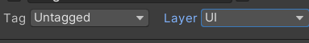

# 系统需求分析

## 开始界面

+ 开始游戏按钮，能够将场景切换到游戏场景
+ 玩法说明按钮，能够将场景切换到玩法说明的界面

## 玩法说明界面

玩法说明场景应该包括游戏内操作的说明，以及控制游戏进程的按钮

+ 控制坦克（移动、转向、开炮）的说明
+ 游戏场景中出现的玩家生命值、玩家得分、游戏中出现的小道具、以及最后的得分计算

+ 返回按钮，能够将场景切换到开始界面
+ 开始游戏按钮，能够将场景切换到游戏场景

## 游戏场景搭建

在游戏场景中需要实现三维的游戏物体和二维的UI设计同时出现

### 游戏物体的搭建

+ 敌我双方的坦克简单建模
+ 简单障碍物建模
+ 回复生命值道具建模
+ 获得积分道具建模

### UI的搭建

+ 实时显示玩家的生命值和得分
+ 三个按钮，分别实现暂停、继续、结束游戏
+ 小地图功能
  + 小地图中的敌我双方坦克、道具、障碍物的简化显示
+ 实现摄像机实时跟随

###  音乐以及特效

+ 场景背景音乐
+ 玩家获取道具的音乐（获取道具不同音乐也不相同）
+ 玩家击败敌方坦克的特效及音乐

## 得分结算界面

+ 能够显示经玩家得分计算后得到的星星:star:
+ 重新游戏按钮，能够将场景切换到游戏场景
+ 返回按钮，能够将场景切换到开始界面
+ 退出游戏按钮，能够退出当前游戏

# 系统功能模块

## UI设计

通过若干按钮、文本框以及图片来展示游戏的基本框架

本游戏中的开始游戏界面、玩法说明界面、得分结算界面都是由纯二维UI构成，而游戏场景是由三维的物体和二维UI构成

在纯UI页面中玩家可以阅读与本游戏相关的内容以及通过按钮绑定的事件来控制游戏的进程或实现跳转页面

## 游戏设计

玩家通过键盘来控制己方坦克：==WASD来控制坦克前后移动、左右旋转；空格用来控制坦克发射炮弹；JL来控制坦克上部左右旋转==

为了标识坦克的正前方，在坦克的正前方有绿色标识

敌方坦克在“未发现”玩家时会随机移动或转身，“发现后”将会立刻转向玩家并发射炮弹，玩家可以通过场景中的障碍物或控制坦克灵活变换位置来躲避敌方坦克的炮弹

在场景中，每隔50秒会随机产生一个恢复玩家生命值的道具，12秒后消失；每隔60秒会随机产生一个增加玩家得分的道具，10秒后消失。玩家拾取道具后会有相应的背景音乐出现

玩家可以在场景的左下角通过观察小地图来实时观测敌方坦克的位置以及生成道具的位置

玩家可以在场景的左上角实时看到自己剩余的生命值以及当前玩家得分

玩家可以通过场景的右上角的按钮来控制游戏的进程，或暂停、或继续、或退出

玩家可以利用场地中的障碍物来躲避敌方坦克的炮弹

玩家在遇到敌方坦克时，可用通过按下空格键来发射炮弹攻击敌方坦克，玩家坦克发射的炮弹命中敌方坦克，敌方坦克会发生爆炸，玩家得分+1

当玩家的生命值为0时，游戏结束，通过玩家在游戏中的得分来对玩家进行最终结算来控制显示星星的数量

# 系统实现

## 游戏场景所需资源总和

+ 背景音乐

  

+ 字体

  

+ 图片

  

+ 材质

  

+ 预设体

  

+ 场景

  

  

+ 纹理

  

+ 着色器

  

+ 脚本

  

## 开始界面设计实现

### 场景组成


### 场景实现

+ 开始游戏按钮实现

```csharp
using System.Collections;
using System.Collections.Generic;
using UnityEngine;
using UnityEngine.UI;
using UnityEngine.SceneManagement;

public class LoadGame : MonoBehaviour
{
    private Button btn;

    private void Awake()
    {
        btn= GetComponent<Button>();
    }

    // Start is called before the first frame update
    void Start()
    {
        btn.onClick.AddListener(onButtonClick);
    }

    // Update is called once per frame
    void Update()
    {
        
    }

    private void onButtonClick()
    {
        //转换场景
        SceneManager.LoadScene("Demo2_TankBattle");
    }
}

```

+ 玩法说明按钮实现

```csharp
using System.Collections;
using System.Collections.Generic;
using UnityEngine;
using UnityEngine.UI;
using UnityEngine.SceneManagement;

public class Operation : MonoBehaviour
{
    private Button btn;

    private void Awake()
    {
        btn = GetComponent<Button>();
    }

    // Start is called before the first frame update
    void Start()
    {
        btn.onClick.AddListener(buttonOnClick);
    }

    // Update is called once per frame
    void Update()
    {
        
    }

    public void buttonOnClick()
    {
        SceneManager.LoadScene(3);
    }
}

```

## 玩法说明页面设计实现

### 场景组成


### 场景实现

+ 开始游戏按钮实现

  ```csharp
  using System.Collections;
  using System.Collections.Generic;
  using UnityEngine;
  using UnityEngine.UI;
  using UnityEngine.SceneManagement;
  
  public class StartGame : MonoBehaviour
  {
      private Button btn;
  
      private void Awake()
      {
          btn = GetComponent<Button>();
      }
      // Start is called before the first frame update
      void Start()
      {
          btn.onClick.AddListener(buttonOnClick);
      }
  
      // Update is called once per frame
      void Update()
      {
          
      }
  
      public void buttonOnClick()
      {
          SceneManager.LoadScene(1);
      }
  }
  
  ```

+ 返回开始界面按钮实现

  ```csharp
  using System.Collections;
  using System.Collections.Generic;
  using UnityEngine;
  using UnityEngine.UI;
  using UnityEngine.SceneManagement;
  
  public class RebackStartBtn : MonoBehaviour
  {
      private Button btn;
  
      private void Awake()
      {
          
          btn = GetComponent<Button>();
      }
  
      // Start is called before the first frame update
      void Start()
      {
          btn.onClick.AddListener(ButtonOnClick);
      }
  
      // Update is called once per frame
      void Update()
      {
          
      }
  
      public void ButtonOnClick()
      {
          SceneManager.LoadScene(0);
      }
  }
  
  ```

## 游戏场景设计实现

### 场景组成

+ 总体场景实现

  

+ 障碍物

  

+ UI

  

+ 坦克

  

+ 爆照效果

  

  + 音乐

    

  + 特效

    

    

    

+ 音乐

  + 背景音乐

    

  + 获取道具音乐

    + 恢复生命值道具

      

    + 得分道具

      

### 场景实现

+ 摄像机跟随

  ```csharp
  using System.Collections;
  using System.Collections.Generic;
  using UnityEngine;
  
  public class CameraFollowingTank : MonoBehaviour
  {
      [Header("跟随目标")]
      public Transform followTarget;
  
      private Vector3 dir;
      // Start is called before the first frame update
      void Start()
      {
          //计算方向向量
          dir=followTarget.position-transform.position;
      }
  
      // Update is called once per frame
      void Update()
      {
          //时刻保持跟随
          transform.position = followTarget.position - dir;
      }
  }
  
  ```

+ 玩家坦克控制

  ```csharp
  using System.Collections;
  using System.Collections.Generic;
  using System.Runtime.CompilerServices;
  using Unity.VisualScripting;
  using UnityEngine;
  using UnityEngine.SceneManagement;
  
  public class PlayerTank : MonoBehaviour
  {
      [Header("移动速度")]
      public float moveSpeed = 5f;
      [Header("转身速度")]
      public float turnSpeed = 1f;
      [Header("坦克上部转身速度")]
      public float turnTopSpeed = 30f;
      [Header("炮弹速度")]
      public float bulletSpeed = 30f;
      [Header("炮弹预设体")]
      public GameObject bulletPerfab;
  
      [Header("玩家得分")]
      public int score = 0;
      [Header("玩家的生命值")]
      public int HP = 5;
  
      private float hor, ver;
      private bool turnLeft, turnRight;
      private bool fire;
      private Transform firePoint;
      private Transform tankTop;
      private SingleTon ins;
      //控制玩家子弹发射时间间隔
      private float interval = 0.25f;
      private float timer;
  
      private void Awake()
      {
          firePoint = transform.Find("TankTop/Gun/FirePoint");
          tankTop = transform.Find("TankTop");
          ins = SingleTon.getInstance();
      }
  
      // Start is called before the first frame update
      void Start()
      {
          ins.currentPlayerHP = HP;
          ins.currentPlayerScore = score;
      }
  
      // Update is called once per frame
      void Update()
      {
          timer += Time.deltaTime;
  
          //获取虚拟轴和虚拟按键
          hor = Input.GetAxis("Horizontal");
          ver = Input.GetAxis("Vertical");
          fire = Input.GetKeyDown(KeyCode.Space);
          turnLeft = Input.GetKey(KeyCode.J);
          turnRight = Input.GetKey(KeyCode.L);
  
          //控制坦克前后移动，左右转动
          transform.position += transform.forward * ver * Time.deltaTime * moveSpeed;
          transform.eulerAngles += transform.up * hor * turnSpeed;
  
          //控制坦克上部左右旋转
          //整个坦克上部向左旋转
          if (turnLeft)
          {
              tankTop.Rotate(Vector3.down * Time.deltaTime * turnTopSpeed);
          }
          //整个坦克上部向右旋转
          if (turnRight)
          {
              tankTop.Rotate(Vector3.up * Time.deltaTime * turnTopSpeed);
          }
  
          //控制发射炮弹
          if (fire && timer > interval)
          {
              //计时器清零
              timer = 0;
  
              //生成炮弹
              GameObject blt = Instantiate(bulletPerfab, firePoint.position, Quaternion.identity);
  
              //确定炮弹的归属
              blt.GetComponent<BulletController>().belong = transform.root;
  
              //给炮弹一个速度
              blt.transform.GetComponent<Rigidbody>().velocity = firePoint.forward * bulletSpeed;
  
              Destroy(blt, 2.5f);
          }
  
          Debug.Log("分数为："+ins.currentPlayerScore);
          Debug.Log("生命值为：" + ins.currentPlayerHP);
  
          //游戏结束
          if (ins.gameIsOver())
          {
              //转换场景
              SceneManager.LoadScene("Demo2_EndUI");
          }
      }
  }
  
  ```
  
+ 敌方坦克总体控制

  ```csharp
  using System.Collections;
  using System.Collections.Generic;
  using UnityEngine;
  
  public class EnemyTankManager : MonoBehaviour
  {
      [Header("敌方坦克预设体")]
      public GameObject Tank;
      [Header("坦克生成时间")]
      public float interval = 10f;
      [Header("生成敌方坦克的最大数量")]
      [Range(0,128)]
      public int maxEnemy = 49;
  
      private float timer = 0;
      private int counter = 0;
  
      // Start is called before the first frame update
      void Start()
      {
          SingleTon.getInstance().maxEnemyCount= maxEnemy;
      }
  
      // Update is called once per frame
      void Update()
      {
          timer += Time.deltaTime;
          if (timer > interval)
          {
              if (counter < maxEnemy)
              {
                  CreateTank();
                  counter++;
              }
              timer = 0;
          }
      }
  
      /// <summary>
      /// 创建坦克
      /// </summary>
      private void CreateTank()
      {
          float x, z;
          int y = Random.Range(0, 360);
          Vector3 pos = Vector3.zero;
  
          do
          {
              x = Random.Range(-40f, 40f);
              z = Random.Range(-40f, 40f);
              pos = new Vector3(x, 0.328f, z);
          } while (!CanUsePosition(pos));
  
          //将一个欧拉角转换成一个四元素
          Quaternion qua = Quaternion.Euler(new Vector3(0, y, 0));
  
          GameObject tank = Instantiate(Tank, pos, qua);
      }
  
      /// <summary>
      /// 判断位置是否可用
      /// </summary>
      /// <param name="pos"></param>
      /// <returns></returns>
      private bool CanUsePosition(Vector3 pos)
      {
          return !Physics.CheckSphere(pos, 4, ~(1 << 8));
      }
  }
  
  ```
  
+ 敌方坦克单个控制

  ```csharp
  using System.Collections;
  using System.Collections.Generic;
  using UnityEngine;
  
  public class EnemyTankController : MonoBehaviour
  {
      [Header("移动速度")]
      public float moveSpeed = 5f;
      [Header("转身速度")]
      public float rotateSpeed = 5f;
      [Header("开炮的时间间隔")]
      public float fireInterval = 2f;
      [Header("巡逻时转变方向的时间间隔")]
      public float turnInterval = 1.5f;
      [Header("炮弹预设体")]
      public GameObject bulletPerfab;
      [Header("炮弹飞行速度")]
      public float bulletSpeed = 30f;
  
      //玩家位置
      private Transform player;
      //当前坦克与玩家之间的距离
      private float distance;
      //射线碰撞检测器
      private RaycastHit hit;
      //开火点
      private Transform firePoint;
      //计时器
      private float timer;
      private float y;
  
      private void Awake()
      {
          player = GameObject.FindWithTag("Player").transform;
          firePoint = transform.Find("Gun/FirePoint");
      }
      // Start is called before the first frame update
      void Start()
      {
          
      }
  
      // Update is called once per frame
      void Update()
      {
          if (gameObject)
          {
              //计时器开始计时
              timer += Time.deltaTime;
              //计算距离
              distance = Vector3.Distance(transform.position, player.position);
  
              if (distance < 8)
              {
                  Fire();
              }
              else if (distance < 25)
              {
                  Move();
              }
              else
              {
                  Patrol();
              }
          }
      }
  
      /// <summary>
      /// 转向玩家
      /// </summary>
      private void TurnToPlayer()
      {
          Vector3 dir = player.position - transform.position;
          RotateTo(dir);
      }
  
      /// <summary>
      /// 转向
      /// </summary>
      /// <param name="dir"></param>
      private void RotateTo(Vector3 dir)
      {
          //先将方向向量转换成四元数
          Quaternion targetQua = Quaternion.LookRotation(dir);
  
          //Lerp过去
          transform.rotation = Quaternion.Lerp(transform.rotation, targetQua, Time.deltaTime * rotateSpeed);
      }
  
      /// <summary>
      /// 检测前方dis米是否有友方坦克
      /// </summary>
      /// <returns></returns>
      private bool CheckForwardFriendTank(float dis)
      {
          if(Physics.Raycast(firePoint.position,transform.forward,out hit, dis))
          {
              if (hit.collider.transform.root.tag == "Enemy")
              {
                  return true;
              }
          }
          return false;
      }
  
      /// <summary>
      /// 检测右方是否存在友方坦克
      /// </summary>
      /// <param name="dis"></param>
      /// <returns></returns>
      private bool CheckRightFriendTank(float dis)
      {
          if (Physics.Raycast(transform.position, transform.right, out hit, dis))
          {
              if (hit.collider.transform.root.tag == "Enemy")
              {
                  return true;
              }
          }
          return false;
      }
  
      /// <summary>
      /// 检测左方是否存在友方坦克
      /// </summary>
      /// <param name="dis"></param>
      /// <returns></returns>
      private bool CheckLeftFriendTank(float dis)
      {
          if (Physics.Raycast(transform.position, -transform.right, out hit, dis))
          {
              if (hit.collider.transform.root.tag == "Enemy")
              {
                  return true;
              }
          }
          return false;
      }
  
      /// <summary>
      /// 开火
      /// </summary>
      private void Fire()
      {
          TurnToPlayer();
          if (CheckForwardFriendTank(10))
          {
              return;
          }
          if (timer > fireInterval)
          {
              GameObject blt = Instantiate(bulletPerfab, firePoint.position, Quaternion.identity);
              blt.GetComponent<BulletController>().belong = transform.root;
              blt.transform.GetComponent<Rigidbody>().velocity = transform.forward * bulletSpeed;
              Destroy(blt, 2.5f);
  
              timer = 0;
          }
      }
  
      /// <summary>
      /// 向玩家逼近
      /// </summary>
      private void Move()
      {
          TurnToPlayer();
  
          if ((!CheckForwardFriendTank(4))&&(!CheckRightFriendTank(4))&&(!CheckLeftFriendTank(4)))
          {
              transform.position += transform.forward * Time.deltaTime * moveSpeed;
          }
          else
          {
              Patrol();
          }
      }
  
      /// <summary>
      /// 巡逻
      /// </summary>
      private void Patrol()
      {
          transform.position += transform.forward * Time.deltaTime * moveSpeed;
          if (timer > turnInterval)
          {
              y = Random.Range(0, 360);
              timer = 0;
          }
          Quaternion qua = Quaternion.Euler(new Vector3(0, y, 0));
          transform.rotation = Quaternion.Lerp(transform.rotation, qua, Time.deltaTime * rotateSpeed);
      }
  }
  
  ```
  
+ 炮弹控制

  ```csharp
  using System.Collections;
  using System.Collections.Generic;
  using UnityEngine;
  
  public class BulletController : MonoBehaviour
  {
      public Transform belong;
  
      private SingleTon ins;
      private AudioSource boom;
      private GameObject boomEffect;
  
      // Start is called before the first frame update
      void Start()
      {
          ins = SingleTon.getInstance();
          GameObject music = GameObject.FindGameObjectWithTag("BoomMusic");
          boomEffect = GameObject.FindGameObjectWithTag("BoomEffect");
          boom=music.GetComponent<AudioSource>();
      }
  
      // Update is called once per frame
      void Update()
      {
          
      }
  
      private void OnTriggerEnter(Collider other)
      {
          if (other.transform.root.CompareTag("Player") && belong.transform.root.CompareTag("Enemy"))
          {
              Destroy(transform.gameObject);
              ins.currentPlayerHP--;
              return;
          }
          if (other.transform.root.tag == "Enemy" && belong.transform.root.tag == "Player")
          {
              ins.currentPlayerScore++;
              boom.Play();
              boomEffect.transform.position = new Vector3(transform.position.x, 1, other.transform.position.z);
              boomEffect.GetComponent<ParticleSystem>().Play();
              Destroy(transform.gameObject);
              Destroy(other.transform.root.gameObject,0.1f);
              return;
          }
          if (other.transform.tag == "Wall")
          {
              Destroy(transform.gameObject);
              return;
          }
      }
  }
  
  ```
  
+ 得分道具控制

  ```csharp
  using System.Collections;
  using System.Collections.Generic;
  using UnityEngine;
  
  public class GetCoinController : MonoBehaviour
  {
      private SingleTon ins;
      private AudioSource sound;
  
      // Start is called before the first frame update
      void Start()
      {
          ins=SingleTon.getInstance();
          sound=GameObject.FindGameObjectWithTag("GetCoinMusic").GetComponent<AudioSource>();
      }
  
      // Update is called once per frame
      void Update()
      {
          
      }
  
      private void OnTriggerEnter(Collider other)
      {
          if (other.transform.root.CompareTag("Player"))
          {
              ins.currentPlayerScore++;
              sound.Play();
              Destroy(gameObject);
          }
      }
  }
  
  ```
  
+ 恢复生命值道具

  ```csharp
  using System.Collections;
  using System.Collections.Generic;
  using UnityEngine;
  
  public class GetHpController : MonoBehaviour
  {
      //获取单例类
      private SingleTon ins;
      //获取捡取声音效果的组件
      private AudioSource sound;
  
      // Start is called before the first frame update
      void Start()
      {
          //绑定
          ins=SingleTon.getInstance();
          sound=GameObject.FindGameObjectWithTag("GetHpMusic").GetComponent<AudioSource>();
      }
  
      // Update is called once per frame
      void Update()
      {
          
      }
  
      private void OnTriggerEnter(Collider other)
      {
          if (other.transform.root.CompareTag("Player"))
          {
              if (ins.currentPlayerHP < 5)
              {
                  ins.currentPlayerHP++;
                  sound.Play();
                  Destroy(gameObject);
              }
          }
      }
  }
  
  ```
  
+ 单例类设计

  ```csharp
  using System.Collections;
  using System.Collections.Generic;
  using UnityEngine;
  
  public class SingleTon
  {
      //单例
      private static SingleTon instance;
  
      /// <summary>
      /// 私有化构造
      /// </summary>
      private SingleTon()
      {
  
      }
  
      public static SingleTon getInstance()
      {
          if (instance == null)
          {
              instance=new SingleTon();
          }
          return instance;
      }
  
      //当前玩家血量
      public int currentPlayerHP;
      //当前玩家得分
      public int currentPlayerScore;
      //敌方最大坦克数量
      public int maxEnemyCount;
  
      /// <summary>
      /// 判断游戏是否结束
      /// </summary>
      /// <returns></returns>
      public bool gameIsOver()
      {
          if (this.currentPlayerHP == 0 || this.currentPlayerScore == this.maxEnemyCount)
          {
              return true;
          }
          return false;
      }
  }
  
  ```
  
+ 暂停游戏按钮实现

  ```csharp
  using System.Collections;
  using System.Collections.Generic;
  using UnityEngine;
  using UnityEngine.UI;
  
  public class TankPauseBtn : MonoBehaviour
  {
      public GameObject music;
  
      private Button btn;
      private AudioSource bgm;
  
      private void Awake()
      {
          btn = GetComponent<Button>();
          bgm=music.GetComponent<AudioSource>();
      }
  
      // Start is called before the first frame update
      void Start()
      {
          btn.onClick.AddListener(onClickButton);
      }
  
      // Update is called once per frame
      void Update()
      {
          
      }
  
      public void onClickButton()
      {
          Time.timeScale = 0;
          bgm.Stop();
      }
  }
  
  ```
  
+ 继续游戏按钮实现

  ```csharp
  using System.Collections;
  using System.Collections.Generic;
  using UnityEngine;
  using UnityEngine.UI;
  
  public class TankStartBtn : MonoBehaviour
  {
      public GameObject music;
  
      private Button btn;
      private AudioSource bgm;
  
      private void Awake()
      {
          btn = GetComponent<Button>();
          bgm = music.GetComponent<AudioSource>();
      }
  
      // Start is called before the first frame update
      void Start()
      {
          btn.onClick.AddListener(onClickButton);
      }
  
      // Update is called once per frame
      void Update()
      {
          
      }
  
      public void onClickButton()
      {
          Time.timeScale = 1;
          bgm.Play();
      }
  }
  
  ```
  
+ 退出游戏按钮实现

  ```csharp
  using System.Collections;
  using System.Collections.Generic;
  using UnityEngine;
  using UnityEngine.SceneManagement;
  using UnityEngine.UI;
  
  public class TankExitBtn : MonoBehaviour
  {
      private Button btn;
  
      private void Awake()
      {
          btn = GetComponent<Button>();
      }
  
      // Start is called before the first frame update
      void Start()
      {
          btn.onClick.AddListener(onClickButton);
      }
  
      // Update is called once per frame
      void Update()
      {
          
      }
  
      public void onClickButton()
      {
          SceneManager.LoadScene(2);
      }
  }
  
  ```
  
+ 生命值组实现

  
  
  ```csharp
  using System.Collections;
  using System.Collections.Generic;
  using UnityEngine;
  using UnityEngine.UI;
  
  public class HpController : MonoBehaviour
  {
      public Image[] hp;
  
      private SingleTon ins;
  
      private void Awake()
      {
          ins = SingleTon.getInstance();
      }
  
      // Start is called before the first frame update
      void Start()
      {
          
      }
  
      // Update is called once per frame
      void Update()
      {
          for(int i=0;i< ins.currentPlayerHP; i++)
          {
              hp[i].color = new Color(hp[i].color.r, hp[i].color.g, hp[i].color.b, 1);
          }
          for(int i= ins.currentPlayerHP; i < 5; i++)
          {
              hp[i].color = new Color(hp[i].color.r, hp[i].color.g, hp[i].color.b, 0);
          }
      }
  }
  
  ```
  
+ 实时显示玩家得分

  ```csharp
  using System.Collections;
  using System.Collections.Generic;
  using UnityEngine;
  using UnityEngine.UI;
  using TMPro;
  
  public class PlayerScoreController : MonoBehaviour
  {
      private SingleTon ins;
      private TMP_Text tmp;
  
      private void Awake()
      {
          ins=SingleTon.getInstance();
          tmp=transform.GetComponent<TMP_Text>();
      }
  
      // Start is called before the first frame update
      void Start()
      {
  
      }
  
      // Update is called once per frame
      void Update()
      {
          tmp.text = "分数：" + ins.currentPlayerScore;
      }
  }
  
  ```

## 得分计算页面设计实现

### 场景组成


### 场景实现

+ 星星数量控制

  + 单个星星

    

  + 整组星星控制

    

    ```csharp
    using System.Collections;
    using System.Collections.Generic;
    using UnityEngine;
    using UnityEngine.UI;
    
    public class StarController : MonoBehaviour
    {
        //星星组
        public Image[] starsImages;
    
        //玩家的分数
        private int score;
        private SingleTon ins;
    
        private void Awake()
        {
            ins = SingleTon.getInstance();
            score = (ins.currentPlayerScore + ins.currentPlayerHP) / 7;
        }
    
        // Start is called before the first frame update
        void Start()
        {
    
        }
    
        // Update is called once per frame
        void Update()
        {
            for (int i = 0; i < score; i++)
            {
                //通过改变星星的透明度来实现星星的显示和消失
                starsImages[i].color = new Color(starsImages[i].color.r, starsImages[i].color.b, starsImages[i].color.g, 1);
            }
        }
    }
    
    ```

+ 按钮实现

  + 重新游戏按钮实现

    ```csharp
    using System.Collections;
    using System.Collections.Generic;
    using UnityEngine;
    using UnityEngine.UI;
    using UnityEngine.SceneManagement;
    
    public class ReplayBtn : MonoBehaviour
    {
        private Button btn;
    
        private void Awake()
        {
            btn = GetComponent<Button>();
        }
    
        // Start is called before the first frame update
        void Start()
        {
            btn.onClick.AddListener(onButtonClick);
        }
    
        // Update is called once per frame
        void Update()
        {
            
        }
    
        private void onButtonClick()
        {
            //转换场景
            SceneManager.LoadScene("Demo2_TankBattle");
        }
    }
    
    ```

  + 返回按钮实现

    ```csharp
    using System.Collections;
    using System.Collections.Generic;
    using UnityEngine;
    using UnityEngine.UI;
    using UnityEngine.SceneManagement;
    
    public class RebackBtn : MonoBehaviour
    {
        private Button btn;
    
        private void Awake()
        {
            btn = GetComponent<Button>();
        }
    
        // Start is called before the first frame update
        void Start()
        {
            btn.onClick.AddListener(onButtonClick);
        }
    
        // Update is called once per frame
        void Update()
        {
            
        }
    
        private void onButtonClick()
        {
            //转换场景
            SceneManager.LoadScene("Demo2_StartUI");
        }
    }
    
    ```

  + 退出游戏按钮实现

    ```csharp
    using System.Collections;
    using System.Collections.Generic;
    using UnityEngine;
    using UnityEngine.UI;
    using UnityEditor;
    
    public class ExitBtn : MonoBehaviour
    {
        private Button btn;
    
        private void Awake()
        {
            btn = GetComponent<Button>();
        }
    
        // Start is called before the first frame update
        void Start()
        {
            btn.onClick.AddListener(onClickButton);
        }
    
        // Update is called once per frame
        void Update()
        {
            
        }
    
        public void onClickButton()
        {
            //预处理
            #if UNITY_EDITOR    //在编辑器模式下
                 EditorApplication.isPlaying = false;
            #else
                 Application.Quit();
            #endif
        }
    }
    
    ```
  
  + 小地图功能实现
  
    通过使用层剔除技术来实现在小地图上显示玩家位置、敌方坦克位置、以及道具位置
  
    
  
    主摄像机显示：
  
    
  
    小地图摄像机显示：
  
    

# 系统测试

## 开始界面


## 玩法说明界面


## 游戏场景搭建

+ 初始状态

  

+ 爆炸效果

  

+ 道具

  

  

## 得分计算界面


