# 第一次作业

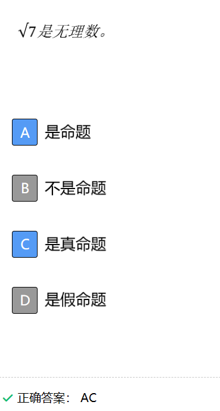

 

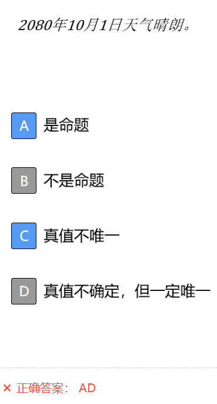

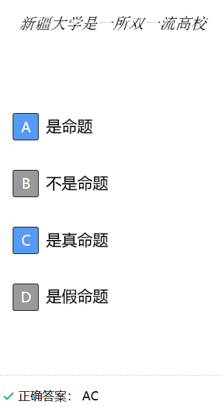

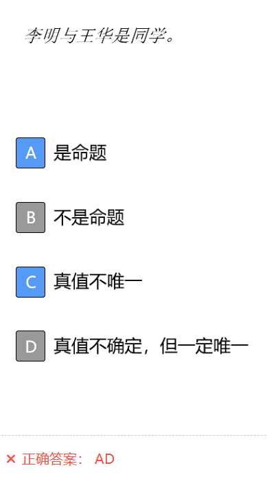

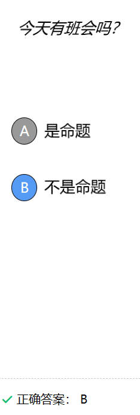

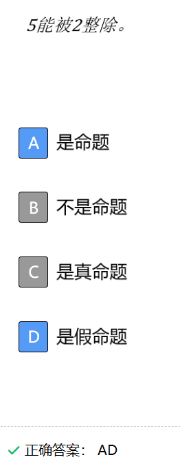

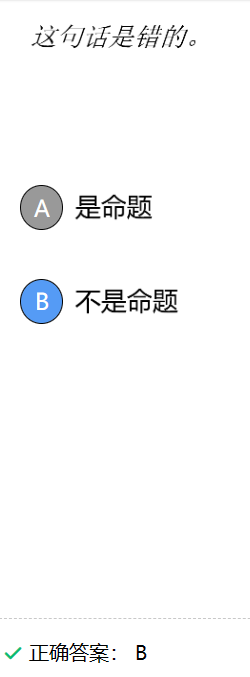

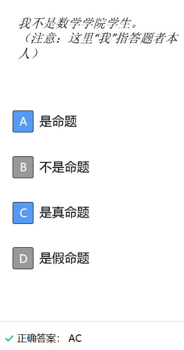

# 第二次作业

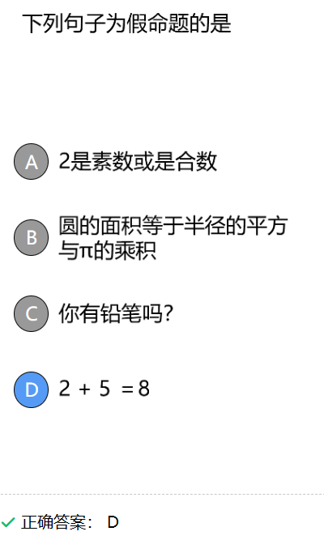

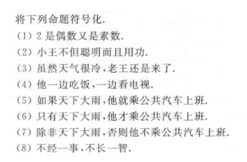

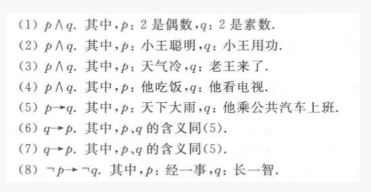

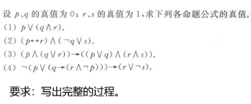

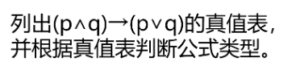

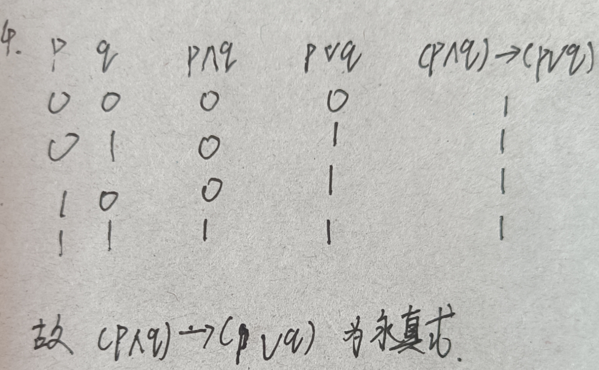

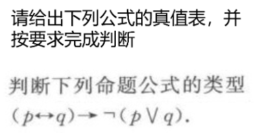

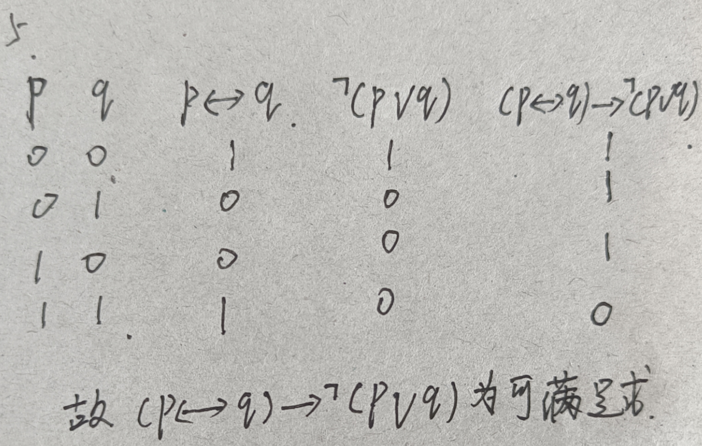

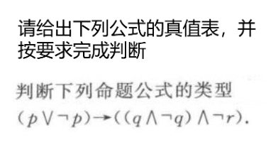

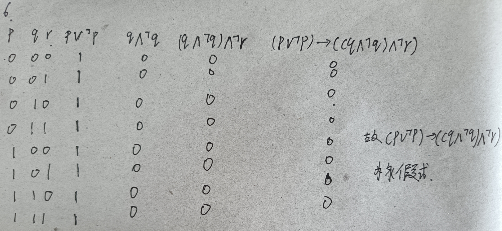

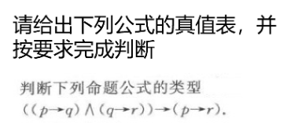

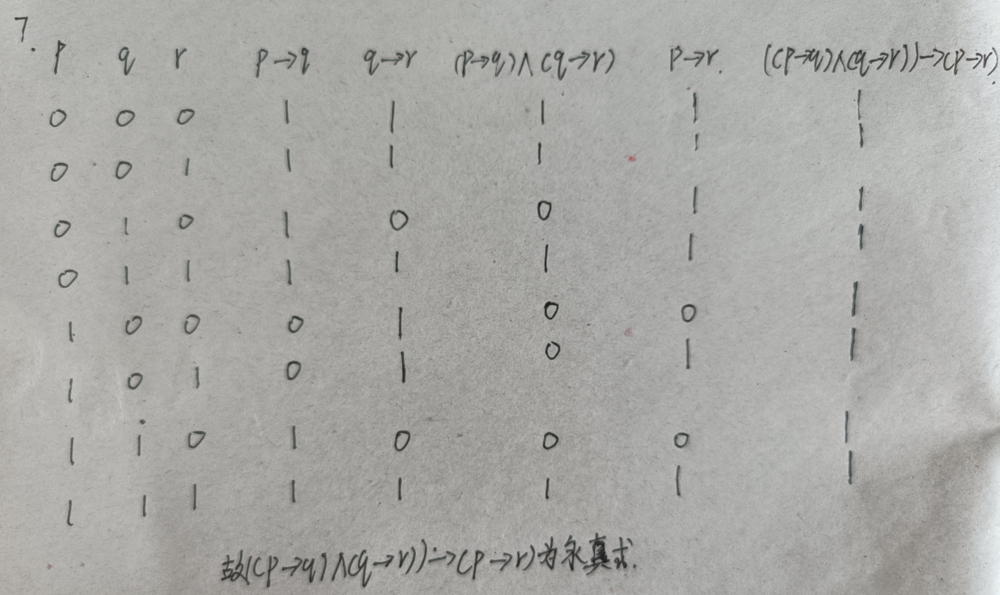

# 第三次作业

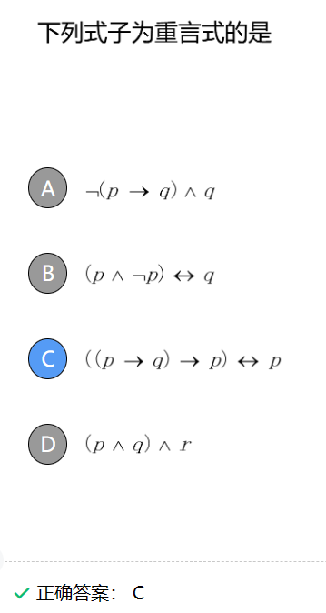

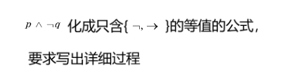

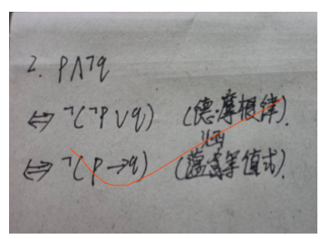

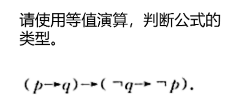

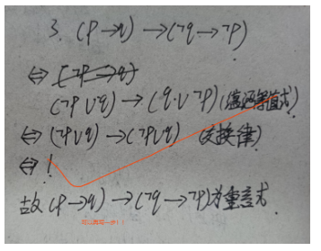

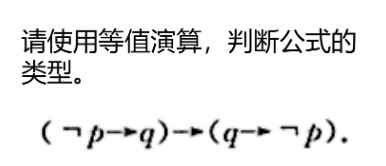

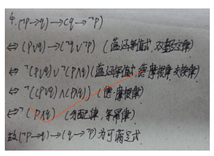

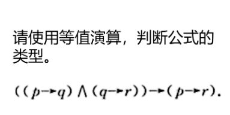

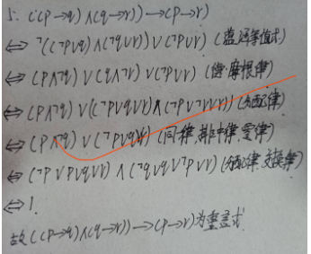

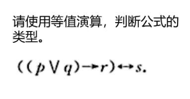

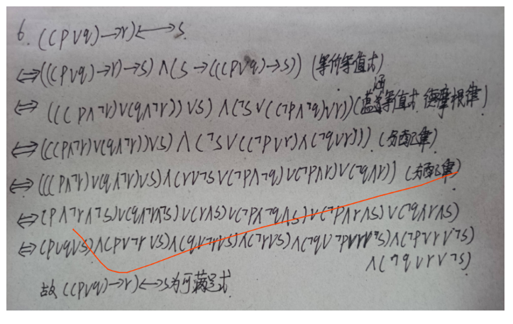

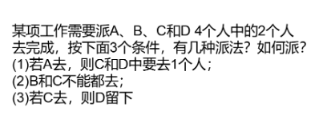

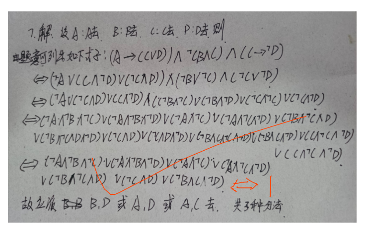

# 第四次作业

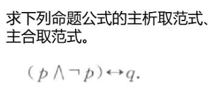

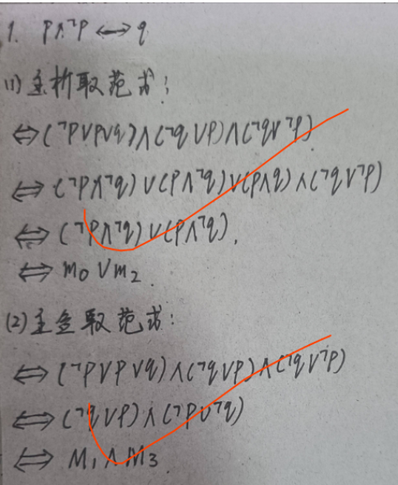

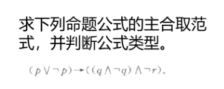

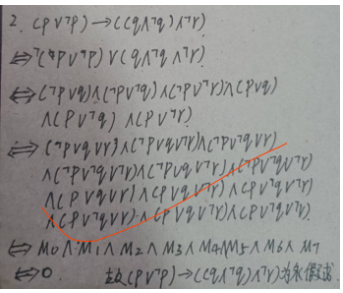

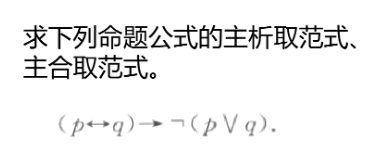

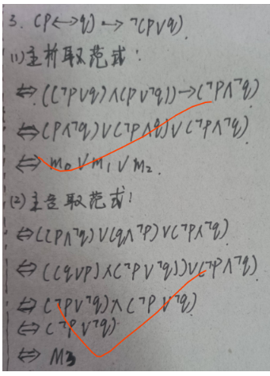

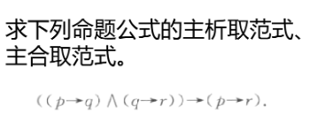

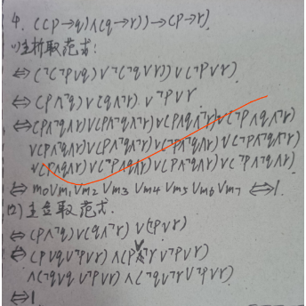

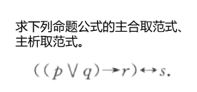

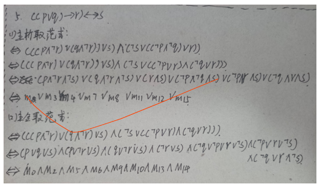

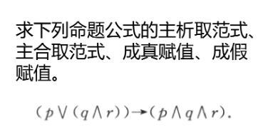

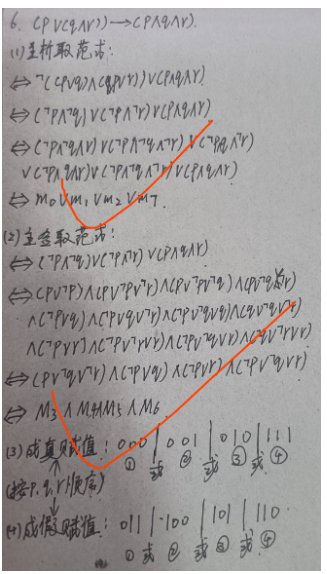

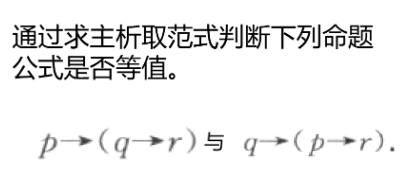

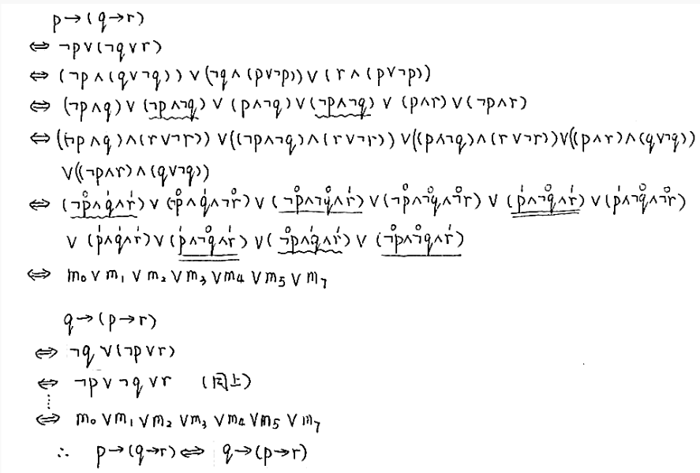

# 第五次作业

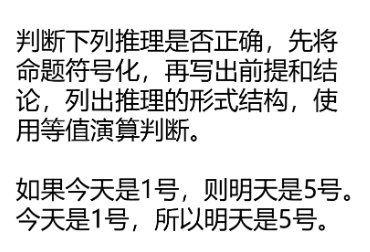

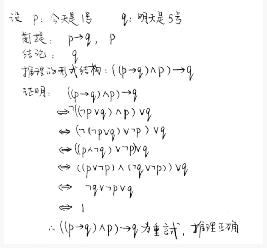

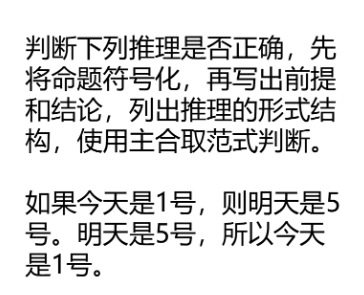

# 第六次作业

# 第七次作业

# 第八次作业

# 第九次作业

# 第十次作业

# 第十一次作业

# 第十二次作业

# 期中测试

