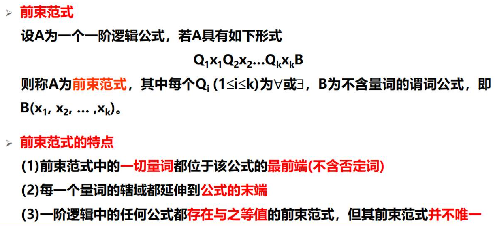
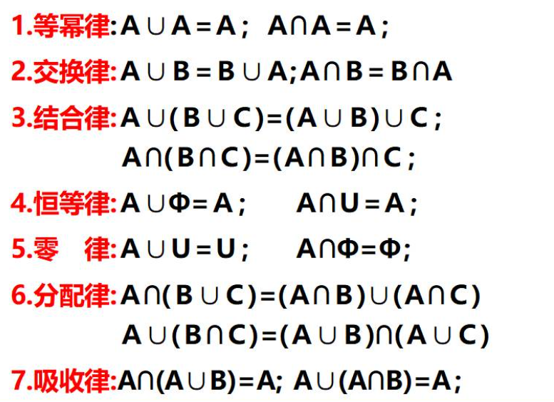
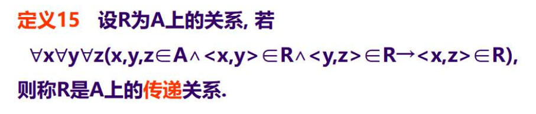
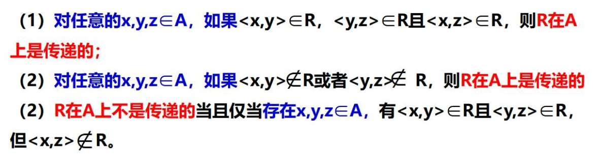
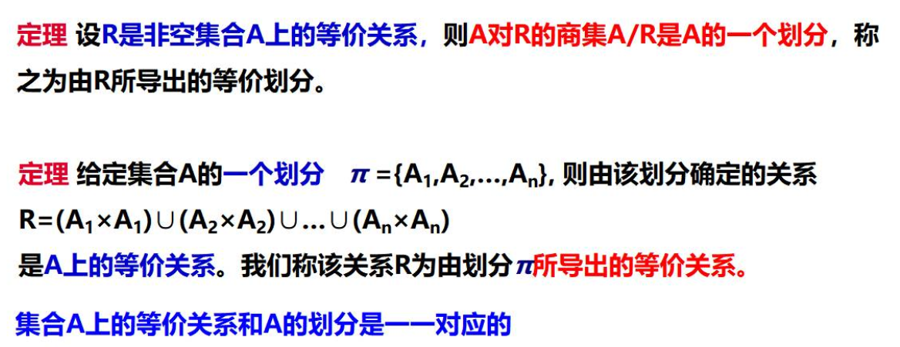
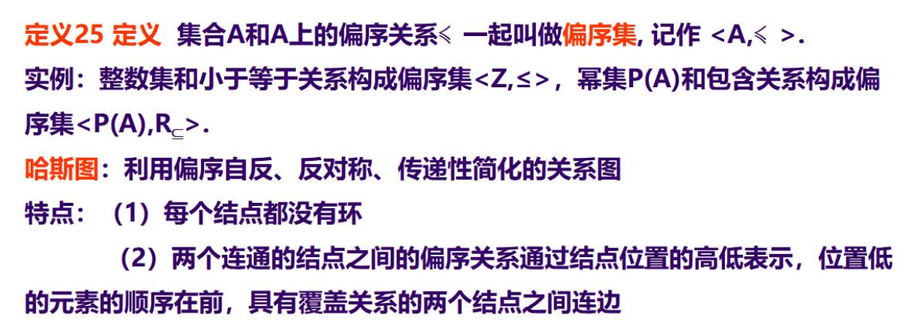

# 第一章

## 真值表

## 联结词的优先级

## 24个基本等值式

## 范式

## 推理论证

# 第二章
## 一阶逻辑基本概念

## 特性谓词

## 一阶逻辑合式公式及解释

## 代换实例

## 一阶逻辑基本等值式

## 前束范式

# 第三章

## 集合的三大特征

## 有限集和无限集

## 幂集

## 集合的运算

## 包含排斥定理

# 第四章

## 关系的运算

## 关系的合成运算

## 限制与像

## 关系基本运算的性质

## 关系的幂运算

## 幂运算的性质

## 关系的性质

### 自反性与反自反性

### 对称性和反对称性

### 传递性

## 闭包

## 等价关系

## 偏序关系

## 函数

