# 第一章

## 题目

==年份==

输入年份，判断是否为闰年。如果是，则输出yes，否则输出no

## 代码

```c++
#include <iostream>

using namespace std;

int main(){
	int year;

	cout<<"请输入要判断的年份："<<endl;
	cin>>year;

	if((year%4==0&&year%100!=0)||(year%400==0)){
		cout<<"yes"<<endl;
	}else{
		cout<<"no"<<endl;
	}

	return  0;
}

```

## 运行结果

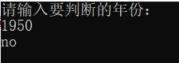

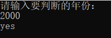

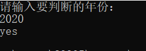

# 第二章

## 题目

==水仙花数==

输出100~999中的所有水仙花数。若三位数ABC满足ABC=A^3^+B^3^+C^3^，则称其为水仙花数，例如153=1^3^+5^3^+3^3^，所以153就是水仙花数。

## 代码

```C++
#include <iostream>
#include <cmath>

using namespace std;

int main() {
	int a, b, c;

	for (int i = 100; i < 1000; i++) {
		c = i % 10;
		b = (i / 10) % 10;
		a = (i / 100) % 10;

		int tmp = (int)pow(a, 3) + pow(b, 3) + pow(c, 3);

		if (tmp == i) {
			cout << i << endl;
		}
		else {
			continue;
		}
	}

	return 0;
}

```

## 运行结果

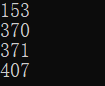

# 第三章

## 题目

==分子量==

给出一个物质的分子式（不带括号），求分子量。本题中的分子式只包含4中原子，分别为C,H,O,N,原子量为12.01,1.008,16.00，14.01（单位：g/mol）。例如，C6H5OH的分子量为94.108g/mol。

## 代码

```c++
#include <iostream>
#include <string>

using namespace std;

int main()
{
	double arr[] = {12.01, 1.008, 16.00, 14.01};
	string s;

	cout << "请输入化学式：" << endl;
	cin >> s;

	int len = s.size();
	double total = 0.0;
	int i = 0;

		while(s[i]!='\0'){
		int sum = 0;
		char c = s[i];
		i++;

		while (s[i] >= '0' && s[i] <= '9') {
			sum = sum * 10 + s[i] - '0';
			i++;
		}

		if (sum != 0) {
			if (c == 'C') {
				total += sum * arr[0];
			}
			else if (c == 'H') {
				total += sum * arr[1];
			}
			else if (c == 'O') {
				total += sum * arr[2];
			}
			else if (c == 'N') {
				total += sum * arr[3];
			}
		}
		else{
			if (c == 'C') {
				total += arr[0];
			}
			else if (c == 'H') {
				total += arr[1];
			}
			else if (c == 'O') {
				total += arr[2];
			}
			else if (c == 'N') {
				total += arr[3];
			}
		}
	}

	cout << "化学式对应的分子量为：" << endl;
	cout << total << endl;

	return 0;
}

```

## 运行结果

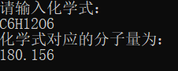

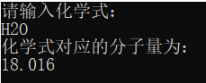

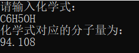

# 第四章

## 题目

==洪水==

有一个n*m(1<=m,n<30)的网格，每个格子是变长10米的正方形，网格四周是无限大的墙壁。输入每个格子的海拔高度，以及网格内雨水的总体积，输出水位的海拔高度以及有多少百分比的区域有水（即高度严格小于水平面）。

## 代码

```c++
#include <iostream>
#include <vector>
#include <iomanip>
#include <algorithm>

using namespace std;

int main() {
	int m, n;
	int sum[1000] = { 0 };
	double water, rate, high;
	double avg[1000] = { 0.0 };
	vector<int> height;
	height.push_back(0);

	cout << "请输入m，n：" << endl;
	cin >> m >> n;
	cout << "请输入水量：" << endl;
	cin >> water;
	cout << "请输入每个格子的海拔高度：" << endl;
	for (int i = 0; i < m * n; i++) {
		int h;
		cin >> h;
		height.push_back(h);
	}

	sort(height.begin(), height.end());

	sum[0] = 0;
	int i = 1;
	for (i = 1; i <= m * n; i++) {
		sum[i] = sum[i - 1] + height[i];
		avg[i] = (double)sum[i] / i;

		if (((double)height[i+1] - avg[i]) * n * 100 > water) {
			break;
		}
	}

	rate = ((double)(i - 1)) / ((double)(m * n));
	high = (double)(water / 100 / (i - 1)) + avg[i - 1];

	cout << "水位的海拔高度为：" << high << endl;
	cout << "所占区域的百分比为：" << setiosflags(ios::fixed) << setprecision(2) << rate * 100 << endl;

	return 0;
}

```

## 运行结果

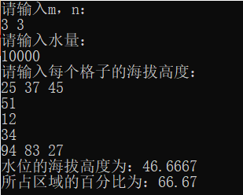

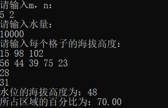

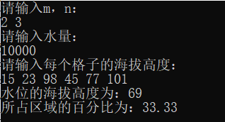


# 第五章

## 题目

==对称轴==

给出平面上N（N<=1000）个点，问是否可以找到一条竖线，使得所有点左右对称。

## 代码

```c++
#include <iostream>
#include <set>

using namespace std;

int main() {
	int n;
	int sum = 0;
	set<pair<int, int>> point;
	bool flag = true;

	cout << "请输入坐标点个数：" << endl;
	cin >> n;

	for (int i = 0; i < n; i++) {
		int x, y;

		cout << "请输入第" << i + 1 << "个点的x，y坐标：" << endl;
		cin >> x >> y;

		sum += x;

		point.insert(pair<int, int>(n * x, y));
	}

	for (set<pair<int, int>>::iterator i = point.begin(); i != point.end(); i++) {
		pair<int, int> p = *i;

		if (point.find(pair<int,int> (2 * sum - p.first,p.second)) == point.end()) {
			flag = false;
			break;
		}
	}

	if (flag) {
		cout << "YES" << endl;
	}
	else {
		cout << "NO" << endl;
	}

	return 0;
}

```

## 运行结果

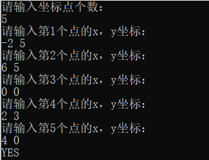

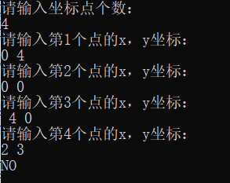

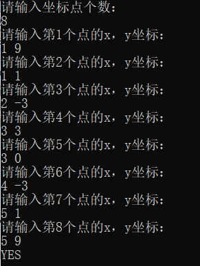

# 第六章

## 题目

==二叉树重建==

输入一棵二叉树的先序遍历和中序遍历序列，输出后序遍历序列

## 代码

```c++
#include <iostream>
#include <string>

using namespace std;

string preorder, inorder;

void get_postorder(int s1,int s2,int length) {
	if (length == 0) {
		return;
	}

	int len = inorder.find(preorder[s1]) - s2;

	get_postorder(s1 + 1, s2, len);//左子树
	get_postorder(s1 + len + 1, s2 + len + 1, length - len - 1);//右子树

	cout << preorder[s1];
}

int main(){
	int len;

	cout << "二叉树的先序遍历结果为：" << endl;
	cin >> preorder;
	cout << "二叉树的中序遍历结果为：" << endl;
	cin >> inorder;

	len = inorder.size();

	cout << "二叉树的后序遍历结果为：" << endl;
	get_postorder(0, 0, len);

	return 0;
}

```

## 运行结果

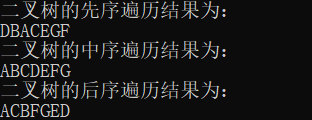

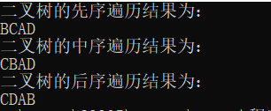

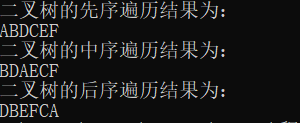

