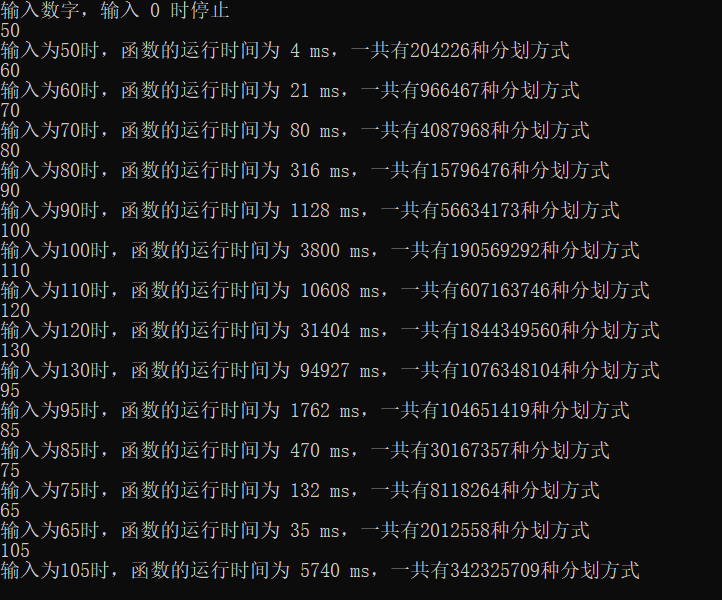

电脑配置：

+ 处理器：Intel(R) Core(TM) i5-10500H CPU @ 2.50GHz   2.50 GHz
+ 机带RAM：16.0 GB (15.8 GB 可用)

整数分划：

代码：

```c++
#include <iostream>
#include <time.h>

using namespace std;

int Divinteger(int n,int m) {
	if (n == 1 || m == 1) {
		return 1;
	}
	else if (n < m) {
		return Divinteger(n, n);
	}
	else if (n == m) {
		return 1 + Divinteger(n, n - 1);
	}
	else {
		return Divinteger(n, m - 1) + Divinteger(n - m, m);
	}
}

int main() {
	int num = 0;

	cout << "输入数字，输入 0 时停止" << endl;
	cin >> num;
	while (num != 0) {
		clock_t start, finish;
		double costTime;

		start = clock();
		long long p = Divinteger(num, num);
		finish = clock();

		costTime = (double)(finish - start);
		cout << "输入为" << num << "时，函数的运行时间为 " << costTime << " ms，一共有" << p << "种分划方式" << endl;
		cin >> num;
	}

	return 0;
}
```

运行结果：

