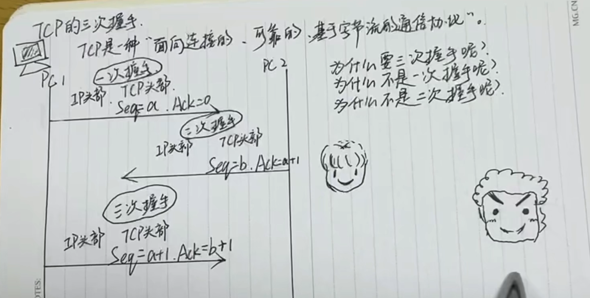
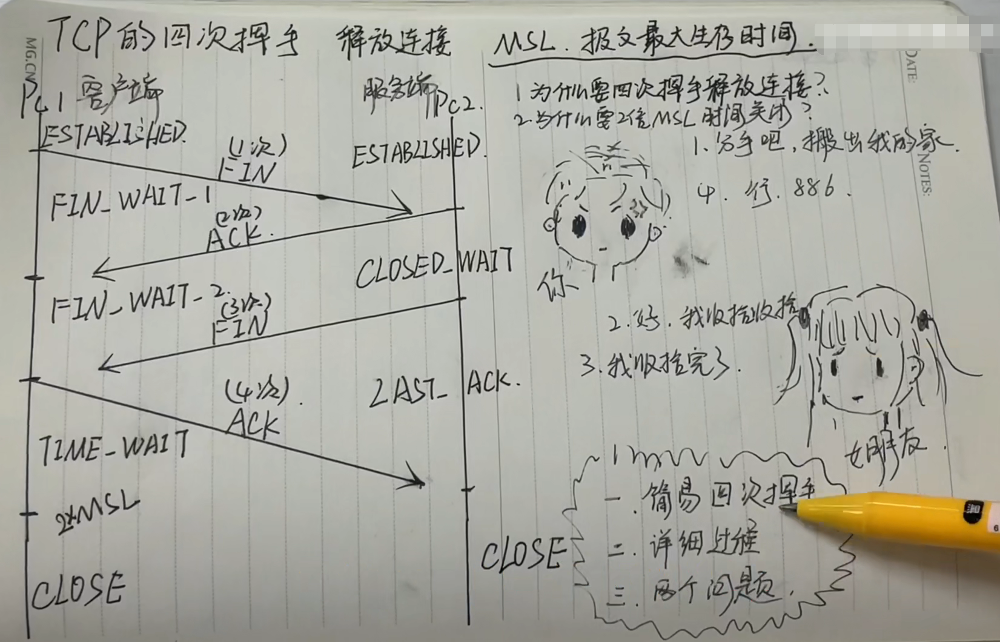

# 一、计算机网络概述

## 计算机网络的定义

计算机网络是指将地理位置不同的具有独立功能的多台计算机及其外部设备，通过通信线路连接起来，在网络操作系统，网络管理软件及网络通信协议的管理和协调下，实现资源共享和信息传递的计算机系统

## 计算机网络的组成

+ 终端系统（资源子网）：提供共享的软件资源和硬件资源

+ 通信子网：提供信息交换的网络结点和通信线路

## 计算机网络的类型

+ 按照拓扑分类：星型结构、树形结构、总线型结构、环形结构、网状结构

+ 按照范围分类：局域网LAN、城域网MAN、广域网WAN

+ 按照传输方式分类：

  + 有线网络：IEEE801.3

  + 无线网络：IEEE802.11、WLAN无线局域网、WPAN无线个域网

## 计算机网络体系结构

### 传输方式

#### 按照传输方向

+ 单工：只能单方向传输的工作模式

+ 双工：在同一时间，线路上只能允许一个方向上的数据通过

+ 全双工：双方可以同时进行数据通信

#### 按照传输对象（方式）分

+ 单播：1对1

+ 多播：1对多

+ 广播：1对all

### 数据交换

+ 电路交换：整个报文从源头到终点连续的传输

+ 报文交换：整个报文先传送到相邻结点，全部存储下来查找转发表，再转发到下一个结点

+ 分组交换：将一个报文分成多个分组，传送到相邻结点，再查找转发表，再转发到下一个结点

## 通信协议和体系结构

### 网络协议三要素

+ 语法
+ 语义
+ 时序

### osi参考模型（开放系统互连基本参考模型）

==物理层（比特流传输，传输单位：bit）、数据链路层（控制网络层与物理层之间的通信，传输单位：帧）、网络层（IP寻址和路由选择，传输单位：报文）、传输层（建立、维护、管理端到端连接）、会话层（建立、维护、管理回话连接）、表示层（数据格式化，加密、解密）、应用层（为应用程序提供网络服务）==

### TCP/IP参考模型

==网络接口层、网际层、传输层、应用层==

# 二、物理层

## 物理层的基本概念

### 四大特性（双绞线为例）

+ 机械特性：接口是怎样的

+ 电气特性：用多少伏特的电

+ 功能特性：电路上电平电压的特性

+ 过程特性：实现不同功能所发射信号的顺序

### 两种信号

+ 模拟信号：特定频段的信号，有更加丰富的表现形式，模拟信号是连续的

+ 数字信号：不是0就是1，数字信号时离散的

### 调制和编码

+ 调制：模拟信号转换（不管之前是数字信号还是模拟信号，最后输出的都是模拟信号）

+ 编码：数字信号转换（不管之前是数字信号还是模拟信号，最后输出的都是数字信号）
  + 编码的步骤：采样、量化、编码

> 区别：
>
> + 1、数据可以通过编码的手段转换成数字信号，也可以通过调制手段将数据转换为模拟信号
> + 2、数字数据可以通过数字发送器转换为数字信号（编码），也可以通过调制器转化为模拟信号（调制）
> + 3、模拟数据可以通过PCM编码器转化为数字信号（编码），也可以通过放大器调制器转化为模拟信号（调制）

### 传输介质

#### 双绞线

+ 传输距离100－500

+ 屏蔽双绞线STP：抗干扰强、贵一点

+ 非屏蔽双绞线UTP：便宜、抗干扰差

+ 制作标准：

  + 568B：橙白、橙、绿白、蓝、蓝白、绿、棕白、棕

  + 568A：13、26调换

#### 光纤

+ 单模光纤：弹幕光线中心线芯很细（芯径一般为9或10微米），只能传一种模式的光。因此，其模间色散很小，适用于远程通讯，但还存在着材料色散和波导色散，这样单模光纤对光源的谱宽和稳定性有较高的要求，即谱宽要窄，稳定性要好。***单模光纤的传输距离为100KM***

+ 多模光纤：多模光纤的线芯较粗（50或62.5微米），可传多重模式的光，但其模间色散较大，这就限制了传输数字信号的频率，而且随距离的增加会更加严-+重。例如：600MBKM的光线在2KM时则只有300MB的带宽了。因此多模光纤传输的距离就比较近，一般只有几公里。***多模光纤的传输距离为2KM***

#### 同轴电缆：已被淘汰

#### 无线

+ 无线信号频率 IEEE802.11

### 三大部分

+ 源系统：发送数据的一端

+ 传输系统：传输过程中的各种传输介质

+ 目的系统：接受数据的电脑

## 物理层的基本通信技术

### 四种信道复用技术

> 复用技术：复用技术是指在传输路径上综合多路信道，然后恢复原机制或解除终端各信道复用技术的过程。将多种不同的信号在同一信道上进行传输，复用技术主要是用于解决不同信号传输时应该如何区分

#### 波分复用WDM

是将两种或多种不同波长的光载波信号（携带各种信息）在发送端经复用器（亦称为合波器）汇合在一起，并耦合到光线路的同一根光线中进行传输的技术。根据光波的波长进行传输（合波器耦合）

#### 频分复用FDM

频分多路复用，是在适于某种传输媒质的传输频带内，若干个频谱互不重叠的信号一并传输的方式，简称FDM在每路信号进入传输频带前，先要一次搬移频率（调制），而在接收端，再搬回到原来的频段，恢复每路的原信号，从而使传输频带得到多路信号的复用。划分不同频率来并行传输信号

#### 时分复用TDM

时分复用TDM是采用同一物理连接的不同时段来传输不同的信号，也能达到多路传输的目的，时分多路复用以时间作为信号的分割参量，故必须使各路信号在时间轴上互不重叠。时分复用就是将提供整个信道传输信息的时间划分成若干时间片（简称时隙），并将这些时隙分配给每一个信号源使用。划分不同时间段来传输信号

#### 码分复用CDM

码分复用是靠不同的编码来区分各路原始信号的一种复用方式，主要和各种多址技术结合产生了各种接入技术，包括无线和有线接入。在同一时间同一频率根据传输的数据码进行区分

### 数据的传输方式

#### 通过同时间传输数量分为

##### 串行传输

使用一条数据线，将数据一位一位地依次传输，每一位数据占据一个固定的时间长度。只需要少数几条线就可以在系统间交换信息，特别适用于计算机与计算机、外设之间的远距离通信

##### 并行传输

并行传输指的是数据以成组的方式，在多条并行信道上同时进行传输，是在传输中有多个数据位同时在设备之间进行的传输

#### 通过数据报文的双方的行为分为

##### 同步传输

同步：在计算机网络中，定时的因素称为位同步。同步是要接收方按照发送方发送的每个位的起止时刻和速率来接受数据，否则会产生误差

同步传输的比特分组要大的多，它不是独立地发送每个字符，每个字符都有自己的开始位和停止位，而是把它们组合起来一起发送。我们讲这些组合称为数据帧，或简称为帧

##### 异步传输

异步传输将比特分成小组进行传送，小组可以是8位的1个字符或更长。发送方可以在任何时刻发送这些比特组，而接收方从不知道它们会什么时候到达

#### 通过传输的信号分为

+ 基带传输：传输数字信号叫做基带传输

+ 频带传输：传输模拟信号叫做频带传输，频率在300－3400Hz

+ 传输方向：单工、半双工、全双工

+ 传输对象：单播、组播、广播

# 三、数据链路层

## 数据链路层基础概论

### 数据链路层概念

数据链路层是在物理层和网络层之间的协议，提供相邻结点的可靠数据传输

### 三个基本问题

+ 封装成帧
  + 数据部分长度上限--最大传送单元MTU
+ 透明传输
+ 差错检验

### 帧的概念

帧是数据链路层的协议数据单元

帧的组成：帧头（源MAC地址、目的MAC地址，类型），数据，帧尾（校检）

### 以太网数据帧中的MAC和LLC

#### MAC（对接物理层）

==MAC媒体接入控制==

作用：数据帧的封装/卸装，帧的寻址和识别，帧的接受与发送，链路的管理，帧的差错控制等。MAC子层的存在屏蔽了不同物理链路种类的差异性

#### LLC（对接网络层）

==LLC逻辑链路控制==

作用：LLC子层的主要功能为传输可靠性的保障和控制，数据包的分段与重组，数据包的顺序传输

> 注解：该协议位于OSI七层协议中的数据链路层，数据链路层分为上层LLC（逻辑链路控制），和下层MAC（媒体访问控制），MAC主要负责控制与连接物理层的物理介质。在发送数据的时候，MAC协议可以事先判断是否可以发送数据，如果可以发送将给数据加上一些控制信息，最终将数据以及控制信息以规定的格式发送到物理层；在接受数据的时候，MAC协议首先判断输入的信息是否发生传输错误，如果没有，则去掉控制信息并发送到LLC（逻辑链路控制）层。

### 数据链路层的传输方式

+ 单播：MAC地址第一个bit为0

+ 广播：MAC地址全为1

+ 组播：MAC地址第一个bit为1

### 数据链路层的三个基本问题

#### 封装成帧

封装成帧就是在一段数据的前后分别添加首部和尾部，这样就构成了一个帧，接收端在收到物理层上交的比特流后，就能根据首部和尾部的标记，从收到的比特流中识别帧的开始和结束（PPP）

#### 透明传输

透明传输是指不管所传数据是什么样的比特组合，都应当能够在链路上传送

#### 差错检测

收到正确的帧就要向发送端发送确认，发送端在一定期限内若没有收到对方的确认，就认为出现了差错，因而进行重传，直到收到对方的确认为止（奇数校验，偶数校验，CRC）

### 以太网中的设备

#### 集线器（物理层）

集线器的英文为"Hub"，"Hub"是

“中心”的意思，集线器的主要功能是对接受到的信号进行再生整形放大，以扩大网络的传输距离，同时把所有结点集中在以它为中心的节点上。

#### 交换机（数据链路层）

交换机（Switch）意为“开关”是一种用于电（光）信号转发的网络设备，它可以为接入交换机的任意两个网络节点提供独享的电信号通路。最常见的交换机是以太网交换机。

#### 网桥（物理层和数据链路层之间）

两个端口的交换机

## 数据链路层的通信协议

### 冲突域和广播域

+ 冲突域：交换机的每个端口都是一个冲突域，冲突域只能发生在一个网段

+ 广播域：交换机的所有端口都在一个广播域，广播域在一个或多个网段内发生

> 区别：
>
> + 1、广播域可以跨网段
> + 2、冲突域是基于第一层（物理层），而广播域是基于第二层（数据链路层）
> + 3、Hub所有端口都在同一个广播域，冲突域内；Switch所有端口都在同一个广播域内，而每一个端口都是一个冲突域
> + 4、同一冲突域共享带宽

### 虚拟局域网（实验）VLAN

#### 概念

VLAN即虚拟局域网，是将一个物理的LAN在逻辑上划分为多个广播域的通信技术。VLAN内的主机间是可以直接通信，而VLAN间不能直接通信，从而将广播报文限制在一个VLAN中

#### 优点和目的

+ 1、划分广播域，减少垃圾数据

+ 2、增强局域网的安全性

+ 3、提高健壮性

+ 4、灵活构建工作组

#### 划分VLAN的方式

##### 基于端口

给交换机的每个借口配置不同的PVID，当一个数据帧进入交换机接口时，如果没有带VLAN标签，且该接口上配置了PVID，那么该数据帧就会被打上该接口的PVID。如果进入的数据帧已经带有VLAN标签，那么交换机不会再增加VLAN标签，即使接口已经配置了PVID

+ Access：只允许通过一个VLAN

+ Trunk：允许通过多个VLAN

+ hybird

##### 基于子网

##### 基于MAC地址

##### 基于协议

##### 基于匹配策略

### ==CSMA/CD==

==CSMA/CD即载波监听多点接入/碰撞检测==，是广播型信道中采用一种随机访问技术的竞争型访问特点，具有多目标地址的特点。总线型网络传输数据

#### 截断二进制退避算法

#### 四大要点

+ 先听后发
+ 边听边发
+ 冲突停止
+ 延迟后发

### PPP（点对点协议）

点对点通信是一对一信道（单播），因此不会发生碰撞，因此比较简单，采用PPP协议；其中PPP协议就是用户计算机和ISP进行通信时使用的数据链路层的协议

PPP最初设计是为了两个对等结点之间的IP流量传输提供一种封装协议

#### 异步传输

+ 使用字节填充（转义字符：0x7D）
  + 0x7E ---> 0X7D,0X5E
  + 0X7D--- >0x7d,0X5D
  + 0x03--->0x7D,0x23

#### 同步传输

+ 使用零比特填充
  + 只要发现5个连续的1，则立即填入一个0

#### ppp协议的工作状态

+ LCP：链路控制协议
+ NCP：网络控制协议
+ PAP：口令鉴别协议（使用明文）
+ CHAP：口令握手鉴别协议（使用密文）

### CRC（循环冗余校验）

是数据通信领域中最常用的一种查错校验码，其特征是信息字段和校验字段的长度可以任意选定。CRC是一种数据传输检错功能，对数据进行多项式计算，并将得到的结果附在帧的后面，接受设备也执行类似算法，以保证数据传输的正确性和完整性

### 交换机的工作原理

# 四、网络层

| 层     | 中间设备       |
| ------ | -------------- |
| 物理层 | 转发器、集线器 |
| 链路层 | 网桥、交换机   |
| 网络层 | 路由器         |

## 网络层的作用（==提供点到点服务==）

网络层的目的是实现两个端系统之间的数据透明传送，具体功能包括寻址和路由选择、连接的建立、保持和终止等。他提供的服务使传输层不需要了解网络中的数据传输和交换技术

***网络层的协议数据单元：分组***

## 网际层协议IP

+ ARP地址解析协议：根据IP地址获取物理地址
  + ARP请求：广播

  + ARP响应：单播

+ RARP反地址解析协议：根据物理地址找到IP地址

+ ICMP网际控制报文协议：通过ICMP传输控制信息，控制信息是指网络通不通、主机是否可达、路由是否可用等网络本身的信息

+ IGMP网际组管理协议：是用于管理网络协议多播组成员的一种通信协议。IP主机和相邻的路由器利用IGMP来创建多播组的组成员。组播方式解决了单播情况下数据的重复拷贝以及带宽的重复占用，也解决了广播方式下带宽资源的浪费

## IP地址

### IP地址的概念

#### IP地址

IP地址是IP协议提供的一种同一的地址格式，它为互联网上的每一个网络和每一台主机分配一个逻辑地址，以此来屏蔽物理地址上的差异

#### 组成

一个IP地址由4个字节，32个比特位，一般用点分十进制的方式表现

#### IP地址和MAC地址的区别

+ 1、IP地址是一个逻辑地址，MAC地址是物理地址
+ 2、MAC地址是唯一的，但是IP地址不是唯一的
+ 3、MAC地址主要工作在第二层，IP地址在网络层
+ 4、MAC地址是48位，IP地址一般是32位
+ 5、IP地址的分配取决于网络拓扑，MAC地址分配取决于制造商

### IP地址的组成

IP地址是由==主机地址==和==网络地址==组成的

+ 主机地址/主机号：标识某一台设备的地址

+ 网络地址/网络号：表示某一个网段的地址

+ 子网掩码：它是一种用来指名IP地址的哪些位标识的是主机所在的子网，以及哪些位标识的是主机的位掩码。子网掩码不能单独存在它必须结合IP地址一起使用。子网掩码只有一个作用，就是将某个IP地址划分成网络地址和主机地址两部分（子网掩码用于区分主机号和网络号）

### IP地址的分类

+ A类：A类IP地址中网络的标识长度为8位，主机标识长度的为24位。***A类IP地址的范围为1.0.0.1到127.255.255.254。第一个字节为网路号，第一个字节的第一位为0。A类IP地址的子网掩码为255.0.0.0***

+ B类：B类IP地址中网络的标识长度为16位，主机标识长度的为216位。***B类IP地址的范围为128.0.0.1到191.255.255.254。前两个字节为网路号，第一个字节的前两位为10。B类IP地址的子网掩码为255.255.0.0***

+ C类：B类IP地址中网络的标识长度为24位，主机标识长度的为8位。***C类IP地址的范围为192.0.0.1到223.255.255.254。前三个字节为网路号，第一个字节的前两位为110。A类IP地址的子网掩码为255.255.255.0***

+ D类：D类IP地址在历史上被叫做多播地址，即组播地址。在以太网中，多播地址命名了一组应该在这个网络中应用接收到一个分组的站点。***D类IP地址的范围为244.0.0.0到239.255.255.255。***

+ E类：保留

+ 特殊地址

  + 网络地址：主机号为全0的地址不可用

  + 广播地址：主机号全为1的地址不可用

  + 回环地址：127.0.0.0

### IPv6

因为IPv4地址满足不了需求，出现匮乏的情况，所以诞生了IPv6地址继续使用。v6地址由128位二进制、16个字节组成，一般表现形式为十六进制

## 子网划分

### 子网划分

#### 概念

+ 由于使用以上的方式进行IP地址的分配会造成地址的浪费，因此可以利用子网划分来减少地址的浪费，即VLSM，可变长子网掩码。将一个大的有类网络，划分成若干个小的子网，使得IP地址的使用更为科学

+ 通过修改子网掩码，起到更加精细划分网络号和主机号的作用

+ ==网络掩码一般与IP地址相结合使用，其中值为1的比特对应IP地址中的网络；值为0的比特位对应IP地址中的主机位，以此来辅助我们识别一个IP地址中的网络位和主机位==。即网络掩码中1的个数就是IP地址的网络号的位数，0的个数就是IP地址的主机号的位数

#### VLSM

VLSM是为了有效的使用无类别域间路由和路由汇聚来控制路由表的大小，它是网络管理员常用的IP寻址技术，VLSM就是其中的常用方式，可以对子网进行层次化变址，以便有效的利用现有的地址空间

### 网络层的路由（实验）

#### 路由

路由是指分组从源到目的地时，决定端到端路径的网络范围的进程。路由是指导报文转发的路径信息，通过路由可以确认转发IP报文的路径（***路由时网络层最主要的工作任务***）

## 路由器

### 概念

+ 网络层的基本设备

+ 用于数据转发

+ 一个端口代表一个网段，路由器中存放着通往各个网段的表格，叫做路由表
  + 路由表或称路由择域信息库，是一个存储在路由器或者联网计算机中的电子表格或类数据库。路由表存储着指向特定网络地址的路径

+ 网关又称网间连接器。协议转换器。用于两个高层协议不同的网络互联。网关既可以用于广域网互联，也可以用于局域网互联

### 路由获取方式

+ 直连路由

+ 静态路由

+ 动态路由

### 路由的配置方式

+ 静态路由

  + 静态路由：由管理员手工配置。配置方便，对系统要求低，适用于拓扑结构简单稳定的小型网络

  + 缺省路由：是一种特殊的路由，当报文没有在路由表中找到匹配的具体表时才能使用的路由

+ 动态路由

  + 动态路由：通过动态路由协议来实现不同网段的路由互通

  + 动态路由协议由自己的路由算法，能够自动适应网络拓扑的变化，适用于具有一定数量的三层设备的网络

### 动态路由协议

#### RIP

RIP（路由信息协议），是基于矢量的动态路由协议，适用于中小规模的网络拓扑，最大跳数为15

#### OSPF

OSPF（开放式最短路径优先），是基于链路状态的协议，使用SPF算法，计算最短路径，树形协议

#### BGP

BGP是自治系统间的路由协议。

#### IS－IS

IS－IS（中间系统到中间系统）与OSPF类似。IS－IS是基于路由划分区域。OSPF利用接口划分。是一种内部网关协议

#### RIP和OSPF的区别

+ 1、RIP是基于矢量的协议，OSPF是基于链路状态
+ 2、RIP适用于中小型网络拓扑，OSPF适用于较大规模的网络
+ 3、OSPF支持可变长度子网掩码（VLSM），RIP不支持
+ 4、OSPF的收敛速度比RIP更加迅速
+ 5、OSPF由防环的效果，单RIP不具备

# 五、传输层

## 传输层概论

### 传输层（**提供端到端服务**）

从通信和信息处理的角度来看，传输层向上层应用层提供通信服务

> 所谓端口，就好像是门牌号一样，客户端可以通过IP地址找到对应的服务器端但是服务器端是有很多端口的，每个应用程序对应一个端口号，通过类似于门牌号的端口号，客户端才能真正的访问到该服务器。为了对端口进行区分，将每个端口进行了编号，这就是端口号

### 端口号

+ FTP（文件传输协议）：21（20），21连接，20传输数据

+ TELNET（远程登录）：23

+ SMTP（电子邮件传输协议）（发邮件）：25

+ POP3（邮局协议版本3）（接受邮件）：110

+ DNS（域名系统）：53

+ TFTP（简单文本传输协议）：69

+ HTTP（超文本传输协议）：80

+ SNMP（简单网络管理协议）：161

+ HTTPS（超文本传输安全协议）：443

## 传输层的两个重要协议

### TCP（传输控制协议）

TCP是TCP/IP体系中较为复杂的协议，是传输层中最重要的协议

#### TCP的主要特点

+ 1、TCP是面向连接的传输层协议
+ 2、TCP提供可靠的交付服务
+ 3、TCP提供全双工通信
+ 4、TCP是面向字节流

#### 窗口

##### 固定窗口

如果窗口过小，当传输比较大的数据的时候需要不停的对数据进行确认，这个时候就会造成很大的延迟。

##### 滑动窗口

滑动窗口通俗来讲就是一种流量监控技术。它本质上是描述接收方的TCP数据报缓冲区大小的数据，发送方根据这个数据来计算自己最多能发送多长的数据，如果发送方收到接收方的窗口大小为0的TCP数据报，那么发送方将停止发送数据，等到接收方发送窗口大小不为0的数据报的到来

##### 拥塞处理和流量控制

#### TCP的三次握手和四次挥手

##### 三次握手



##### 四次挥手



### UDP（用户数据报协议）

UDP是在IP数据报服务之上增加了一些功能，增加了复用和分用的功能以及差错检测的功能

#### UDP的主要特点

+ 1、UDP时无连接的
+ 2、UDP尽最大努力交付
+ 3、UDP面向报文且没有拥塞控制
+ 4、UDP开销较小传输效率较高

UDP首部的概念

# 六、应用层（最贴近用户的一层）

## 应用层的作用

通过位于不同主机中的多个应用进程之间的通信和协同工作来完成。应用层的内容就是具体定义通信规则

## 应用层中常见的协议

+ 域名系统DNS
  + 域名结构：每个域名用标号隔开
  + 域名服务器：递归、迭代

```markdown
mail.cctv.com
三级域名.二级域名.顶级域名
```

+ DNS端口号为53

+ 文本传输协议FTP

  + 使用TCP连接，传输数据

  + 端口是服务是20（21），21是连接，20是发送数据

+ 远程终端协议TELNET
  + 使用TCP连接，远程登录到远地的另一台主机上，端口号是23

+ 万维网和HTTP协议
  + 超文本传输协议，是一个简单的请求－响应协议，端口号时80

+ 电子邮件协议

  + SMTP电子邮件传输协议，端口号是25

  + POP3邮局协议版本3，端口号是110

+ DHCP动态主机配置协议
  + 指的是由服务器控制一段IP地址范围，客户机登录服务器时就可以自动获得服务器分配的IP地址和子网掩码，端口号是68

# 七、网络安全基本概述

## 网络安全概论

### 网络安全

网络安全是指网络系统的硬件、软件及其系统中的数据受到保护，不因偶然的或者恶意的原因遭到破坏、更改、泄露，系统连续可靠正常地运行，网络服务不中断

### 计算机网络面临的威胁主要分为两大类

#### 主动攻击

主动的去做一些在网络基础上的恶意行为。恶意篡改信息数据，发布恶意程序脚本等待。其中包含：篡改、恶意程序、拒绝服务

#### 被动攻击

被动攻击主要是收集信息而不是进行访问，不改变数据本身的结构，也不对软硬件数据造成影响。其中包含：截获、窃取、流量分析

### 网络系统的特性

+ 保密性：信息不泄露给非授权用户、实体或过程，或宫其利用的的特性

+ 完整性：数据未经授权不能进行改变的特性。即信息在存储或传输过程中保持不被修改。不被破坏和丢失的特性。

+ 可用性：可被授权实体访问并按需求使用的特性。即当需要时是否存取所需的信息，例如网络环境下拒绝服务、破坏网络和有关系统的正常运行等都属于对可用性的攻击

+ 可靠性：对信息的传播及内容具有控制能力

+ 不可抵赖性：出现安全问题时提供依据和手段

## 加密和交互

### 加密和解密

#### 加密

加密是以某种特殊的算法改变原有的信息数据，使得未授权的用户即使获得了已加密的信息，但因不知解密方法，仍然无法了解信息的内容

##### 加密手段

+ MD5加密*（信息－摘要算法）：128位

+ AES加密（城密钥加密）：128、192、256位

+ SHA1加密（安全哈希算法）：160位

+ RSA加密*（公钥加密，私钥解密）：1024位

#### 解密

+ 加密的你过程就是解密

### 公钥和私钥

#### 对称加密

采用单钥密码系统的加密方式，同一个密钥可以同时用作信息的加密和解密，这种加密方式称为对称加密，也称为单密钥加密

#### 非对称加密

使用非对称的加密方式时，会生成两把钥匙，发送方利用自己的公钥加密，接收方理由自己的私钥解密

#### 数字签名的四大特点

+ 防止重放攻击
+ 防止数据伪造
+ 防止数据被篡改
+ 防止数据抵赖

### 防火墙

防火墙是一种访问控制技术，可以严格控制进出网络边界的分组，禁止使用任何不必要的通信，来减少潜在入侵的发生

#### 防火墙的区域

+ Local 本地区域：顶级安全区域，安全优先级为100

+ Trust 受信区域：高级安全区域，安全优先级为85

+ DMZ 非军事化区：中级安全区域，安全优先级为50
+ Untrust 非受信区：低级安全区域，安全优先级为5
